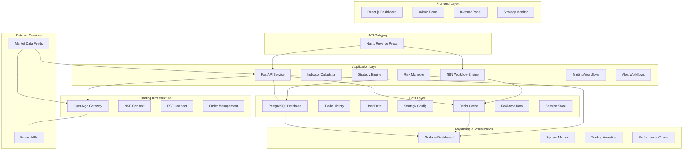

# Algorithmic Trading Stack Architecture Plan

## System Overview

This document outlines the architecture for a comprehensive algorithmic trading system using OpenAlgo as the multi-broker interface, N8N for workflow orchestration, FastAPI for real-time calculations, Grafana for visualization, and React.js for the frontend interface.

## System Architecture



## Component Specifications

### 1. Frontend (React.js)
- **Framework**: React 18+ with TypeScript
- **State Management**: Redux Toolkit
- **UI Components**: Material-UI or Ant Design
- **Charts**: Chart.js or D3.js
- **Authentication**: JWT tokens with refresh mechanism
- **Real-time Updates**: WebSocket connections

**Key Features**:
- Admin dashboard for system configuration
- Investor portal with portfolio view
- Strategy performance monitoring
- Real-time P&L tracking
- Risk metrics display
- Order management interface

### 2. FastAPI Service
- **Framework**: FastAPI with Python 3.9+
- **Async Support**: asyncio for concurrent operations
- **WebSocket**: Real-time data streaming
- **Authentication**: OAuth2 with JWT

**Core Modules**:
- **Indicator Calculator**: Technical indicators (RSI, MACD, Bollinger Bands, etc.)
- **Strategy Engine**: Strategy execution logic
- **Risk Manager**: Position sizing and risk controls
- **Data Processor**: Market data normalization
- **API Endpoints**: RESTful services for frontend

### 3. N8N Workflow Engine
- **Version**: Latest stable N8N
- **Database**: PostgreSQL for workflow persistence
- **Custom Nodes**: Trading-specific nodes for OpenAlgo integration

**Workflow Types**:
- Strategy execution workflows
- Risk monitoring workflows
- Alert and notification workflows
- Data backup and archival workflows

### 4. OpenAlgo Integration
- **Function**: Multi-broker abstraction layer
- **Supported Brokers**: NSE, BSE
- **Features**: Order placement, position tracking, market data

### 5. Database Design
- **Primary Database**: PostgreSQL 14+
- **Cache Layer**: Redis 6+
- **Time Series**: InfluxDB for market data (optional)

**Key Tables**:
- Users and authentication
- Strategy configurations
- Trade history
- Position data
- Market data cache
- System logs

### 6. Grafana Dashboard
- **Data Sources**: PostgreSQL, Redis, Prometheus
- **Dashboards**: System health, trading performance, risk metrics
- **Alerts**: Email and webhook notifications

## Trading Strategies Implementation

### 1. Trend Following Strategy
- **Indicators**: Moving averages, ADX, Parabolic SAR
- **Logic**: Buy on uptrend confirmation, sell on downtrend
- **Timeframes**: Multiple timeframe analysis
- **Risk**: Stop-loss based on ATR

### 2. Mean Reversion Strategy
- **Indicators**: Bollinger Bands, RSI, Stochastic
- **Logic**: Buy oversold, sell overbought conditions
- **Filters**: Volume confirmation, volatility thresholds
- **Risk**: Dynamic position sizing based on deviation

### 3. Momentum Strategy
- **Indicators**: MACD, Rate of Change, Price momentum
- **Logic**: Follow strong price movements
- **Confirmation**: Volume surge, pattern recognition
- **Risk**: Time-based exits, momentum failure detection

## Risk Management Framework

### Position Sizing
- **Fixed Fractional**: Risk 1-2% per trade
- **Volatility Adjusted**: Size based on ATR
- **Portfolio Heat**: Maximum exposure limits

### Risk Controls
- **Stop Loss**: Technical and time-based stops
- **Take Profit**: Partial booking strategies
- **Drawdown Limits**: Maximum daily/weekly loss
- **Correlation Limits**: Sector and stock exposure caps

## Technology Stack Details

### Backend Services
```yaml
FastAPI:
  version: "0.104+"
  features:
    - async endpoints
    - websocket support
    - automatic documentation
    - data validation with Pydantic

N8N:
  version: "Latest stable"
  custom_nodes:
    - OpenAlgo connector
    - Technical analysis nodes
    - Risk management nodes

OpenAlgo:
  brokers:
    - NSE (through supported brokers)
    - BSE (through supported brokers)
  features:
    - order management
    - position tracking
    - real-time quotes
```

### Database Schema
```sql
-- Users Table
CREATE TABLE users (
    id SERIAL PRIMARY KEY,
    username VARCHAR(50) UNIQUE NOT NULL,
    email VARCHAR(100) UNIQUE NOT NULL,
    password_hash VARCHAR(255) NOT NULL,
    role VARCHAR(20) NOT NULL, -- 'admin' or 'investor'
    created_at TIMESTAMP DEFAULT CURRENT_TIMESTAMP,
    updated_at TIMESTAMP DEFAULT CURRENT_TIMESTAMP
);

-- Strategies Table
CREATE TABLE strategies (
    id SERIAL PRIMARY KEY,
    name VARCHAR(100) NOT NULL,
    type VARCHAR(50) NOT NULL, -- 'trend', 'mean_reversion', 'momentum'
    config JSONB NOT NULL,
    is_active BOOLEAN DEFAULT false,
    created_by INTEGER REFERENCES users(id),
    created_at TIMESTAMP DEFAULT CURRENT_TIMESTAMP
);

-- Trades Table
CREATE TABLE trades (
    id SERIAL PRIMARY KEY,
    strategy_id INTEGER REFERENCES strategies(id),
    symbol VARCHAR(20) NOT NULL,
    exchange VARCHAR(10) NOT NULL,
    side VARCHAR(10) NOT NULL, -- 'BUY' or 'SELL'
    quantity INTEGER NOT NULL,
    price DECIMAL(10,2) NOT NULL,
    timestamp TIMESTAMP DEFAULT CURRENT_TIMESTAMP,
    status VARCHAR(20) NOT NULL -- 'OPEN', 'CLOSED', 'CANCELLED'
);

-- Positions Table
CREATE TABLE positions (
    id SERIAL PRIMARY KEY,
    symbol VARCHAR(20) NOT NULL,
    exchange VARCHAR(10) NOT NULL,
    quantity INTEGER NOT NULL,
    average_price DECIMAL(10,2) NOT NULL,
    current_price DECIMAL(10,2),
    pnl DECIMAL(10,2),
    last_updated TIMESTAMP DEFAULT CURRENT_TIMESTAMP
);
```

## Deployment Architecture

### Single Server Setup
```yaml
Server Requirements:
  CPU: 8+ cores
  RAM: 16GB+
  Storage: 500GB SSD
  Network: Low latency connection to exchanges

Docker Compose Services:
  - Nginx (reverse proxy)
  - FastAPI (main application)
  - N8N (workflow engine)
  - PostgreSQL (database)
  - Redis (cache)
  - Grafana (monitoring)
  - OpenAlgo (trading gateway)
```

### Directory Structure
```
VELOX-N8N/
├── backend/
│   ├── fastapi/
│   │   ├── app/
│   │   │   ├── api/
│   │   │   ├── core/
│   │   │   ├── models/
│   │   │   ├── services/
│   │   │   └── main.py
│   │   ├── requirements.txt
│   │   └── Dockerfile
│   └── n8n/
│       ├── custom-nodes/
│       └── workflows/
├── frontend/
│   ├── public/
│   ├── src/
│   │   ├── components/
│   │   ├── pages/
│   │   ├── services/
│   │   ├── store/
│   │   └── App.tsx
│   ├── package.json
│   └── Dockerfile
├── infrastructure/
│   ├── docker-compose.yml
│   ├── nginx/
│   ├── grafana/
│   └── postgres/
├── docs/
└── scripts/
```

## Development Phases

### Phase 1: Infrastructure Setup (Week 1-2)
- Set up development environment
- Configure Docker containers
- Establish database schema
- Set up CI/CD pipeline

### Phase 2: Core Services (Week 3-4)
- Implement FastAPI service
- Configure OpenAlgo integration
- Set up N8N workflows
- Create basic frontend structure

### Phase 3: Strategy Implementation (Week 5-6)
- Implement trading strategies
- Create risk management system
- Develop backtesting framework
- Build strategy configuration interface

### Phase 4: Monitoring & Visualization (Week 7-8)
- Configure Grafana dashboards
- Implement real-time monitoring
- Create performance analytics
- Set up alerting system

### Phase 5: Testing & Deployment (Week 9-10)
- Perform end-to-end testing
- Optimize performance
- Deploy to production
- Create documentation

## Security Considerations

### Authentication & Authorization
- JWT-based authentication
- Role-based access control
- API rate limiting
- Session management

### Data Security
- Encrypted data transmission
- Secure API key storage
- Database encryption
- Audit logging

### Trading Security
- Order validation
- Position limits
- Emergency stop mechanisms
- Trade confirmation workflows

## Performance Optimization

### Latency Reduction
- Efficient data structures
- Connection pooling
- Caching strategies
- Asynchronous processing

### Scalability Planning
- Horizontal scaling readiness
- Load balancing configuration
- Database optimization
- Resource monitoring

This architecture provides a solid foundation for your algorithmic trading system with room for growth and optimization as your requirements evolve.