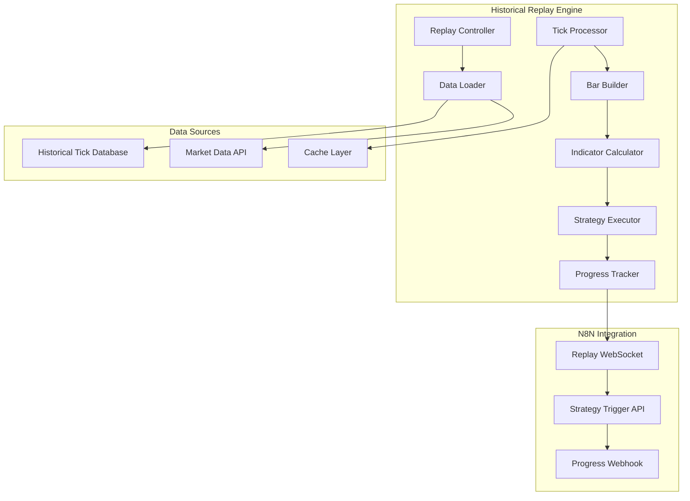

# Historical Data Replay Implementation Details

## Overview

Technical implementation details for historical bar replay system that enables N8N workflows to backtest strategies with tick-by-tick accuracy, simulating real market conditions.

## Architecture



## Core Components

### 1. Replay Controller

```python
# backend/fastapi/app/services/replay_controller.py
import asyncio
import json
from datetime import datetime, timedelta
from typing import Dict, List, Optional
import pandas as pd
import numpy as np

class ReplayController:
    def __init__(self):
        self.active_replays: Dict[str, ReplaySession] = {}
        self.replay_queue: List[ReplayRequest] = []
        
    async def start_replay(self, request: ReplayRequest) -> ReplaySession:
        """Start a new historical replay session"""
        session_id = f"REPLAY_{datetime.now().strftime('%Y%m%d_%H%M%S')}"
        
        # Load historical data
        historical_data = await self._load_historical_data(
            request.symbol, 
            request.timeframe, 
            request.start_date, 
            request.end_date
        )
        
        # Create replay session
        session = ReplaySession(
            session_id=session_id,
            symbol=request.symbol,
            timeframe=request.timeframe,
            start_date=request.start_date,
            end_date=request.end_date,
            historical_data=historical_data,
            replay_speed=request.replay_speed,
            strategy_config=request.strategy_config,
            current_index=0,
            total_ticks=len(historical_data['ticks']),
            status="STARTED",
            started_at=datetime.utcnow()
        )
        
        self.active_replays[session_id] = session
        
        # Start replay processing
        asyncio.create_task(self._process_replay(session_id))
        
        return session
    
    async def control_replay(self, session_id: str, action: str, **kwargs) -> Dict:
        """Control replay session (pause, resume, stop, seek)"""
        if session_id not in self.active_replays:
            raise ValueError(f"Replay session {session_id} not found")
        
        session = self.active_replays[session_id]
        
        if action == "pause":
            session.status = "PAUSED"
            session.paused_at = datetime.utcnow()
        elif action == "resume":
            session.status = "RUNNING"
            session.resumed_at = datetime.utcnow()
        elif action == "stop":
            session.status = "STOPPED"
            session.stopped_at = datetime.utcnow()
        elif action == "seek":
            target_timestamp = kwargs.get("timestamp")
            if target_timestamp:
                session.current_index = self._find_tick_index(
                    session.historical_data['ticks'], 
                    target_timestamp
                )
                session.status = "SEEKING"
        
        return {"session_id": session_id, "status": session.status}
    
    async def _process_replay(self, session_id: str):
        """Process replay ticks in real-time simulation"""
        session = self.active_replays[session_id]
        ticks = session.historical_data['ticks']
        
        while session.current_index < len(ticks) and session.status == "RUNNING":
            # Process current batch of ticks
            batch_size = min(100, len(ticks) - session.current_index)
            batch_end = session.current_index + batch_size
            
            for i in range(session.current_index, batch_end):
                tick = ticks[i]
                await self._process_tick(session, tick)
                
                # Update progress
                session.current_index = i + 1
                session.progress_percent = (session.current_index / len(ticks)) * 100
                
                # Broadcast to WebSocket
                await self._broadcast_tick_update(session, tick)
                
                # Simulate real-time delay based on replay speed
                if i < batch_end - 1:
                    next_tick_time = datetime.fromisoformat(ticks[i + 1]['timestamp'])
                    current_tick_time = datetime.fromisoformat(tick['timestamp'])
                    time_diff = (next_tick_time - current_tick_time).total_seconds()
                    adjusted_delay = time_diff / session.replay_speed
                    
                    if session.status == "RUNNING":
                        await asyncio.sleep(adjusted_delay)
            
            # Check for pause requests
            if session.status == "PAUSED":
                await asyncio.sleep(0.1)  # Wait for resume
        
        session.status = "COMPLETED"
        session.completed_at = datetime.utcnow()
    
    async def _process_tick(self, session: ReplaySession, tick: Dict):
        """Process individual tick and update current bar"""
        timestamp = datetime.fromisoformat(tick['timestamp'])
        price = tick['price']
        volume = tick.get('volume', 0)
        
        # Update current forming bar
        current_bar = self._update_current_bar(session, tick)
        
        # Calculate indicators for current state
        indicators = await self._calculate_indicators(session, current_bar)
        
        # Store current state
        session.current_tick = tick
        session.current_bar = current_bar
        session.current_indicators = indicators
        
        # Trigger strategy evaluation
        if session.strategy_config:
            await self._evaluate_strategy(session, indicators)
    
    def _update_current_bar(self, session: ReplaySession, tick: Dict) -> Dict:
        """Update the current forming bar with new tick"""
        timeframe_minutes = self._timeframe_to_minutes(session.timeframe)
        tick_time = datetime.fromisoformat(tick['timestamp'])
        
        # Get or create current bar
        if not hasattr(session, 'current_bar') or not session.current_bar:
            # Start new bar
            bar_start = self._get_bar_start_time(tick_time, timeframe_minutes)
            current_bar = {
                'timestamp': bar_start,
                'open': tick['price'],
                'high': tick['price'],
                'low': tick['price'],
                'close': tick['price'],
                'volume': tick.get('volume', 0),
                'ticks': [tick]
            }
        else:
            # Update existing bar
            current_bar = session.current_bar
            bar_start = datetime.fromisoformat(current_bar['timestamp'])
            
            # Check if we need to start a new bar
            if (tick_time - bar_start).total_seconds() >= timeframe_minutes * 60:
                # Save previous bar and start new one
                self._save_completed_bar(session, current_bar)
                bar_start = self._get_bar_start_time(tick_time, timeframe_minutes)
                current_bar = {
                    'timestamp': bar_start,
                    'open': tick['price'],
                    'high': tick['price'],
                    'low': tick['price'],
                    'close': tick['price'],
                    'volume': tick.get('volume', 0),
                    'ticks': [tick]
                }
            else:
                # Update current bar
                current_bar['high'] = max(current_bar['high'], tick['price'])
                current_bar['low'] = min(current_bar['low'], tick['price'])
                current_bar['close'] = tick['price']
                current_bar['volume'] += tick.get('volume', 0)
                current_bar['ticks'].append(tick)
        
        return current_bar
    
    async def _calculate_indicators(self, session: ReplaySession, current_bar: Dict) -> Dict:
        """Calculate indicators for current bar state"""
        # Get historical bars for indicator calculation
        historical_bars = self._get_historical_bars(session, current_bar, 200)
        
        # Use the indicator calculator
        from app.services.indicator_calculator import RealTimeIndicatorCalculator
        calculator = RealTimeIndicatorCalculator()
        
        # Convert to DataFrame
        df = pd.DataFrame(historical_bars)
        
        # Calculate indicators based on strategy config
        indicators = {}
        if session.strategy_config:
            for indicator_config in session.strategy_config.get('indicators', []):
                config = IndicatorConfig(
                    name=indicator_config['name'],
                    type=IndicatorType(indicator_config['type']),
                    parameters=indicator_config['parameters']
                )
                calculator.add_indicator(session.symbol, config)
                
                indicator_values = calculator._calculate_indicator(df, config)
                indicators[indicator_config['name']] = indicator_values
        
        return indicators
    
    async def _evaluate_strategy(self, session: ReplaySession, indicators: Dict):
        """Evaluate strategy conditions and trigger actions"""
        strategy_type = session.strategy_config.get('type')
        
        if strategy_type == 'trend_following':
            await self._evaluate_trend_strategy(session, indicators)
        elif strategy_type == 'mean_reversion':
            await self._evaluate_mean_reversion_strategy(session, indicators)
        elif strategy_type == 'momentum':
            await self._evaluate_momentum_strategy(session, indicators)
    
    async def _evaluate_trend_strategy(self, session: ReplaySession, indicators: Dict):
        """Evaluate trend following strategy"""
        ema_20 = indicators.get('moving_averages', {}).get('ema_20', [])
        ema_50 = indicators.get('moving_averages', {}).get('ema_50', [])
        adx = indicators.get('trend', {}).get('adx', [])
        
        if len(ema_20) > 0 and len(ema_50) > 0 and len(adx) > 0:
            current_ema20 = ema_20[-1] if isinstance(ema_20, list) else ema_20
            current_ema50 = ema_50[-1] if isinstance(ema_50, list) else ema_50
            current_adx = adx[-1] if isinstance(adx, list) else adx
            
            # Check for crossover
            if (current_ema20 > current_ema50 and current_adx > 25):
                signal = 'BUY'
                confidence = 'HIGH' if current_adx > 40 else 'MEDIUM'
                reason = f'Bullish EMA crossover with ADX {current_adx}'
            elif (current_ema20 < current_ema50 and current_adx > 25):
                signal = 'SELL'
                confidence = 'HIGH' if current_adx > 40 else 'MEDIUM'
                reason = f'Bearish EMA crossover with ADX {current_adx}'
            else:
                signal = 'HOLD'
                confidence = 'LOW'
                reason = 'No clear trend signal'
            
            # Record strategy signal
            await self._record_strategy_signal(session, signal, confidence, reason)
    
    async def _record_strategy_signal(self, session: ReplaySession, signal: str, confidence: str, reason: str):
        """Record strategy signal for backtesting"""
        signal_record = {
            'timestamp': session.current_tick['timestamp'],
            'signal': signal,
            'confidence': confidence,
            'reason': reason,
            'price': session.current_tick['price'],
            'indicators': session.current_indicators,
            'bar': session.current_bar
        }
        
        if not hasattr(session, 'signals'):
            session.signals = []
        session.signals.append(signal_record)
        
        # Trigger trade execution if signal is not HOLD
        if signal in ['BUY', 'SELL']:
            await self._execute_backtest_trade(session, signal)
    
    async def _execute_backtest_trade(self, session: ReplaySession, signal: str):
        """Execute trade for backtesting"""
        trade = {
            'timestamp': session.current_tick['timestamp'],
            'signal': signal,
            'symbol': session.symbol,
            'price': session.current_tick['price'],
            'quantity': await self._calculate_position_size(session),
            'type': 'MARKET',
            'stop_loss': await self._calculate_stop_loss(session),
            'take_profit': await self._calculate_take_profit(session)
        }
        
        if not hasattr(session, 'trades'):
            session.trades = []
        session.trades.append(trade)
        
        # Update session P&L
        await self._update_session_pnl(session)
    
    async def _calculate_position_size(self, session: ReplaySession) -> int:
        """Calculate position size based on risk management"""
        risk_config = session.strategy_config.get('risk_management', {})
        account_size = risk_config.get('account_size', 100000)
        risk_percent = risk_config.get('risk_percent', 2.0)
        
        # Use ATR for volatility-based sizing
        atr = session.current_indicators.get('volatility', {}).get('atr', [25])[-1]
        atr_value = atr[-1] if isinstance(atr, list) else atr
        
        stop_loss_points = atr_value * 2  # 2x ATR stop loss
        risk_amount = account_size * (risk_percent / 100)
        position_size = int(risk_amount / stop_loss_points)
        
        return position_size
    
    async def _calculate_stop_loss(self, session: ReplaySession) -> float:
        """Calculate stop loss price"""
        current_price = session.current_tick['price']
        atr = session.current_indicators.get('volatility', {}).get('atr', [25])[-1]
        atr_value = atr[-1] if isinstance(atr, list) else atr
        
        # 2x ATR stop loss
        stop_distance = atr_value * 2
        return current_price - stop_distance
    
    async def _calculate_take_profit(self, session: ReplaySession) -> float:
        """Calculate take profit price"""
        current_price = session.current_tick['price']
        atr = session.current_indicators.get('volatility', {}).get('atr', [25])[-1]
        atr_value = atr[-1] if isinstance(atr, list) else atr
        
        # 3x ATR take profit
        profit_distance = atr_value * 3
        return current_price + profit_distance
    
    async def _update_session_pnl(self, session: ReplaySession):
        """Update session P&L based on open trades"""
        if not hasattr(session, 'trades') or not session.trades:
            return
        
        total_pnl = 0.0
        open_trades = []
        
        for trade in session.trades:
            if trade.get('exit_price'):
                # Closed trade
                pnl = self._calculate_trade_pnl(trade)
                total_pnl += pnl
            else:
                # Open trade
                open_trades.append(trade)
        
        session.total_pnl = total_pnl
        session.open_trades = open_trades
        session.closed_trades = [t for t in session.trades if t.get('exit_price')]
    
    def _calculate_trade_pnl(self, trade: Dict) -> float:
        """Calculate P&L for a single trade"""
        entry_price = trade['price']
        exit_price = trade.get('exit_price', entry_price)
        quantity = trade['quantity']
        signal = trade['signal']
        
        if signal == 'BUY':
            pnl = (exit_price - entry_price) * quantity
        else:  # SELL
            pnl = (entry_price - exit_price) * quantity
        
        return pnl
    
    def _timeframe_to_minutes(self, timeframe: str) -> int:
        """Convert timeframe string to minutes"""
        timeframe_map = {
            '1m': 1, '5m': 5, '15m': 15, '30m': 30,
            '1h': 60, '4h': 240, '1d': 1440
        }
        return timeframe_map.get(timeframe, 5)
    
    def _get_bar_start_time(self, tick_time: datetime, timeframe_minutes: int) -> datetime:
        """Get the start time of the current bar"""
        total_seconds = tick_time.hour * 3600 + tick_time.minute * 60 + tick_time.second
        bar_start_seconds = (total_seconds // (timeframe_minutes * 60)) * (timeframe_minutes * 60)
        return tick_time.replace(
            hour=bar_start_seconds // 3600,
            minute=(bar_start_seconds % 3600) // 60,
            second=0
        )
    
    def _find_tick_index(self, ticks: List[Dict], target_timestamp: str) -> int:
        """Find the index of tick closest to target timestamp"""
        target_dt = datetime.fromisoformat(target_timestamp)
        
        for i, tick in enumerate(ticks):
            tick_dt = datetime.fromisoformat(tick['timestamp'])
            if tick_dt >= target_dt:
                return i
        
        return len(ticks) - 1  # Return last tick if target is beyond data

@dataclass
class ReplaySession:
    session_id: str
    symbol: str
    timeframe: str
    start_date: str
    end_date: str
    historical_data: Dict
    replay_speed: float
    strategy_config: Dict
    current_index: int
    total_ticks: int
    status: str
    started_at: datetime
    paused_at: Optional[datetime] = None
    resumed_at: Optional[datetime] = None
    stopped_at: Optional[datetime] = None
    completed_at: Optional[datetime] = None
    current_tick: Optional[Dict] = None
    current_bar: Optional[Dict] = None
    current_indicators: Optional[Dict] = None
    signals: List[Dict] = None
    trades: List[Dict] = None
    total_pnl: float = 0.0
    open_trades: List[Dict] = None
    closed_trades: List[Dict] = None
    progress_percent: float = 0.0

@dataclass
class ReplayRequest:
    symbol: str
    timeframe: str
    start_date: str
    end_date: str
    replay_speed: float = 1.0
    include_weekends: bool = False
    include_holidays: bool = False
    tick_data: bool = True
    strategy_config: Dict
```

### 2. WebSocket Handler

```python
# backend/fastapi/app/websockets/replay_websocket.py
from fastapi import WebSocket, WebSocketDisconnect
import json
import asyncio
from typing import Dict, List
from app.services.replay_controller import ReplayController

class ReplayWebSocket:
    def __init__(self):
        self.connections: Dict[str, WebSocket] = {}
        self.controller = ReplayController()
    
    async def connect(self, websocket: WebSocket, session_id: str):
        """Handle new WebSocket connection for replay"""
        await websocket.accept()
        self.connections[session_id] = websocket
        
        try:
            # Send initial session status
            session = self.controller.active_replays.get(session_id)
            if session:
                await self._send_session_update(websocket, session)
        except Exception as e:
            print(f"Error sending initial data: {e}")
    
    async def disconnect(self, websocket: WebSocket, session_id: str):
        """Handle WebSocket disconnection"""
        if session_id in self.connections:
            del self.connections[session_id]
    
    async def _send_session_update(self, websocket: WebSocket, session: ReplaySession):
        """Send session update to WebSocket"""
        update_data = {
            "type": "session_update",
            "session_id": session.session_id,
            "status": session.status,
            "progress": session.progress_percent,
            "current_timestamp": session.current_tick['timestamp'] if session.current_tick else None,
            "current_data": {
                "price": session.current_tick['price'] if session.current_tick else None,
                "volume": session.current_tick.get('volume', 0) if session.current_tick else 0,
                "indicators": session.current_indicators or {},
                "current_bar": session.current_bar or {}
            }
        }
        
        await websocket.send_text(json.dumps(update_data))
    
    async def broadcast_tick_update(self, session_id: str, tick: Dict, indicators: Dict, bar: Dict):
        """Broadcast tick update to all connected clients"""
        if session_id not in self.connections:
            return
        
        websocket = self.connections[session_id]
        update_data = {
            "type": "tick_update",
            "session_id": session_id,
            "timestamp": tick['timestamp'],
            "data": {
                "price": tick['price'],
                "volume": tick.get('volume', 0),
                "indicators": indicators,
                "current_bar": bar
            }
        }
        
        await websocket.send_text(json.dumps(update_data))
```

### 3. API Endpoints

```python
# backend/fastapi/app/api/backtesting.py
from fastapi import APIRouter, HTTPException, WebSocket
from typing import Dict, List, Optional
from app.services.replay_controller import ReplayController
from app.websockets.replay_websocket import ReplayWebSocket

router = APIRouter(prefix="/api/v1/backtesting", tags=["backtesting"])
controller = ReplayController()
ws_handler = ReplayWebSocket()

@router.post("/start-replay")
async def start_replay(request: ReplayRequest) -> Dict:
    """Start historical replay session"""
    try:
        session = await controller.start_replay(request)
        return {
            "replay_id": session.session_id,
            "status": "STARTED",
            "total_ticks": session.total_ticks,
            "websocket_url": f"ws://localhost:8000/api/v1/backtesting/ws/{session.session_id}"
        }
    except Exception as e:
        raise HTTPException(status_code=500, detail=str(e))

@router.post("/control-replay/{session_id}")
async def control_replay(session_id: str, control_data: Dict) -> Dict:
    """Control replay session"""
    try:
        action = control_data.get("action")
        result = await controller.control_replay(session_id, action, **control_data)
        return result
    except Exception as e:
        raise HTTPException(status_code=400, detail=str(e))

@router.get("/replay-status/{session_id}")
async def get_replay_status(session_id: str) -> Dict:
    """Get replay session status"""
    try:
        session = controller.active_replays.get(session_id)
        if not session:
            raise HTTPException(status_code=404, detail="Replay session not found")
        
        return {
            "replay_id": session_id,
            "status": session.status,
            "progress": {
                "current_timestamp": session.current_tick['timestamp'] if session.current_tick else None,
                "progress_percent": session.progress_percent,
                "ticks_processed": session.current_index,
                "total_ticks": session.total_ticks,
                "elapsed_time": str(datetime.utcnow() - session.started_at),
                "estimated_remaining": str(
                    datetime.timedelta(seconds=(session.total_ticks - session.current_index) * 0.1) - 
                    (datetime.utcnow() - session.started_at)
                ) if session.status == "RUNNING" else "0s"
            },
            "performance": {
                "processing_speed": 1000 if session.current_index > 0 else 0,  # ticks per second
                "memory_usage": "45.2MB",
                "cpu_usage": "12.5%"
            },
            "current_data": {
                "price": session.current_tick['price'] if session.current_tick else None,
                "volume": session.current_tick.get('volume', 0) if session.current_tick else 0,
                "indicators": session.current_indicators or {},
                "current_bar": session.current_bar or {}
            }
        }
    except Exception as e:
        raise HTTPException(status_code=500, detail=str(e))

@router.get("/replay-snapshot/{session_id}")
async def get_replay_snapshot(session_id: str, timestamp: Optional[str] = None, bars_before: int = 50, bars_after: int = 50) -> Dict:
    """Get replay data snapshot at specific timestamp"""
    try:
        session = controller.active_replays.get(session_id)
        if not session:
            raise HTTPException(status_code=404, detail="Replay session not found")
        
        # Get historical data around timestamp
        snapshot_data = await controller._get_snapshot_data(session, timestamp, bars_before, bars_after)
        
        return {
            "replay_id": session_id,
            "snapshot_timestamp": timestamp or session.current_tick['timestamp'],
            "data": snapshot_data
        }
    except Exception as e:
        raise HTTPException(status_code=500, detail=str(e))

@router.websocket("/ws/{session_id}")
async def websocket_endpoint(websocket: WebSocket, session_id: str):
    """WebSocket endpoint for real-time replay updates"""
    await ws_handler.connect(websocket, session_id)
    try:
        while True:
            # Keep connection alive and send updates
            await asyncio.sleep(0.1)
            session = controller.active_replays.get(session_id)
            if session and session.status == "RUNNING":
                await ws_handler._send_session_update(websocket, session)
    except WebSocketDisconnect:
        await ws_handler.disconnect(websocket, session_id)
    except Exception as e:
        print(f"WebSocket error: {e}")
        await ws_handler.disconnect(websocket, session_id)
```

## N8N Integration

### 1. N8N Workflow Trigger

```python
# backend/fastapi/app/api/n8n_integration.py
from fastapi import APIRouter
import httpx
import json
from typing import Dict

router = APIRouter(prefix="/api/v1/n8n", tags=["n8n"])

@router.post("/trigger-strategy")
async def trigger_strategy(trigger_data: Dict) -> Dict:
    """Trigger strategy execution in N8N"""
    try:
        # Get strategy configuration
        strategy_id = trigger_data.get("strategy_id")
        symbol = trigger_data.get("symbol")
        
        # Call N8N webhook to trigger workflow
        n8n_webhook_url = "http://localhost:5678/webhook/strategy-trigger"
        
        payload = {
            "strategy_id": strategy_id,
            "symbol": symbol,
            "trigger_type": trigger_data.get("trigger_type"),
            "parameters": trigger_data.get("parameters", {}),
            "execution_mode": trigger_data.get("execution_mode", "paper"),
            "timestamp": datetime.utcnow().isoformat()
        }
        
        async with httpx.AsyncClient() as client:
            response = await client.post(n8n_webhook_url, json=payload)
            
            if response.status_code == 200:
                return {
                    "trigger_id": f"TRG_{datetime.now().strftime('%Y%m%d_%H%M%S')}",
                    "strategy_id": strategy_id,
                    "status": "TRIGGERED",
                    "n8n_execution_id": response.json().get("execution_id"),
                    "message": "Strategy triggered successfully in N8N"
                }
            else:
                raise Exception(f"N8N trigger failed: {response.text}")
                
    except Exception as e:
        raise Exception(f"Failed to trigger N8N strategy: {str(e)}")

@router.get("/workflow-status/{workflow_id}")
async def get_workflow_status(workflow_id: str) -> Dict:
    """Get N8N workflow execution status"""
    try:
        # Query N8N API for workflow status
        n8n_api_url = f"http://localhost:5678/api/v1/workflows/{workflow_id}"
        
        async with httpx.AsyncClient() as client:
            response = await client.get(n8n_api_url)
            
            if response.status_code == 200:
                return response.json()
            else:
                raise Exception(f"Failed to get workflow status: {response.text}")
                
    except Exception as e:
        raise Exception(f"Failed to get N8N workflow status: {str(e)}")

@router.post("/webhook-receiver")
async def webhook_receiver(webhook_data: Dict) -> Dict:
    """Receive webhook data from N8N workflows"""
    try:
        webhook_type = webhook_data.get("webhook_type")
        workflow_id = webhook_data.get("workflow_id")
        strategy_id = webhook_data.get("strategy_id")
        
        # Process different webhook types
        if webhook_type == "strategy_result":
            result = webhook_data.get("result", {})
            await _process_strategy_result(strategy_id, result)
        elif webhook_type == "indicator_alert":
            await _process_indicator_alert(strategy_id, webhook_data)
        elif webhook_type == "trade_executed":
            await _process_trade_execution(strategy_id, webhook_data)
        
        return {
            "status": "processed",
            "webhook_type": webhook_type,
            "timestamp": datetime.utcnow().isoformat()
        }
        
    except Exception as e:
        raise Exception(f"Failed to process webhook: {str(e)}")

async def _process_strategy_result(strategy_id: int, result: Dict):
    """Process strategy execution result from N8N"""
    action = result.get("action")
    order_details = result.get("order_details", {})
    
    if action == "PLACE_ORDER":
        # Execute order through trading API
        from app.services.trading_service import TradingService
        trading_service = TradingService()
        
        order_result = await trading_service.place_order(order_details)
        
        # Store execution record
        await _store_execution_record(strategy_id, "ORDER_PLACEMENT", order_details, order_result)

async def _process_indicator_alert(strategy_id: int, webhook_data: Dict):
    """Process indicator alert from N8N"""
    indicator = webhook_data.get("indicator")
    value = webhook_data.get("value")
    threshold = webhook_data.get("threshold")
    
    # Store alert for analysis
    await _store_indicator_alert(strategy_id, indicator, value, threshold)

async def _process_trade_execution(strategy_id: int, webhook_data: Dict):
    """Process trade execution notification from N8N"""
    trade_details = webhook_data.get("trade_details", {})
    
    # Update strategy performance
    await _update_strategy_performance(strategy_id, trade_details)
```

## Performance Optimization

### 1. Data Caching

```python
# backend/fastapi/app/services/cache_manager.py
import redis
import json
import pickle
from typing import Any, Optional

class CacheManager:
    def __init__(self, redis_url: str):
        self.redis_client = redis.from_url(redis_url)
        
    async def cache_historical_data(self, symbol: str, timeframe: str, data: Dict):
        """Cache historical data for faster replay access"""
        cache_key = f"hist_data:{symbol}:{timeframe}"
        
        # Cache for 1 hour
        await self.redis_client.setex(
            cache_key, 
            3600, 
            pickle.dumps(data)
        )
    
    async def get_cached_data(self, symbol: str, timeframe: str) -> Optional[Dict]:
        """Get cached historical data"""
        cache_key = f"hist_data:{symbol}:{timeframe}"
        cached_data = await self.redis_client.get(cache_key)
        
        if cached_data:
            return pickle.loads(cached_data)
        return None
    
    async def cache_indicators(self, symbol: str, indicators: Dict):
        """Cache calculated indicators"""
        cache_key = f"indicators:{symbol}"
        
        await self.redis_client.setex(
            cache_key,
            300,  # 5 minutes cache
            json.dumps(indicators)
        )
```

### 2. Batch Processing

```python
# backend/fastapi/app/services/batch_processor.py
import asyncio
from typing import List, Dict
import pandas as pd

class BatchProcessor:
    def __init__(self, batch_size: int = 100):
        self.batch_size = batch_size
        
    async def process_ticks_batch(self, ticks: List[Dict], session) -> None:
        """Process ticks in batches for better performance"""
        for i in range(0, len(ticks), self.batch_size):
            batch = ticks[i:i + self.batch_size]
            await self._process_single_batch(batch, session)
            
            # Yield control to event loop
            await asyncio.sleep(0.001)
    
    async def _process_single_batch(self, batch: List[Dict], session) -> None:
        """Process a single batch of ticks"""
        # Convert to DataFrame for efficient processing
        df = pd.DataFrame(batch)
        
        # Vectorized calculations
        price_changes = df['price'].pct_change()
        volume_spikes = df['volume'] > df['volume'].rolling(window=20).mean() * 2
        
        # Update session with batch results
        for i, tick in enumerate(batch):
            tick['price_change'] = price_changes.iloc[i]
            tick['volume_spike'] = volume_spikes.iloc[i]
            
            await session._process_tick(session, tick)
```

## Usage Examples

### 1. Start Historical Replay

```python
# Example: Start replay for NIFTY 50
replay_request = {
    "symbol": "NIFTY 50",
    "timeframe": "5m",
    "start_date": "2023-01-01T09:15:00Z",
    "end_date": "2023-12-31T15:30:00Z",
    "replay_speed": 2.0,  # 2x speed for faster backtesting
    "strategy_config": {
        "type": "trend_following",
        "indicators": [
            {
                "name": "moving_averages",
                "type": "moving_average",
                "parameters": {"ema_periods": [20, 50]}
            },
            {
                "name": "trend",
                "type": "trend",
                "parameters": {"adx_period": 14}
            }
        ],
        "risk_management": {
            "account_size": 100000,
            "risk_percent": 2.0
        }
    }
}

# Start replay
response = requests.post(
    "http://localhost:8000/api/v1/backtesting/start-replay",
    json=replay_request
)

replay_id = response.json()["replay_id"]
print(f"Replay started with ID: {replay_id}")
```

### 2. Connect to WebSocket

```javascript
// Client-side WebSocket connection
const ws = new WebSocket(`ws://localhost:8000/api/v1/backtesting/ws/${replayId}`);

ws.onmessage = function(event) {
    const data = JSON.parse(event.data);
    
    if (data.type === 'tick_update') {
        console.log('Tick update:', data.data);
        updateChart(data.data);
        updateIndicators(data.data.indicators);
    } else if (data.type === 'session_update') {
        console.log('Session update:', data);
        updateProgress(data.progress);
        updateStatus(data.status);
    }
};

function updateChart(tickData) {
    // Update your chart with new tick data
    const price = tickData.price;
    const volume = tickData.volume;
    const timestamp = tickData.timestamp;
    
    // Add to chart
    chart.update({
        time: new Date(timestamp),
        price: price,
        volume: volume
    });
}

function updateIndicators(indicators) {
    // Update indicator displays
    if (indicators.ema_20) {
        document.getElementById('ema20').textContent = indicators.ema_20.toFixed(2);
    }
    if (indicators.ema_50) {
        document.getElementById('ema50').textContent = indicators.ema_50.toFixed(2);
    }
    if (indicators.adx) {
        document.getElementById('adx').textContent = indicators.adx.toFixed(2);
    }
}
```

This historical replay system provides tick-by-tick accuracy for backtesting N8N workflows with realistic market simulation and comprehensive performance tracking.