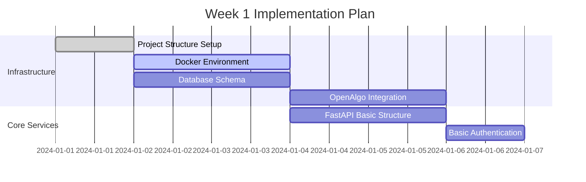
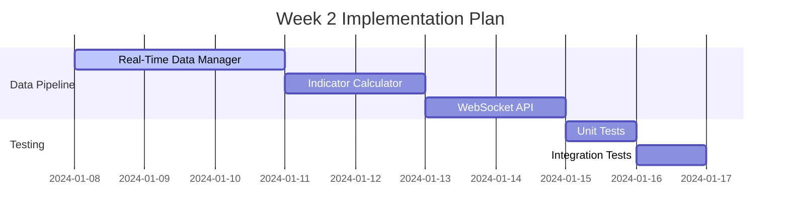
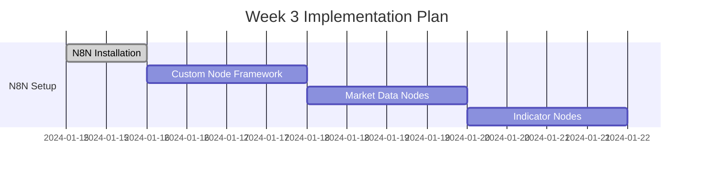
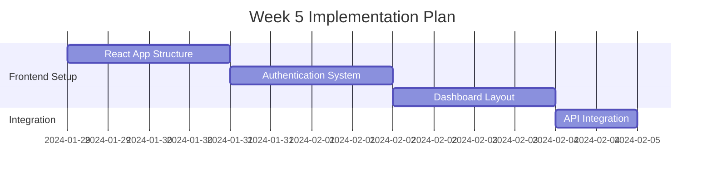
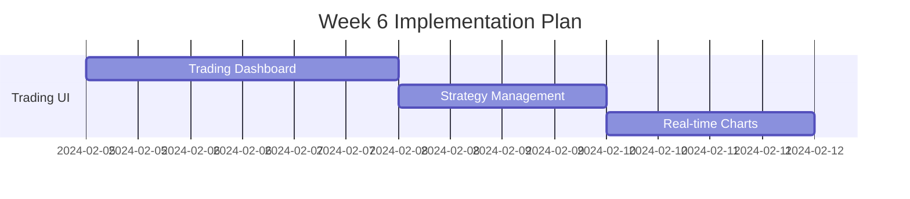
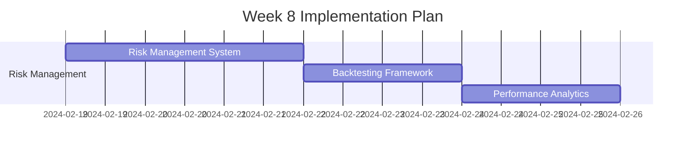
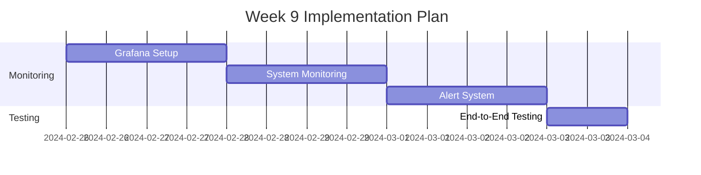

# VELOX-N8N Implementation Timeline and Priorities

## Project Overview

**Total Estimated Duration**: 10-12 weeks
**Team Size**: 1-2 developers (you can scale based on resources)
**Approach**: Agile development with 2-week sprints
**Priority**: Real-time indicators first, then strategy implementation

## Implementation Phases

### Phase 1: Foundation & Infrastructure (Week 1-2)
**Priority**: 🔴 Critical
**Goal**: Set up core infrastructure and data pipelines

#### Week 1: Core Infrastructure


**Deliverables**:
- [x] Complete project structure with all directories
- [x] Docker Compose setup with all services
- [x] PostgreSQL database with initial schema
- [x] OpenAlgo API connection and basic data fetching
- [x] FastAPI basic structure with authentication

**Key Tasks**:
1. **Project Structure Setup** (Day 1)
   - Create all directories and files
   - Initialize git repository
   - Set up basic configuration files

2. **Docker Environment** (Day 2-3)
   - Configure docker-compose.yml
   - Set up all service containers
   - Test container connectivity

3. **Database Setup** (Day 2-3)
   - Create PostgreSQL schema
   - Set up Redis cache
   - Create initial migration scripts

4. **OpenAlgo Integration** (Day 3-4)
   - Install and configure OpenAlgo
   - Test broker connection (NSE/BSE)
   - Implement basic market data fetching

5. **FastAPI Foundation** (Day 4-5)
   - Set up FastAPI application structure
   - Implement JWT authentication
   - Create basic API endpoints

#### Week 2: Real-Time Data Pipeline
**Priority**: 🔴 Critical
**Goal**: Implement real-time data processing and indicator calculation



**Deliverables**:
- [x] Real-time data manager with OpenAlgo integration
- [x] Comprehensive indicator calculator using ta
- [x] WebSocket API for real-time data streaming
- [x] Basic test coverage for core components

**Key Tasks**:
1. **Real-Time Data Manager** (Day 1-3)
   - Implement tick data streaming from OpenAlgo
   - Create candle formation logic for multiple timeframes
   - Set up data buffering and management

2. **Indicator Calculator** (Day 3-4)
   - Implement all indicator types using ta
   - Create pre-configured indicator presets
   - Optimize for real-time calculations

3. **WebSocket API** (Day 4-5)
   - Implement real-time data streaming endpoints
   - Create subscription management
   - Add connection handling and error recovery

4. **Testing** (Day 6-7)
   - Write unit tests for core components
   - Create integration tests for data pipeline
   - Performance testing for real-time processing

### Phase 2: Strategy Development Platform (Week 3-4)
**Priority**: 🟡 High
**Goal**: Build N8N-based strategy design framework

#### Week 3: N8N Custom Nodes


**Deliverables**:
- [x] N8N installation and configuration
- [x] Custom node development framework
- [x] Market data nodes for real-time indicators
- [x] Technical indicator calculation nodes

**Key Tasks**:
1. **N8N Setup** (Day 1)
   - Install and configure N8N
   - Set up PostgreSQL backend
   - Configure authentication

2. **Custom Node Framework** (Day 2-3)
   - Create base structure for custom nodes
   - Set up development environment
   - Create node packaging and deployment

3. **Market Data Nodes** (Day 3-4)
   - Implement real-time market data node
   - Create historical data node
   - Add market scanner node

4. **Indicator Nodes** (Day 5-6)
   - Create technical indicator nodes
   - Implement signal generation nodes
   - Add multi-timeframe support

#### Week 4: Strategy Workflow Templates


**Deliverables**:
- [x] Signal generation and filtering nodes
- [x] Risk management and position sizing nodes
- [x] Order execution nodes
- [x] Pre-built strategy templates

**Key Tasks**:
1. **Signal Nodes** (Day 1-2)
   - Implement crossover detection nodes
   - Create threshold-based signal nodes
   - Add confluence and divergence nodes

2. **Risk Management Nodes** (Day 3-4)
   - Create position sizing nodes
   - Implement stop-loss and take-profit nodes
   - Add risk check and portfolio nodes

3. **Order Execution Nodes** (Day 5-6)
   - Implement order placement nodes
   - Create order modification nodes
   - Add position tracking nodes

4. **Strategy Templates** (Day 7)
   - Create trend following template
   - Build mean reversion template
   - Design momentum strategy template

### Phase 3: Frontend & Visualization (Week 5-6)
**Priority**: 🟡 High
**Goal**: Build user interface for monitoring and control

#### Week 5: React Frontend Foundation


**Deliverables**:
- [x] React application structure with TypeScript
- [x] Authentication system with JWT
- [x] Dashboard layout and navigation
- [x] API integration layer

**Key Tasks**:
1. **React Setup** (Day 1-2)
   - Create React app with TypeScript
   - Set up Material-UI theme
   - Configure Redux store
   - Set up routing structure

2. **Authentication** (Day 3-4)
   - Implement login/logout functionality
   - Create role-based access control
   - Add session management
   - Set up protected routes

3. **Dashboard Layout** (Day 5-6)
   - Create main dashboard layout
   - Implement navigation components
   - Design responsive layout
   - Add loading and error states

4. **API Integration** (Day 7)
   - Create API service layer
   - Implement WebSocket connections
   - Add error handling
   - Set up data caching

#### Week 6: Trading Interface


**Deliverables**:
- [x] Trading dashboard with position management
- [x] Strategy management interface
- [x] Real-time charts with indicators
- [x] Portfolio monitoring

**Key Tasks**:
1. **Trading Dashboard** (Day 1-3)
   - Create position display
   - Implement order management
   - Add trade history view
   - Create P&L tracking

2. **Strategy Management** (Day 4-5)
   - Build strategy list and details
   - Create strategy configuration
   - Add performance metrics
   - Implement start/stop controls

3. **Real-time Charts** (Day 6-7)
   - Integrate charting library
   - Add real-time data updates
   - Implement indicator overlays
   - Create drawing tools

### Phase 4: Strategy Implementation (Week 7-8)
**Priority**: 🟢 Medium
**Goal**: Implement and test trading strategies

#### Week 7: Core Strategies


**Deliverables**:
- [x] Trend following strategy with real-time indicators
- [x] Mean reversion strategy implementation
- [x] Momentum strategy with volume confirmation
- [x] Strategy performance tracking

**Key Tasks**:
1. **Trend Following** (Day 1-3)
   - Implement EMA crossover logic
   - Add ADX trend strength filter
   - Create multi-timeframe confirmation
   - Add position sizing based on volatility

2. **Mean Reversion** (Day 4-5)
   - Implement Bollinger Bands strategy
   - Add RSI overbought/oversold signals
   - Create volume confirmation
   - Add support/resistance levels

3. **Momentum** (Day 6-7)
   - Implement MACD-based strategy
   - Add rate of change confirmation
   - Create volume spike detection
   - Add breakout confirmation

#### Week 8: Risk Management & Backtesting


**Deliverables**:
- [x] Comprehensive risk management system
- [x] Backtesting framework with historical data
- [x] Performance analytics and reporting
- [x] Strategy optimization tools

**Key Tasks**:
1. **Risk Management** (Day 1-3)
   - Implement position sizing algorithms
   - Create stop-loss mechanisms
   - Add portfolio risk limits
   - Create alert system

2. **Backtesting** (Day 4-5)
   - Create backtesting engine
   - Add historical data loading
   - Implement performance metrics
   - Create comparison tools

3. **Analytics** (Day 6-7)
   - Build performance dashboard
   - Create risk metrics display
   - Add strategy comparison
   - Implement reporting system

### Phase 5: Monitoring & Deployment (Week 9-10)
**Priority**: 🟢 Medium
**Goal**: Set up monitoring, testing, and deployment

#### Week 9: Monitoring & Testing


**Deliverables**:
- [x] Grafana dashboards for system monitoring
- [x] Real-time system health monitoring
- [x] Alert system for critical events
- [x] Comprehensive end-to-end testing

**Key Tasks**:
1. **Grafana Setup** (Day 1-2)
   - Install and configure Grafana
   - Create data source connections
   - Build system monitoring dashboards
   - Set up trading analytics

2. **System Monitoring** (Day 3-4)
   - Implement health check endpoints
   - Create performance metrics
   - Add error tracking
   - Set up log aggregation

3. **Alert System** (Day 5-6)
   - Create alert rules
   - Implement notification channels
   - Add escalation procedures
   - Test alert delivery

4. **Testing** (Day 7)
   - Run comprehensive tests
   - Perform load testing
   - Test failure scenarios
   - Validate data accuracy

#### Week 10: Deployment & Documentation


**Deliverables**:
- [x] Production environment setup
- [x] Automated deployment scripts
- [x] Comprehensive documentation
- [x] User training materials

**Key Tasks**:
1. **Production Setup** (Day 1-3)
   - Configure production servers
   - Set up SSL certificates
   - Configure backup systems
   - Implement security measures

2. **Deployment Scripts** (Day 4-5)
   - Create automated deployment
   - Set up CI/CD pipeline
   - Add rollback procedures
   - Test deployment process

3. **Documentation** (Day 6-7)
   - Write user documentation
   - Create API documentation
   - Build troubleshooting guide
   - Record training videos

## Priority Matrix

### 🔴 Critical (Must Have)
1. **Real-time indicator system** - Core requirement
2. **OpenAlgo integration** - Data source
3. **N8N strategy framework** - Strategy development
4. **Basic authentication** - Security
5. **Database setup** - Data persistence

### 🟡 High (Should Have)
1. **React frontend** - User interface
2. **Risk management** - Trading safety
3. **Backtesting framework** - Strategy validation
4. **Real-time charts** - Visualization
5. **Strategy templates** - Quick start

### 🟢 Medium (Nice to Have)
1. **Advanced analytics** - Performance insights
2. **Mobile responsiveness** - Accessibility
3. **Multi-user support** - Collaboration
4. **Advanced alerts** - Proactive monitoring
5. **Strategy optimization** - Performance tuning

## Resource Allocation

### Development Team Structure
```
Lead Developer (You)
├── Backend Development (40%)
├── N8N Integration (30%)
├── Frontend Development (20%)
└── DevOps/Deployment (10%)
```

### Time Allocation by Component
```
Real-time Indicators: 25%
N8N Strategy Framework: 20%
Frontend Development: 20%
Risk Management: 15%
Testing & QA: 10%
Documentation: 5%
Deployment: 5%
```

## Risk Mitigation

### Technical Risks
1. **Real-time Data Latency**
   - Mitigation: Optimize data processing, use efficient algorithms
   - Contingency: Implement data buffering and fallback mechanisms

2. **OpenAlgo API Limits**
   - Mitigation: Implement rate limiting, data caching
   - Contingency: Multiple data sources, API key rotation

3. **N8N Custom Node Complexity**
   - Mitigation: Modular design, comprehensive testing
   - Contingency: Simplified node versions, fallback to API calls

### Timeline Risks
1. **Integration Delays**
   - Mitigation: Early integration testing, parallel development
   - Contingency: Buffer time in each phase, MVP approach

2. **Learning Curve**
   - Mitigation: Proof of concepts, incremental development
   - Contingency: Additional research time, expert consultation

## Success Metrics

### Technical Metrics
- **Data Latency**: < 100ms for indicator updates
- **System Uptime**: > 99.5%
- **API Response Time**: < 200ms
- **Memory Usage**: < 4GB for full system

### Business Metrics
- **Strategy Execution Accuracy**: > 99%
- **Real-time Indicator Accuracy**: 100%
- **User Interface Responsiveness**: < 1s load time
- **System Reliability**: Zero data loss

## Next Steps

1. **Immediate Actions (This Week)**
   - Set up development environment
   - Create project structure
   - Install and configure Docker
   - Test OpenAlgo connection

2. **Short-term Goals (2 Weeks)**
   - Complete Phase 1 implementation
   - Have real-time indicators working
   - Test basic data pipeline

3. **Medium-term Goals (1 Month)**
   - Complete Phase 2 implementation
   - Have working N8N strategy framework
   - Test basic strategy execution

4. **Long-term Goals (2-3 Months)**
   - Complete full system implementation
   - Deploy to production
   - Start live trading with paper trading

This timeline provides a structured approach to building your algorithmic trading system with clear priorities and measurable milestones. The phased approach allows for incremental development and testing, reducing risks and ensuring quality at each stage.