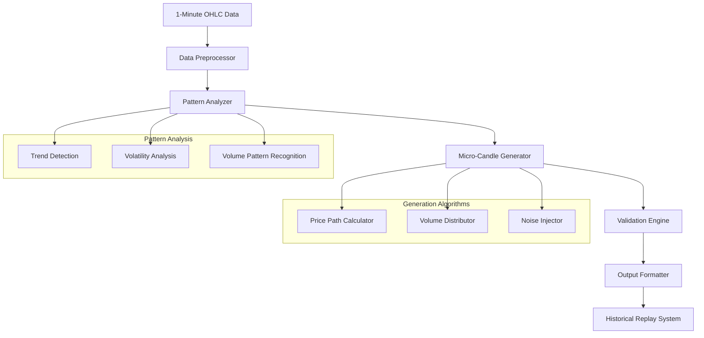

# Micro-Candle Generation Algorithm Design

## Overview

This document outlines the design for generating 10 micro-candles (6-second intervals) within each 1-minute candle, using the next candle's OHLC data to create realistic price movements for backtesting.

## Algorithm Design

### 1. Core Concept

The algorithm will transform 1-minute OHLC data into 10 micro-candles by:
- Using the current candle's open as the starting point
- Using the next candle's OHLC to determine the overall price movement direction
- Creating realistic price movements within the candle boundaries
- Distributing volume proportionally across micro-candles

### 2. Mathematical Model

#### Price Movement Calculation
```
Given:
- Current candle: O₁, H₁, L₁, C₁, V₁
- Next candle: O₂, H₂, L₂, C₂, V₂

Calculate trend direction:
trend = sign(C₂ - O₁)  # Overall price direction

Calculate price range:
price_range = max(H₁, H₂) - min(L₁, L₂)

Calculate volatility factor:
volatility = (H₁ - L₁) / O₁  # Current candle volatility
next_volatility = (H₂ - L₂) / O₂  # Next candle volatility
avg_volatility = (volatility + next_volatility) / 2
```

#### Micro-Candle Generation
```
For i = 1 to 10 (micro-candles):
  # Time distribution (6-second intervals)
  time_offset = i * 6 seconds
  
  # Price path calculation
  if trend > 0 (uptrend):
    base_price = O₁ + (C₂ - O₁) * (i / 10)
  else (downtrend):
    base_price = O₁ - (O₁ - C₂) * (i / 10)
  
  # Add realistic volatility
  noise = random_normal(0, avg_volatility * O₁ * 0.1)
  micro_price = base_price + noise
  
  # Ensure price stays within reasonable bounds
  micro_price = clamp(micro_price, min(L₁, L₂), max(H₁, H₂))
  
  # Volume distribution
  volume_weight = calculate_volume_distribution(i, V₁, V₂)
  micro_volume = V₁ * volume_weight
```

### 3. Volume Distribution Patterns

#### Pattern Types
1. **Front-loaded**: Higher volume at beginning (common in breakouts)
2. **Back-loaded**: Higher volume at end (common in reversals)
3. **U-shaped**: Higher volume at start and end
4. **Bell-shaped**: Higher volume in middle
5. **Random**: Random distribution with slight bias

#### Volume Distribution Algorithm
```
def calculate_volume_distribution(position, current_volume, next_volume):
  # Determine pattern based on price action
  if C₂ > H₁:  # Breakout
    pattern = "front_loaded"
  elif C₂ < L₁:  # Breakdown
    pattern = "front_loaded"
  elif abs(C₂ - O₁) < (H₁ - L₁) * 0.2:  # Consolidation
    pattern = "bell_shaped"
  else:
    pattern = "random"
  
  # Apply pattern weights
  weights = get_pattern_weights(pattern, position)
  
  # Blend current and next volume
  avg_volume = (current_volume + next_volume) / 2
  
  return weights[position] * avg_volume
```

### 4. Realistic Price Movement Patterns

#### Trend Following Pattern
```
if trend > 0 (uptrend):
  # Gradual rise with pullbacks
  for i in 1..10:
    if i % 3 == 0:  # Every 3rd micro-candle has pullback
      price_adjustment = -random_uniform(0, 0.002) * O₁
    else:
      price_adjustment = random_uniform(0, 0.001) * O₁
```

#### Mean Reversion Pattern
```
if abs(C₂ - O₁) < (H₁ - L₁) * 0.3:  # Range bound
  # Oscillate around mean
  mean_price = (H₁ + L₁) / 2
  for i in 1..10:
    oscillation = sin(i * π / 5) * (H₁ - L₁) * 0.3
    price_adjustment = oscillation
```

#### Volatility Expansion Pattern
```
if next_volatility > volatility * 1.5:  # Volatility expanding
  # Increasing price swings
  for i in 1..10:
    swing_magnitude = (i / 10) * avg_volatility * O₁ * 0.2
    price_adjustment = random_uniform(-swing_magnitude, swing_magnitude)
```

## Implementation Architecture

### 1. Data Flow



### 2. Core Components

#### MicroCandleGenerator Class
```python
class MicroCandleGenerator:
    def __init__(self, config: MicroCandleConfig):
        self.config = config
        self.pattern_analyzer = PatternAnalyzer()
        self.price_calculator = PricePathCalculator()
        self.volume_distributor = VolumeDistributor()
    
    def generate_micro_candles(self, current_candle: Candle, next_candle: Candle) -> List[MicroCandle]:
        # Analyze patterns
        pattern = self.pattern_analyzer.analyze(current_candle, next_candle)
        
        # Generate price path
        price_path = self.price_calculator.calculate_path(
            current_candle, next_candle, pattern
        )
        
        # Distribute volume
        volume_distribution = self.volume_distributor.distribute(
            current_candle.volume, next_candle.volume, pattern
        )
        
        # Create micro-candles
        micro_candles = []
        for i in range(10):
            micro_candle = MicroCandle(
                timestamp=current_candle.timestamp + timedelta(seconds=i * 6),
                open=price_path[i],
                high=max(price_path[i:i+2]),
                low=min(price_path[i:i+2]),
                close=price_path[i+1] if i < 9 else price_path[i],
                volume=volume_distribution[i]
            )
            micro_candles.append(micro_candle)
        
        return micro_candles
```

#### PatternAnalyzer Class
```python
class PatternAnalyzer:
    def analyze(self, current: Candle, next_candle: Candle) -> MarketPattern:
        # Calculate trend
        trend = self._calculate_trend(current, next_candle)
        
        # Calculate volatility
        volatility = self._calculate_volatility(current, next_candle)
        
        # Determine volume pattern
        volume_pattern = self._analyze_volume_pattern(current, next_candle)
        
        # Identify candlestick patterns
        candlestick_pattern = self._identify_candlestick_pattern(current, next_candle)
        
        return MarketPattern(
            trend=trend,
            volatility=volatility,
            volume_pattern=volume_pattern,
            candlestick_pattern=candlestick_pattern
        )
```

### 3. Configuration Options

#### MicroCandleConfig
```python
@dataclass
class MicroCandleConfig:
    # Generation parameters
    micro_candles_per_minute: int = 10
    noise_factor: float = 0.1  # Randomness in price movements
    volatility_smoothing: float = 0.5  # Smoothing between current and next volatility
    
    # Pattern preferences
    enable_trend_following: bool = True
    enable_mean_reversion: bool = True
    enable_volatility_expansion: bool = True
    
    # Volume distribution
    volume_pattern_weights: Dict[str, float] = field(default_factory=lambda: {
        "front_loaded": 0.3,
        "back_loaded": 0.2,
        "u_shaped": 0.2,
        "bell_shaped": 0.2,
        "random": 0.1
    })
    
    # Validation constraints
    max_price_deviation: float = 0.05  # 5% max deviation from OHLC bounds
    min_volume_per_micro: float = 0.01  # Minimum 1% of total volume per micro-candle
```

## Validation and Testing

### 1. Validation Rules

#### Price Validation
```
1. All micro-candle prices must be within [min(L₁, L₂), max(H₁, H₂)]
2. First micro-candle open must equal current candle open
3. Last micro-candle close must trend toward next candle open
4. High/Low of micro-candles must respect current candle boundaries
```

#### Volume Validation
```
1. Sum of micro-candle volumes must equal current candle volume
2. No micro-candle volume should be negative
3. Volume distribution should match identified pattern
4. Volume should correlate with price movements
```

#### Statistical Validation
```
1. Price volatility should match historical patterns
2. Micro-candle price changes should follow realistic distribution
3. Generated data should preserve autocorrelation properties
4. Micro-candle ranges should be proportional to overall range
```

### 2. Test Cases

#### Test Case 1: Trending Market
```
Input: 
- Current: O=100, H=102, L=99, C=101.5, V=10000
- Next: O=101.5, H=103, L=100.5, C=102.8, V=12000

Expected:
- Upward trend in micro-candles
- Volume front-loaded or evenly distributed
- Gradual price appreciation with minor pullbacks
```

#### Test Case 2: Reversal Market
```
Input:
- Current: O=100, H=101, L=99, C=99.2, V=8000
- Next: O=99.2, H=99.5, L=97, C=97.5, V=15000

Expected:
- Initial continuation of downtrend
- Strong reversal in later micro-candles
- Volume spike during reversal
```

#### Test Case 3: Consolidation Market
```
Input:
- Current: O=100, H=101, L=99, C=100.2, V=5000
- Next: O=100.2, H=101, L=99, C=99.8, V=6000

Expected:
- Oscillating price movements
- Bell-shaped volume distribution
- Range-bound behavior
```

## Performance Considerations

### 1. Optimization Strategies

#### Vectorized Calculations
- Use NumPy for bulk price calculations
- Vectorized random number generation
- Batch processing of multiple candles

#### Caching
- Cache pattern analysis results
- Pre-calculate common volume distributions
- Store generated micro-candles for reuse

#### Parallel Processing
- Process multiple symbols in parallel
- Parallel micro-candle generation for different timeframes
- Async I/O for data fetching

### 2. Memory Management

#### Data Structures
- Use efficient data structures for micro-candle storage
- Implement streaming generation for large datasets
- Memory-mapped files for historical data

#### Garbage Collection
- Regular cleanup of temporary objects
- Object pooling for frequently created instances
- Memory profiling and optimization

## Integration Points

### 1. Historical Replay System Integration

#### Modified ReplayController
```python
class EnhancedReplayController(ReplayController):
    def __init__(self):
        super().__init__()
        self.micro_candle_generator = MicroCandleGenerator()
    
    async def _process_candle_with_micros(self, session: ReplaySession, candle: Candle, next_candle: Candle):
        # Generate micro-candles
        micro_candles = self.micro_candle_generator.generate_micro_candles(candle, next_candle)
        
        # Process each micro-candle
        for micro_candle in micro_candles:
            await self._process_tick(session, micro_candle.to_tick())
```

### 2. N8N Integration

#### Enhanced Workflow Nodes
```json
{
  "name": "Process Micro-Candles",
  "type": "function",
  "parameters": {
    "jsCode": "// Process micro-candles for strategy\nconst microCandles = $json.micro_candles;\nconst signals = [];\n\nfor (const micro of microCandles) {\n  // Calculate indicators for micro-candle\n  const indicators = calculateIndicators(micro);\n  \n  // Generate signal\n  const signal = generateStrategySignal(micro, indicators);\n  \n  if (signal !== 'HOLD') {\n    signals.push({\n      timestamp: micro.timestamp,\n      signal: signal,\n      price: micro.close,\n      indicators: indicators\n    });\n  }\n}\n\nreturn [{ json: { signals: signals } }];"
  }
}
```

This design provides a comprehensive framework for generating realistic micro-candles that preserve the statistical properties of real market data while enabling more granular backtesting of trading strategies.