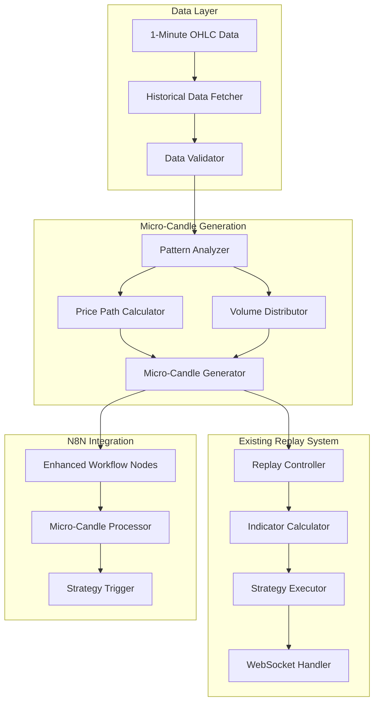

# Micro-Candle Integration Guide

## Overview

This guide explains how to integrate the micro-candle generation system with the existing historical replay system and N8N workflows for enhanced backtesting capabilities.

## Integration Architecture



## 1. Historical Replay System Integration

### 1.1 Enhanced Replay Controller

```python
# backend/fastapi/app/services/enhanced_replay_controller.py
import asyncio
from datetime import datetime, timedelta
from typing import Dict, List, Optional
from .replay_controller import ReplayController, ReplaySession
from .micro_candle_generator import MicroCandleGenerator, MicroCandleConfig
from .historical_data_fetcher import HistoricalDataFetcher, Candle

class EnhancedReplayController(ReplayController):
    def __init__(self, enable_micro_candles: bool = True):
        super().__init__()
        self.enable_micro_candles = enable_micro_candles
        self.micro_generator = MicroCandleGenerator()
        self.data_fetcher = None  # Will be initialized based on config
    
    async def start_replay_with_micro_candles(self, request: ReplayRequest) -> ReplaySession:
        """Start replay with micro-candle generation enabled"""
        # Initialize data fetcher if needed
        if self.data_fetcher is None:
            from .openalgo_data_source import OpenAlgoDataSource
            data_source = OpenAlgoDataSource(
                api_key=request.api_key,
                base_url=request.data_source_url
            )
            self.data_fetcher = HistoricalDataFetcher(data_source)
        
        # Fetch 1-minute data with buffer
        start_date = datetime.fromisoformat(request.start_date)
        end_date = datetime.fromisoformat(request.end_date)
        
        candles = await self.data_fetcher.fetch_with_buffer(
            request.symbol, start_date, end_date
        )
        
        # Generate micro-candles
        micro_candles = self.micro_generator.generate_batch(candles)
        
        # Create enhanced replay session
        session = ReplaySession(
            session_id=f"REPLAY_{datetime.now().strftime('%Y%m%d_%H%M%S')}",
            symbol=request.symbol,
            timeframe="6s",  # Micro-candle timeframe
            start_date=request.start_date,
            end_date=request.end_date,
            historical_data={
                'candles': candles,
                'micro_candles': micro_candles,
                'original_timeframe': request.timeframe
            },
            replay_speed=request.replay_speed,
            strategy_config=request.strategy_config,
            current_index=0,
            total_ticks=len(micro_candles),
            status="STARTED",
            started_at=datetime.utcnow(),
            micro_candle_mode=True
        )
        
        self.active_replays[session.session_id] = session
        
        # Start enhanced replay processing
        asyncio.create_task(self._process_micro_candle_replay(session.session_id))
        
        return session
    
    async def _process_micro_candle_replay(self, session_id: str):
        """Process replay with micro-candles"""
        session = self.active_replays[session_id]
        micro_candles = session.historical_data['micro_candles']
        
        while session.current_index < len(micro_candles) and session.status == "RUNNING":
            micro_candle = micro_candles[session.current_index]
            
            # Convert micro-candle to tick format
            tick = micro_candle.to_tick()
            
            # Process tick with enhanced indicator calculation
            await self._process_micro_tick(session, tick, micro_candle)
            
            # Update progress
            session.current_index += 1
            session.progress_percent = (session.current_index / len(micro_candles)) * 100
            
            # Broadcast to WebSocket
            await self._broadcast_micro_update(session, micro_candle)
            
            # Simulate real-time delay (6 seconds per micro-candle at 1x speed)
            if session.status == "RUNNING":
                delay = 6.0 / session.replay_speed
                await asyncio.sleep(delay)
        
        session.status = "COMPLETED"
        session.completed_at = datetime.utcnow()
    
    async def _process_micro_tick(self, session: ReplaySession, tick: Dict, micro_candle):
        """Process micro-candle as tick with enhanced calculations"""
        # Update current forming bar (could be multiple micro-candles per bar)
        current_bar = self._update_micro_bar(session, micro_candle)
        
        # Calculate indicators with micro-candle precision
        indicators = await self._calculate_micro_indicators(session, current_bar)
        
        # Store current state
        session.current_tick = tick
        session.current_bar = current_bar
        session.current_indicators = indicators
        
        # Trigger strategy evaluation
        if session.strategy_config:
            await self._evaluate_strategy(session, indicators)
    
    def _update_micro_bar(self, session: ReplaySession, micro_candle):
        """Update bar using micro-candle data"""
        original_timeframe = session.historical_data['original_timeframe']
        micro_time = datetime.fromisoformat(micro_candle.timestamp)
        
        # Calculate bar start time based on original timeframe
        bar_start = self._get_bar_start_time(micro_time, original_timeframe)
        
        # Check if we need to start a new bar
        if not hasattr(session, 'current_bar') or not session.current_bar:
            # Start new bar
            current_bar = {
                'timestamp': bar_start,
                'open': micro_candle.open,
                'high': micro_candle.high,
                'low': micro_candle.low,
                'close': micro_candle.close,
                'volume': micro_candle.volume,
                'micro_candles': [micro_candle]
            }
        else:
            # Update existing bar
            current_bar = session.current_bar
            bar_start_time = datetime.fromisoformat(current_bar['timestamp'])
            
            # Check if we need to start a new bar
            if (micro_time - bar_start_time).total_seconds() >= self._timeframe_to_minutes(original_timeframe) * 60:
                # Save previous bar and start new one
                self._save_completed_bar(session, current_bar)
                current_bar = {
                    'timestamp': bar_start,
                    'open': micro_candle.open,
                    'high': micro_candle.high,
                    'low': micro_candle.low,
                    'close': micro_candle.close,
                    'volume': micro_candle.volume,
                    'micro_candles': [micro_candle]
                }
            else:
                # Update current bar
                current_bar['high'] = max(current_bar['high'], micro_candle.high)
                current_bar['low'] = min(current_bar['low'], micro_candle.low)
                current_bar['close'] = micro_candle.close
                current_bar['volume'] += micro_candle.volume
                current_bar['micro_candles'].append(micro_candle)
        
        return current_bar
    
    async def _calculate_micro_indicators(self, session: ReplaySession, current_bar: Dict) -> Dict:
        """Calculate indicators with micro-candle precision"""
        # Get historical bars including micro-candles
        historical_bars = self._get_micro_historical_bars(session, current_bar, 200)
        
        # Use enhanced indicator calculator
        from .enhanced_indicator_calculator import EnhancedIndicatorCalculator
        calculator = EnhancedIndicatorCalculator()
        
        # Convert to DataFrame with micro-candle data
        import pandas as pd
        df = pd.DataFrame(historical_bars)
        
        # Calculate indicators based on strategy config
        indicators = {}
        if session.strategy_config:
            for indicator_config in session.strategy_config.get('indicators', []):
                config = IndicatorConfig(
                    name=indicator_config['name'],
                    type=IndicatorType(indicator_config['type']),
                    parameters=indicator_config['parameters']
                )
                calculator.add_indicator(session.symbol, config)
                
                # Calculate with micro-candle precision
                indicator_values = calculator._calculate_micro_indicator(df, config)
                indicators[indicator_config['name']] = indicator_values
        
        return indicators
```

### 1.2 Enhanced WebSocket Handler

```python
# backend/fastapi/app/websockets/enhanced_replay_websocket.py
from fastapi import WebSocket, WebSocketDisconnect
import json
import asyncio
from typing import Dict, List
from ..services.enhanced_replay_controller import EnhancedReplayController

class EnhancedReplayWebSocket:
    def __init__(self):
        self.connections: Dict[str, WebSocket] = {}
        self.controller = EnhancedReplayController()
    
    async def connect(self, websocket: WebSocket, session_id: str):
        """Handle WebSocket connection for enhanced replay"""
        await websocket.accept()
        self.connections[session_id] = websocket
        
        try:
            session = self.controller.active_replays.get(session_id)
            if session:
                await self._send_enhanced_session_update(websocket, session)
        except Exception as e:
            print(f"Error sending enhanced initial data: {e}")
    
    async def _send_enhanced_session_update(self, websocket: WebSocket, session):
        """Send enhanced session update with micro-candle info"""
        update_data = {
            "type": "enhanced_session_update",
            "session_id": session.session_id,
            "status": session.status,
            "progress": session.progress_percent,
            "current_timestamp": session.current_tick['timestamp'] if session.current_tick else None,
            "micro_candle_mode": getattr(session, 'micro_candle_mode', False),
            "original_timeframe": session.historical_data.get('original_timeframe', '1m'),
            "current_data": {
                "price": session.current_tick['price'] if session.current_tick else None,
                "volume": session.current_tick.get('volume', 0) if session.current_tick else 0,
                "indicators": session.current_indicators or {},
                "current_bar": session.current_bar or {},
                "micro_candles_in_bar": len(session.current_bar.get('micro_candles', [])) if session.current_bar else 0
            }
        }
        
        await websocket.send_text(json.dumps(update_data))
    
    async def broadcast_micro_update(self, session_id: str, micro_candle, indicators: Dict, bar: Dict):
        """Broadcast micro-candle update to connected clients"""
        if session_id not in self.connections:
            return
        
        websocket = self.connections[session_id]
        update_data = {
            "type": "micro_candle_update",
            "session_id": session_id,
            "timestamp": micro_candle.timestamp,
            "data": {
                "micro_candle": {
                    "open": micro_candle.open,
                    "high": micro_candle.high,
                    "low": micro_candle.low,
                    "close": micro_candle.close,
                    "volume": micro_candle.volume
                },
                "indicators": indicators,
                "current_bar": bar,
                "micro_candle_number": bar.get('micro_candles_in_bar', 0)
            }
        }
        
        await websocket.send_text(json.dumps(update_data))
```

## 2. N8N Integration

### 2.1 Enhanced N8N Workflow Nodes

```json
{
  "name": "Enhanced Historical Replay with Micro-Candles",
  "nodes": [
    {
      "parameters": {
        "path": "enhanced-replay-trigger",
        "responseMode": "responseNode",
        "options": {}
      },
      "name": "Enhanced Replay Trigger",
      "type": "n8n-nodes-base.webhook",
      "position": [240, 300]
    },
    {
      "parameters": {
        "mode": "manual",
        "jsCode": "// Enhanced replay configuration\nconst mode = $json.mode || 'micro_candle_backtest';\nconst symbol = $json.symbol || 'NIFTY 50';\nconst originalTimeframe = $json.original_timeframe || '1m';\nconst startDate = $json.start_date;\nconst endDate = $json.end_date;\nconst microCandleConfig = $json.micro_candle_config || {\n  micro_candles_per_minute: 10,\n  noise_factor: 0.1,\n  enable_trend_following: true,\n  enable_mean_reversion: true\n};\n\nreturn [{\n  json: {\n    mode: mode,\n    symbol: symbol,\n    original_timeframe: originalTimeframe,\n    start_date: startDate,\n    end_date: endDate,\n    micro_candle_config: microCandleConfig,\n    current_time: mode === 'backtest' ? startDate : new Date().toISOString()\n  }\n}];"
      },
      "name": "Configure Enhanced Replay",
      "type": "n8n-nodes-base.function",
      "position": [460, 300]
    },
    {
      "parameters": {
        "url": "http://localhost:8000/api/v1/micro-candle/generate",
        "sendBody": true,
        "bodyParameters": {
          "parameters": [
            {
              "name": "symbol",
              "value": "={{$json.symbol}}"
            },
            {
              "name": "start_date",
              "value": "={{$json.start_date}}"
            },
            {
              "name": "end_date",
              "value": "={{$json.end_date}}"
            },
            {
              "name": "config",
              "value": "={{$json.micro_candle_config}}"
            }
          ]
        }
      },
      "name": "Generate Micro-Candles",
      "type": "n8n-nodes-base.httpRequest",
      "position": [680, 300]
    },
    {
      "parameters": {
        "jsCode": "// Process micro-candles for strategy execution\nconst response = items[0].json;\nconst microCandles = response.micro_candles || [];\nconst symbol = response.symbol;\nconst originalTimeframe = response.original_timeframe;\n\n// Group micro-candles into original timeframe bars\nconst bars = [];\nlet currentBar = null;\n\nfor (const micro of microCandles) {\n  const microTime = new Date(micro.timestamp);\n  const barTime = getBarStartTime(microTime, originalTimeframe);\n  \n  if (!currentBar || currentBar.timestamp !== barTime) {\n    if (currentBar) {\n      bars.push(currentBar);\n    }\n    currentBar = {\n      timestamp: barTime,\n      open: micro.open,\n      high: micro.high,\n      low: micro.low,\n      close: micro.close,\n      volume: micro.volume,\n      micro_candles: [micro]\n    };\n  } else {\n    currentBar.high = Math.max(currentBar.high, micro.high);\n    currentBar.low = Math.min(currentBar.low, micro.low);\n    currentBar.close = micro.close;\n    currentBar.volume += micro.volume;\n    currentBar.micro_candles.push(micro);\n  }\n}\n\nif (currentBar) {\n  bars.push(currentBar);\n}\n\nfunction getBarStartTime(time, timeframe) {\n  const minutes = {\n    '1m': 1,\n    '5m': 5,\n    '15m': 15,\n    '30m': 30,\n    '1h': 60,\n    '4h': 240\n  }[timeframe] || 1;\n  \n  const totalMinutes = time.getHours() * 60 + time.getMinutes();\n  const barStartMinutes = Math.floor(totalMinutes / minutes) * minutes;\n  \n  const barStart = new Date(time);\n  barStart.setHours(Math.floor(barStartMinutes / 60));\n  barStart.setMinutes(barStartMinutes % 60);\n  barStart.setSeconds(0);\n  barStart.setMilliseconds(0);\n  \n  return barStart;\n}\n\nreturn bars.map(bar => ({\n  json: {\n    symbol: symbol,\n    timestamp: bar.timestamp.toISOString(),\n    open: bar.open,\n    high: bar.high,\n    low: bar.low,\n    close: bar.close,\n    volume: bar.volume,\n    micro_candles: bar.micro_candles,\n    micro_candle_count: bar.micro_candles.length\n  }\n}));"
      },
      "name": "Process Micro-Candles",
      "type": "n8n-nodes-base.function",
      "position": [900, 300]
    }
  ]
}
```

### 2.2 Micro-Candle Strategy Node

```json
{
  "name": "Micro-Candle Strategy Executor",
  "parameters": {
    "jsCode": "// Enhanced strategy execution with micro-candle precision\nconst bar = items[0].json;\nconst microCandles = bar.micro_candles || [];\nconst strategyConfig = $json.strategy_config || {};\n\n// Strategy parameters\nconst STRATEGY_TYPE = strategyConfig.type || 'trend_following';\nconst MICRO_CANDLE_SENSITIVITY = strategyConfig.micro_sensitivity || 0.5;\nconst MIN_MICROS_FOR_SIGNAL = strategyConfig.min_micros_for_signal || 3;\n\nlet signals = [];\nlet cumulativeIndicators = {};\n\n// Process each micro-candle\nfor (let i = 0; i < microCandles.length; i++) {\n  const micro = microCandles[i];\n  \n  // Calculate micro-indicators\n  const microIndicators = calculateMicroIndicators(microCandles.slice(0, i + 1), bar);\n  \n  // Generate signal based on micro-candle patterns\n  const signal = generateMicroSignal(micro, microIndicators, i, microCandles.length);\n  \n  if (signal && i >= MIN_MICROS_FOR_SIGNAL) {\n    signals.push({\n      timestamp: micro.timestamp,\n      signal: signal.action,\n      confidence: signal.confidence,\n      reason: signal.reason,\n      price: micro.close,\n      micro_candle_number: i + 1,\n      micro_indicators: microIndicators,\n      bar_context: {\n        bar_open: bar.open,\n        bar_high: bar.high,\n        bar_low: bar.low,\n        bar_volume: bar.volume\n      }\n    });\n  }\n  \n  cumulativeIndicators = microIndicators;\n}\n\nfunction calculateMicroIndicators(micros, fullBar) {\n  const prices = micros.map(m => m.close);\n  const volumes = micros.map(m => m.volume);\n  \n  // Simple moving averages on micro-candles\n  const ema5 = calculateEMA(prices, 5);\n  const ema10 = calculateEMA(prices, 10);\n  \n  // Micro RSI\n  const rsi = calculateRSI(prices, 14);\n  \n  // Volume analysis\n  const avgVolume = volumes.reduce((a, b) => a + b, 0) / volumes.length;\n  const volumeSpike = volumes[volumes.length - 1] > avgVolume * 1.5;\n  \n  return {\n    ema_5: ema5[ema5.length - 1] || fullBar.open,\n    ema_10: ema10[ema10.length - 1] || fullBar.open,\n    rsi: rsi[rsi.length - 1] || 50,\n    volume_spike: volumeSpike,\n    price_momentum: prices.length > 1 ? (prices[prices.length - 1] - prices[0]) / prices[0] : 0\n  };\n}\n\nfunction generateMicroSignal(micro, indicators, index, totalMicros) {\n  // Trend following on micro-candles\n  if (STRATEGY_TYPE === 'trend_following') {\n    const emaCross = indicators.ema_5 > indicators.ema_10;\n    const momentum = indicators.price_momentum;\n    const volumeConfirm = indicators.volume_spike;\n    \n    if (emaCross && momentum > 0.001 && volumeConfirm) {\n      return {\n        action: 'BUY',\n        confidence: 'HIGH',\n        reason: `Micro EMA crossover with momentum ${(momentum * 100).toFixed(3)}% and volume spike`\n      };\n    } else if (!emaCross && momentum < -0.001 && volumeConfirm) {\n      return {\n        action: 'SELL',\n        confidence: 'HIGH',\n        reason: `Micro EMA crossunder with momentum ${(momentum * 100).toFixed(3)}% and volume spike`\n      };\n    }\n  }\n  \n  // Mean reversion on micro-candles\n  else if (STRATEGY_TYPE === 'mean_reversion') {\n    const rsi = indicators.rsi;\n    const position = (micro.close - fullBar.low) / (fullBar.high - fullBar.low);\n    \n    if (rsi < 30 && position < 0.2) {\n      return {\n        action: 'BUY',\n        confidence: 'MEDIUM',\n        reason: `Micro oversold: RSI ${rsi.toFixed(1)}, position ${(position * 100).toFixed(1)}%`\n      };\n    } else if (rsi > 70 && position > 0.8) {\n      return {\n        action: 'SELL',\n        confidence: 'MEDIUM',\n        reason: `Micro overbought: RSI ${rsi.toFixed(1)}, position ${(position * 100).toFixed(1)}%`\n      };\n    }\n  }\n  \n  return null;\n}\n\n// Helper functions\nfunction calculateEMA(prices, period) {\n  const ema = [];\n  const multiplier = 2 / (period + 1);\n  \n  for (let i = 0; i < prices.length; i++) {\n    if (i === 0) {\n      ema[i] = prices[i];\n    } else {\n      ema[i] = (prices[i] - ema[i - 1]) * multiplier + ema[i - 1];\n    }\n  }\n  \n  return ema;\n}\n\nfunction calculateRSI(prices, period) {\n  const rsi = [];\n  \n  for (let i = period; i < prices.length; i++) {\n    const gains = [];\n    const losses = [];\n    \n    for (let j = i - period + 1; j <= i; j++) {\n      const change = prices[j] - prices[j - 1];\n      if (change > 0) {\n        gains.push(change);\n        losses.push(0);\n      } else {\n        gains.push(0);\n        losses.push(Math.abs(change));\n      }\n    }\n    \n    const avgGain = gains.reduce((a, b) => a + b, 0) / period;\n    const avgLoss = losses.reduce((a, b) => a + b, 0) / period;\n    \n    const rs = avgGain / avgLoss;\n    rsi.push(100 - (100 / (1 + rs)));\n  }\n  \n  return rsi;\n}\n\nreturn [{\n  json: {\n    symbol: bar.symbol,\n    timestamp: bar.timestamp,\n    bar_data: bar,\n    micro_signals: signals,\n    final_indicators: cumulativeIndicators,\n    total_micro_candles: microCandles.length,\n    signals_generated: signals.length\n  }\n}];"
      },
      "name": "Execute Micro Strategy",
      "type": "n8n-nodes-base.function",
      "position": [1120, 300]
    }
  ]
}
```

## 3. Frontend Integration

### 3.1 Enhanced Chart Component

```typescript
// frontend/src/components/EnhancedTradingChart.tsx
import React, { useEffect, useRef, useState } from 'react';
import { createChart, IChartApi, ISeriesApi, Time } from 'lightweight-charts';

interface MicroCandleData {
  time: Time;
  open: number;
  high: number;
  low: number;
  close: number;
  volume: number;
  isMicroCandle: boolean;
}

interface EnhancedChartProps {
  symbol: string;
  data: MicroCandleData[];
  showMicroCandles: boolean;
  onSignalGenerated: (signal: any) => void;
}

const EnhancedTradingChart: React.FC<EnhancedChartProps> = ({
  symbol,
  data,
  showMicroCandles,
  onSignalGenerated
}) => {
  const chartContainerRef = useRef<HTMLDivElement>(null);
  const chartRef = useRef<IChartApi | null>(null);
  const candleSeriesRef = useRef<ISeriesApi<'Candlestick'> | null>(null);
  const microSeriesRef = useRef<ISeriesApi<'Candlestick'> | null>(null);
  const volumeSeriesRef = useRef<ISeriesApi<'Histogram'> | null>(null);
  
  const [chartType, setChartType] = useState<'candlestick' | 'line'>('candlestick');
  const [timeframe, setTimeframe] = useState('1m');

  useEffect(() => {
    if (!chartContainerRef.current) return;

    // Create chart
    const chart = createChart(chartContainerRef.current, {
      width: chartContainerRef.current.clientWidth,
      height: 500,
      layout: {
        background: { color: '#ffffff' },
        textColor: '#333',
      },
      grid: {
        vertLines: { color: '#f0f0f0' },
        horzLines: { color: '#f0f0f0' },
      },
      crosshair: {
        mode: 0,
      },
      timeScale: {
        borderColor: '#cccccc',
        timeVisible: true,
        secondsVisible: showMicroCandles,
      },
      rightPriceScale: {
        borderColor: '#cccccc',
      },
    });

    // Add candlestick series for regular candles
    const candleSeries = chart.addCandlestickSeries({
      upColor: '#26a69a',
      downColor: '#ef5350',
      borderVisible: false,
      wickUpColor: '#26a69a',
      wickDownColor: '#ef5350',
    });

    // Add micro-candle series (thinner, semi-transparent)
    const microSeries = chart.addCandlestickSeries({
      upColor: 'rgba(38, 166, 154, 0.3)',
      downColor: 'rgba(239, 83, 80, 0.3)',
      borderVisible: false,
      wickUpColor: 'rgba(38, 166, 154, 0.3)',
      wickDownColor: 'rgba(239, 83, 80, 0.3)',
    });

    // Add volume series
    const volumeSeries = chart.addHistogramSeries({
      color: '#2196f3',
      priceFormat: {
        type: 'volume',
      },
      priceScaleId: 'volume',
      scaleMargins: {
        top: 0.8,
        bottom: 0,
      },
    });

    chartRef.current = chart;
    candleSeriesRef.current = candleSeries;
    microSeriesRef.current = microSeries;
    volumeSeriesRef.current = volumeSeries;

    // Handle resize
    const handleResize = () => {
      if (chartContainerRef.current && chartRef.current) {
        chartRef.current.applyOptions({
          width: chartContainerRef.current.clientWidth,
        });
      }
    };

    window.addEventListener('resize', handleResize);

    return () => {
      window.removeEventListener('resize', handleResize);
      chart.remove();
    };
  }, []);

  useEffect(() => {
    if (!candleSeriesRef.current || !microSeriesRef.current || !volumeSeriesRef.current) return;

    // Separate regular candles and micro-candles
    const regularCandles = data.filter(d => !d.isMicroCandle);
    const microCandles = data.filter(d => d.isMicroCandle);

    // Update regular candle series
    candleSeriesRef.current.setData(regularCandles);

    // Update micro-candle series based on visibility
    if (showMicroCandles) {
      microSeriesRef.current.setData(microCandles);
    } else {
      microSeriesRef.current.setData([]);
    }

    // Update volume series
    volumeSeriesRef.current.setData(data.map(d => ({
      time: d.time,
      value: d.volume,
      color: d.close >= d.open ? 'rgba(38, 166, 154, 0.5)' : 'rgba(239, 83, 80, 0.5)',
    })));
  }, [data, showMicroCandles]);

  const toggleMicroCandles = () => {
    // This would be handled by parent component
    // setshowMicroCandles(!showMicroCandles);
  };

  const changeTimeframe = (newTimeframe: string) => {
    setTimeframe(newTimeframe);
    // Fetch new data for this timeframe
  };

  return (
    <div className="enhanced-chart-container">
      <div className="chart-controls">
        <div className="timeframe-selector">
          <button onClick={() => changeTimeframe('1m')} className={timeframe === '1m' ? 'active' : ''}>1m</button>
          <button onClick={() => changeTimeframe('5m')} className={timeframe === '5m' ? 'active' : ''}>5m</button>
          <button onClick={() => changeTimeframe('15m')} className={timeframe === '15m' ? 'active' : ''}>15m</button>
          <button onClick={() => changeTimeframe('1h')} className={timeframe === '1h' ? 'active' : ''}>1h</button>
        </div>
        
        <div className="chart-options">
          <label>
            <input
              type="checkbox"
              checked={showMicroCandles}
              onChange={toggleMicroCandles}
            />
            Show Micro-Candles
          </label>
          
          <select value={chartType} onChange={(e) => setChartType(e.target.value as any)}>
            <option value="candlestick">Candlestick</option>
            <option value="line">Line</option>
          </select>
        </div>
      </div>
      
      <div ref={chartContainerRef} className="chart-container" />
      
      <div className="chart-info">
        <h3>{symbol} - Enhanced Chart</h3>
        <p>Regular Candles: {data.filter(d => !d.isMicroCandle).length}</p>
        <p>Micro-Candles: {data.filter(d => d.isMicroCandle).length}</p>
        <p>Total Data Points: {data.length}</p>
      </div>
    </div>
  );
};

export default EnhancedTradingChart;
```

## 4. Testing and Validation

### 4.1 Micro-Candle Validation Tests

```python
# tests/test_micro_candle_validation.py
import pytest
from datetime import datetime, timedelta
from backend.fastapi.app.services.micro_candle_generator import MicroCandleGenerator
from backend.fastapi.app.services.historical_data_fetcher import Candle
from backend.fastapi.app.services.data_validator import DataValidator

class TestMicroCandleValidation:
    def setup_method(self):
        self.generator = MicroCandleGenerator()
    
    def test_trending_market_micro_candles(self):
        """Test micro-candle generation in trending market"""
        # Create trending candles
        current = Candle(
            timestamp=datetime(2023, 1, 1, 9, 15, 0),
            open=100.0,
            high=102.0,
            low=99.5,
            close=101.5,
            volume=10000,
            symbol="TEST",
            timeframe="1m"
        )
        
        next_candle = Candle(
            timestamp=datetime(2023, 1, 1, 9, 16, 0),
            open=101.5,
            high=103.0,
            low=100.5,
            close=102.8,
            volume=12000,
            symbol="TEST",
            timeframe="1m"
        )
        
        # Generate micro-candles
        micro_candles = self.generator.generate_micro_candles(current, next_candle)
        
        # Validate
        assert len(micro_candles) == 10
        
        # Check price bounds
        for micro in micro_candles:
            assert micro.low >= min(current.low, next_candle.low)
            assert micro.high <= max(current.high, next_candle.high)
        
        # Check trend direction
        assert micro_candles[-1].close > micro_candles[0].open
        
        # Check volume distribution
        total_volume = sum(m.volume for m in micro_candles)
        assert abs(total_volume - current.volume) < current.volume * 0.01  # 1% tolerance
    
    def test_sideways_market_micro_candles(self):
        """Test micro-candle generation in sideways market"""
        # Create sideways candles
        current = Candle(
            timestamp=datetime(2023, 1, 1, 9, 15, 0),
            open=100.0,
            high=100.8,
            low=99.2,
            close=100.2,
            volume=8000,
            symbol="TEST",
            timeframe="1m"
        )
        
        next_candle = Candle(
            timestamp=datetime(2023, 1, 1, 9, 16, 0),
            open=100.2,
            high=100.5,
            low=99.5,
            close=99.8,
            volume=9000,
            symbol="TEST",
            timeframe="1m"
        )
        
        # Generate micro-candles
        micro_candles = self.generator.generate_micro_candles(current, next_candle)
        
        # Validate oscillating behavior
        price_changes = [micro.close - micro.open for micro in micro_candles]
        positive_changes = sum(1 for change in price_changes if change > 0)
        negative_changes = sum(1 for change in price_changes if change < 0)
        
        # Should have both up and down movements
        assert positive_changes > 0
        assert negative_changes > 0
    
    def test_volume_pattern_validation(self):
        """Test volume pattern generation"""
        # Test breakout pattern (front-loaded volume)
        current = Candle(
            timestamp=datetime(2023, 1, 1, 9, 15, 0),
            open=100.0,
            high=101.0,
            low=99.5,
            close=100.8,
            volume=5000,
            symbol="TEST",
            timeframe="1m"
        )
        
        next_candle = Candle(
            timestamp=datetime(2023, 1, 1, 9, 16, 0),
            open=100.8,
            high=103.0,
            low=100.5,
            close=102.5,
            volume=15000,  # Volume spike
            symbol="TEST",
            timeframe="1m"
        )
        
        # Generate micro-candles
        micro_candles = self.generator.generate_micro_candles(current, next_candle)
        
        # Check front-loaded volume pattern
        first_half_volume = sum(m.volume for m in micro_candles[:5])
        second_half_volume = sum(m.volume for m in micro_candles[5:])
        
        # First half should have more volume in breakout
        assert first_half_volume > second_half_volume
```

This integration guide provides comprehensive instructions for connecting the micro-candle generation system with existing components, enabling enhanced backtesting capabilities with realistic intraday price movements.