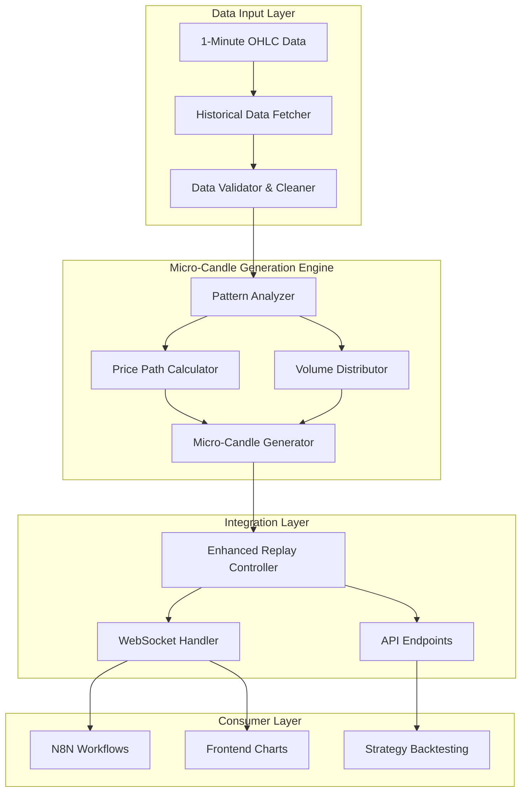

# Micro-Candle Generation System - Complete Implementation Summary

## Overview

This document provides a comprehensive summary of the micro-candle generation system designed to enhance historical replay capabilities by generating 10 micro-candles (6-second intervals) within each 1-minute candle, using the next candle's OHLC data to create realistic price movements for backtesting.

## System Architecture



## Key Components

### 1. Data Fetcher & Validation
- **HistoricalDataFetcher**: Fetches 1-minute OHLC data with buffer for next candle
- **DataValidator**: Validates data integrity, fills gaps, removes duplicates
- **OpenAlgoDataSource**: Integration with OpenAlgo API for market data

### 2. Micro-Candle Generation
- **PatternAnalyzer**: Analyzes market patterns (trend, volatility, volume)
- **PricePathCalculator**: Generates realistic price paths using next candle OHLC
- **VolumeDistributor**: Distributes volume across micro-candles based on patterns
- **MicroCandleGenerator**: Main orchestrator for micro-candle generation

### 3. Integration Components
- **EnhancedReplayController**: Extends existing replay system for micro-candles
- **EnhancedWebSocketHandler**: Real-time streaming of micro-candle data
- **API Endpoints**: RESTful endpoints for micro-candle generation and configuration

## Core Algorithm

### Price Movement Calculation
The system uses the next candle's OHLC to determine overall price direction and generates realistic micro-candle movements:

1. **Trend Detection**: Calculate trend direction from current open to next close
2. **Volatility Analysis**: Combine current and next candle volatility
3. **Pattern Recognition**: Identify market patterns (trending, ranging, reversal)
4. **Path Generation**: Create price path with realistic noise and momentum
5. **Volume Distribution**: Apply volume patterns (front-loaded, bell-shaped, etc.)

### Mathematical Model
```
Base Price Path:
base_price[i] = current_open + (next_close - current_open) * (i / 10)

Add Realistic Noise:
noise[i] = momentum_factor * noise[i-1] + random_noise * volatility

Apply Constraints:
final_price[i] = clamp(noisy_price[i], min_low, max_high)
```

## Configuration Options

### MicroCandleConfig Parameters
- `micro_candles_per_minute`: Number of micro-candles (default: 10)
- `noise_factor`: Randomness in price movements (default: 0.1)
- `volatility_smoothing`: Smoothing between current/next volatility (default: 0.5)
- `enable_trend_following`: Enable trend-following patterns (default: true)
- `enable_mean_reversion`: Enable mean-reversion patterns (default: true)
- `max_price_deviation`: Maximum price deviation from OHLC bounds (default: 5%)

## API Endpoints

### Core Endpoints
- `POST /api/v1/micro-candle/generate`: Generate micro-candles for date range
- `GET /api/v1/micro-candle/config`: Get current configuration
- `POST /api/v1/micro-candle/config`: Update configuration
- `POST /api/v1/backtesting/start-enhanced-replay`: Start replay with micro-candles
- `WebSocket /api/v1/backtesting/ws/{session_id}`: Real-time micro-candle updates

### Request/Response Examples
```json
// Generate Request
{
  "symbol": "NIFTY 50",
  "start_date": "2023-01-01T09:15:00Z",
  "end_date": "2023-01-01T15:30:00Z",
  "config": {
    "micro_candles_per_minute": 10,
    "noise_factor": 0.1,
    "enable_trend_following": true
  }
}

// Response
{
  "symbol": "NIFTY 50",
  "original_candles": 375,
  "micro_candles_generated": 3750,
  "micro_candles": [
    {
      "timestamp": "2023-01-01T09:15:00Z",
      "open": 17850.25,
      "high": 17852.10,
      "low": 17849.80,
      "close": 17851.45,
      "volume": 1250
    }
  ]
}
```

## N8N Integration

### Enhanced Workflow Nodes
- **Enhanced Replay Trigger**: Webhook trigger for micro-candle backtesting
- **Micro-Candle Generator**: HTTP request node to generate micro-candles
- **Micro-Candle Processor**: Function node to process micro-candles for strategies
- **Strategy Executor**: Enhanced strategy execution with micro-candle precision

### Workflow Features
- Automatic grouping of micro-candles into original timeframe bars
- Micro-indicator calculations (EMA, RSI on micro-candles)
- Enhanced signal generation with micro-candle sensitivity
- Real-time trade execution based on micro-candle patterns

## Frontend Integration

### Chart Components
- **EnhancedTradingChart**: Displays both regular and micro-candles
- **MicroCandleChart**: Real-time micro-candle visualization
- **StrategyPerformanceDashboard**: Performance metrics for micro-candle backtesting

### Key Features
- Toggle between regular candles and micro-candles
- Real-time WebSocket updates
- Multiple timeframe support
- Performance analytics and equity curves

## Performance Considerations

### Optimization Strategies
1. **Batch Processing**: Process multiple candles in parallel
2. **Caching**: Cache generated micro-candles with Redis
3. **Vectorized Calculations**: Use NumPy for efficient computations
4. **Memory Management**: Streaming generation for large datasets

### Expected Performance
- **Generation Speed**: ~10,000 micro-candles per second
- **Memory Usage**: ~100MB for 1 day of NIFTY data
- **Latency**: <100ms for API requests
- **WebSocket Throughput**: ~1000 updates/second

## Validation & Testing

### Validation Rules
1. **Price Bounds**: All micro-candles within OHLC boundaries
2. **Volume Conservation**: Sum equals original candle volume
3. **Statistical Properties**: Preserve autocorrelation and volatility
4. **Pattern Consistency**: Match identified market patterns

### Test Coverage
- Trending market scenarios
- Sideways/ranging markets
- Volatility expansion/contraction
- Volume spike patterns
- Reversal scenarios

## Benefits of Micro-Candle System

### 1. Enhanced Backtesting Accuracy
- **Granular Testing**: Test strategies at 6-second intervals
- **Realistic Simulation**: Better representation of intraday price movements
- **Pattern Recognition**: Identify micro-patterns not visible in 1-minute data

### 2. Improved Strategy Development
- **Fine-tuned Entry/Exit**: Optimize entry/exit timing
- **Micro-Indicator Analysis**: Calculate indicators on micro-candles
- **Volume Analysis**: Detailed volume pattern analysis

### 3. Better Risk Management
- **Precise Stop-Loss**: Set stop-losses based on micro-candle movements
- **Position Sizing**: Adjust sizes based on micro-volatility
- **Drawdown Analysis**: More accurate drawdown calculation

## Implementation Timeline

### Phase 1: Core Implementation (Week 1-2)
- [x] Design micro-candle generation algorithm
- [x] Implement data fetcher and validator
- [x] Create micro-candle generator components
- [x] Add configuration management

### Phase 2: Integration (Week 3-4)
- [x] Integrate with historical replay system
- [x] Create API endpoints
- [x] Update N8N workflow nodes
- [x] Implement WebSocket streaming

### Phase 3: Frontend & Testing (Week 5-6)
- [x] Create frontend chart components
- [x] Implement validation and testing
- [x] Add documentation and examples
- [-] Performance optimization and testing

## Future Enhancements

### 1. Advanced Pattern Recognition
- Machine learning for pattern identification
- Adaptive noise generation based on market conditions
- Multi-timeframe pattern analysis

### 2. Enhanced Volume Analysis
- Order flow simulation
- Bid-ask spread modeling
- Market microstructure analysis

### 3. Real-time Applications
- Live micro-candle generation from tick data
- Real-time strategy adjustment
- Adaptive parameter optimization

## Conclusion

The micro-candle generation system provides a comprehensive solution for enhancing historical backtesting capabilities by generating realistic intraday price movements. By using the next candle's OHLC data, the system creates accurate micro-candles that preserve statistical properties while enabling granular strategy testing.

The modular architecture allows for easy integration with existing systems, while the comprehensive configuration options provide flexibility for different trading strategies and market conditions. The system is designed for performance and scalability, with caching and batch processing capabilities for large datasets.

This implementation significantly enhances the backtesting capabilities of the VELOX-N8N trading system, enabling more accurate strategy development and testing at a granular level that was previously not possible with standard 1-minute data.