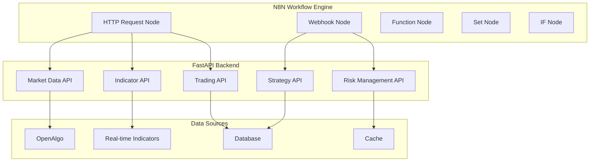

# N8N API Integration Strategy

## Overview

Instead of developing custom N8N nodes, we'll focus on building a comprehensive REST API that N8N can consume using its built-in HTTP Request and Webhook nodes. This approach is more maintainable, faster to implement, and leverages N8N's native capabilities.

## Architecture



## API Design for N8N Integration

### 1. Market Data APIs

```python
# backend/fastapi/app/api/market_data.py
from fastapi import APIRouter, HTTPException
from typing import List, Optional
from app.schemas.market_data import MarketDataRequest, MarketDataResponse
from app.services.market_data_service import MarketDataService

router = APIRouter(prefix="/api/v1/market-data", tags=["market-data"])

@router.get("/current/{symbol}")
async def get_current_data(symbol: str, exchange: str = "NSE") -> MarketDataResponse:
    """Get current market data for a symbol"""
    service = MarketDataService()
    return await service.get_current_data(symbol, exchange)

@router.get("/historical/{symbol}")
async def get_historical_data(
    symbol: str,
    timeframe: str = "1m",
    periods: int = 100,
    exchange: str = "NSE"
) -> List[MarketDataResponse]:
    """Get historical market data"""
    service = MarketDataService()
    return await service.get_historical_data(symbol, timeframe, periods, exchange)

@router.post("/scan")
async def scan_markets(scan_request: MarketScanRequest) -> List[MarketDataResponse]:
    """Scan markets based on criteria"""
    service = MarketDataService()
    return await service.scan_markets(scan_request)

@router.get("/watchlist")
async def get_watchlist(user_id: int) -> List[MarketDataResponse]:
    """Get watchlist data for user"""
    service = MarketDataService()
    return await service.get_watchlist(user_id)
```

### 2. Real-Time Indicator APIs

```python
# backend/fastapi/app/api/indicators.py
from fastapi import APIRouter, WebSocket, WebSocketDisconnect
from typing import List, Dict, Optional
from app.schemas.indicators import IndicatorRequest, IndicatorResponse
from app.services.indicator_service import IndicatorService

router = APIRouter(prefix="/api/v1/indicators", tags=["indicators"])

@router.post("/calculate")
async def calculate_indicators(request: IndicatorRequest) -> IndicatorResponse:
    """Calculate indicators for given data"""
    service = IndicatorService()
    return await service.calculate_indicators(request)

@router.get("/realtime/{symbol}")
async def get_realtime_indicators(
    symbol: str,
    indicators: List[str],
    timeframe: str = "1m"
) -> Dict:
    """Get real-time indicator values"""
    service = IndicatorService()
    return await service.get_realtime_indicators(symbol, indicators, timeframe)

@router.get("/history/{symbol}")
async def get_indicator_history(
    symbol: str,
    indicator: str,
    periods: int = 100,
    timeframe: str = "1m"
) -> Dict:
    """Get historical indicator values"""
    service = IndicatorService()
    return await service.get_indicator_history(symbol, indicator, periods, timeframe)

@router.post("/compare")
async def compare_indicators(request: IndicatorCompareRequest) -> Dict:
    """Compare indicators across multiple symbols"""
    service = IndicatorService()
    return await service.compare_indicators(request)

@router.get("/signals/{symbol}")
async def get_indicator_signals(
    symbol: str,
    strategy: str,
    timeframe: str = "1m"
) -> Dict:
    """Get trading signals based on indicators"""
    service = IndicatorService()
    return await service.get_indicator_signals(symbol, strategy, timeframe)
```

### 3. Trading Execution APIs

```python
# backend/fastapi/app/api/trading.py
from fastapi import APIRouter, HTTPException
from typing import List, Optional
from app.schemas.trading import OrderRequest, OrderResponse, PositionResponse
from app.services.trading_service import TradingService

router = APIRouter(prefix="/api/v1/trading", tags=["trading"])

@router.post("/orders", response_model=OrderResponse)
async def place_order(order: OrderRequest) -> OrderResponse:
    """Place a trading order"""
    service = TradingService()
    return await service.place_order(order)

@router.get("/orders/{order_id}")
async def get_order(order_id: str) -> OrderResponse:
    """Get order details"""
    service = TradingService()
    return await service.get_order(order_id)

@router.put("/orders/{order_id}")
async def modify_order(order_id: str, modifications: OrderModification) -> OrderResponse:
    """Modify existing order"""
    service = TradingService()
    return await service.modify_order(order_id, modifications)

@router.delete("/orders/{order_id}")
async def cancel_order(order_id: str) -> OrderResponse:
    """Cancel order"""
    service = TradingService()
    return await service.cancel_order(order_id)

@router.get("/positions")
async def get_positions(user_id: Optional[int] = None) -> List[PositionResponse]:
    """Get current positions"""
    service = TradingService()
    return await service.get_positions(user_id)

@router.get("/positions/{symbol}")
async def get_symbol_positions(symbol: str) -> List[PositionResponse]:
    """Get positions for specific symbol"""
    service = TradingService()
    return await service.get_symbol_positions(symbol)

@router.get("/trades")
async def get_trade_history(
    user_id: Optional[int] = None,
    symbol: Optional[str] = None,
    limit: int = 100
) -> List[TradeResponse]:
    """Get trade history"""
    service = TradingService()
    return await service.get_trade_history(user_id, symbol, limit)
```

### 4. Risk Management APIs

```python
# backend/fastapi/app/api/risk.py
from fastapi import APIRouter
from typing import List, Dict
from app.schemas.risk import RiskCheckRequest, RiskResponse, PositionSizeRequest
from app.services.risk_service import RiskService

router = APIRouter(prefix="/api/v1/risk", tags=["risk"])

@router.post("/check")
async def check_risk(request: RiskCheckRequest) -> RiskResponse:
    """Check if trade passes risk criteria"""
    service = RiskService()
    return await service.check_risk(request)

@router.post("/position-size")
async def calculate_position_size(request: PositionSizeRequest) -> Dict:
    """Calculate optimal position size"""
    service = RiskService()
    return await service.calculate_position_size(request)

@router.get("/portfolio-risk/{user_id}")
async def get_portfolio_risk(user_id: int) -> Dict:
    """Get portfolio-level risk metrics"""
    service = RiskService()
    return await service.get_portfolio_risk(user_id)

@router.get("/limits/{user_id}")
async def get_risk_limits(user_id: int) -> Dict:
    """Get user's risk limits"""
    service = RiskService()
    return await service.get_risk_limits(user_id)

@router.post("/stop-loss")
async def calculate_stop_loss(request: StopLossRequest) -> Dict:
    """Calculate optimal stop loss levels"""
    service = RiskService()
    return await service.calculate_stop_loss(request)

@router.post("/take-profit")
async def calculate_take_profit(request: TakeProfitRequest) -> Dict:
    """Calculate optimal take profit levels"""
    service = RiskService()
    return await service.calculate_take_profit(request)
```

### 5. Strategy Management APIs

```python
# backend/fastapi/app/api/strategies.py
from fastapi import APIRouter, HTTPException
from typing import List, Optional
from app.schemas.strategies import StrategyRequest, StrategyResponse, StrategyPerformance
from app.services.strategy_service import StrategyService

router = APIRouter(prefix="/api/v1/strategies", tags=["strategies"])

@router.post("/", response_model=StrategyResponse)
async def create_strategy(strategy: StrategyRequest) -> StrategyResponse:
    """Create a new trading strategy"""
    service = StrategyService()
    return await service.create_strategy(strategy)

@router.get("/", response_model=List[StrategyResponse])
async def list_strategies(user_id: Optional[int] = None) -> List[StrategyResponse]:
    """List all strategies"""
    service = StrategyService()
    return await service.list_strategies(user_id)

@router.get("/{strategy_id}", response_model=StrategyResponse)
async def get_strategy(strategy_id: int) -> StrategyResponse:
    """Get strategy details"""
    service = StrategyService()
    return await service.get_strategy(strategy_id)

@router.put("/{strategy_id}", response_model=StrategyResponse)
async def update_strategy(strategy_id: int, strategy: StrategyRequest) -> StrategyResponse:
    """Update strategy"""
    service = StrategyService()
    return await service.update_strategy(strategy_id, strategy)

@router.delete("/{strategy_id}")
async def delete_strategy(strategy_id: int) -> Dict:
    """Delete strategy"""
    service = StrategyService()
    return await service.delete_strategy(strategy_id)

@router.post("/{strategy_id}/start")
async def start_strategy(strategy_id: int) -> Dict:
    """Start strategy execution"""
    service = StrategyService()
    return await service.start_strategy(strategy_id)

@router.post("/{strategy_id}/stop")
async def stop_strategy(strategy_id: int) -> Dict:
    """Stop strategy execution"""
    service = StrategyService()
    return await service.stop_strategy(strategy_id)

@router.get("/{strategy_id}/performance")
async def get_strategy_performance(strategy_id: int) -> StrategyPerformance:
    """Get strategy performance metrics"""
    service = StrategyService()
    return await service.get_strategy_performance(strategy_id)

@router.post("/{strategy_id}/backtest")
async def backtest_strategy(strategy_id: int, backtest_request: BacktestRequest) -> Dict:
    """Run strategy backtest"""
    service = StrategyService()
    return await service.backtest_strategy(strategy_id, backtest_request)
```

## N8N Workflow Examples

### 1. Trend Following Strategy Workflow

```json
{
  "name": "Trend Following Strategy",
  "nodes": [
    {
      "parameters": {
        "url": "http://localhost:8000/api/v1/market-data/current/NIFTY 50",
        "authentication": "genericCredentialType",
        "genericAuthType": "httpHeaderAuth"
      },
      "name": "Get Market Data",
      "type": "n8n-nodes-base.httpRequest",
      "position": [240, 300]
    },
    {
      "parameters": {
        "url": "http://localhost:8000/api/v1/indicators/realtime/NIFTY 50",
        "sendQuery": true,
        "queryParameters": {
          "parameters": [
            {
              "name": "indicators",
              "value": "ema_20,ema_50,rsi,adx"
            },
            {
              "name": "timeframe",
              "value": "5m"
            }
          ]
        }
      },
      "name": "Get Indicators",
      "type": "n8n-nodes-base.httpRequest",
      "position": [460, 300]
    },
    {
      "parameters": {
        "jsCode": "// Check for trend following signals\nconst data = items[0].json;\nconst indicators = items[1].json.indicators;\n\n// EMA Crossover check\nconst ema20 = indicators.ema_20;\nconst ema50 = indicators.ema_50;\nconst rsi = indicators.rsi;\nconst adx = indicators.adx;\n\nconst bullishCrossover = ema20 > ema50 && ema20 > ema50;\nconst bearishCrossover = ema20 < ema50 && ema20 < ema50;\nconst trendStrength = adx > 25;\nconst rsiNotOverbought = rsi < 70;\nconst rsiNotOversold = rsi > 30;\n\nconst buySignal = bullishCrossover && trendStrength && rsiNotOverbought;\nconst sellSignal = bearishCrossover && trendStrength && rsiNotOversold;\n\nreturn [{\n  json: {\n    symbol: data.symbol,\n    price: data.current_price,\n    signal: buySignal ? 'BUY' : sellSignal ? 'SELL' : 'HOLD',\n    confidence: trendStrength ? 'HIGH' : 'MEDIUM',\n    indicators: indicators\n  }\n}];"
      },
      "name": "Analyze Signals",
      "type": "n8n-nodes-base.function",
      "position": [680, 300]
    },
    {
      "parameters": {
        "conditions": {
          "options": {
            "caseSensitive": true,
            "leftValue": "",
            "typeValidation": "strict"
          },
          "conditions": [
            {
              "id": "buy_condition",
              "leftValue": "={{$json.signal}}",
              "rightValue": "BUY",
              "operator": {
                "type": "string",
                "operation": "equals"
              }
            }
          ],
          "combinator": "and"
        }
      },
      "name": "Check Buy Signal",
      "type": "n8n-nodes-base.if",
      "position": [900, 200]
    },
    {
      "parameters": {
        "conditions": {
          "options": {
            "caseSensitive": true,
            "leftValue": "",
            "typeValidation": "strict"
          },
          "conditions": [
            {
              "id": "sell_condition",
              "leftValue": "={{$json.signal}}",
              "rightValue": "SELL",
              "operator": {
                "type": "string",
                "operation": "equals"
              }
            }
          ],
          "combinator": "and"
        }
      },
      "name": "Check Sell Signal",
      "type": "n8n-nodes-base.if",
      "position": [900, 400]
    },
    {
      "parameters": {
        "url": "http://localhost:8000/api/v1/risk/position-size",
        "sendBody": true,
        "bodyParameters": {
          "parameters": [
            {
              "name": "account_size",
              "value": "100000"
            },
            {
              "name": "risk_percent",
              "value": "2"
            },
            {
              "name": "symbol",
              "value": "={{$json.symbol}}"
            },
            {
              "name": "method",
              "value": "volatility_based"
            }
          ]
        }
      },
      "name": "Calculate Position Size",
      "type": "n8n-nodes-base.httpRequest",
      "position": [1120, 200]
    },
    {
      "parameters": {
        "url": "http://localhost:8000/api/v1/trading/orders",
        "sendBody": true,
        "bodyParameters": {
          "parameters": [
            {
              "name": "symbol",
              "value": "={{$json.symbol}}"
            },
            {
              "name": "side",
              "value": "BUY"
            },
            {
              "name": "quantity",
              "value": "={{$json.position_size}}"
            },
            {
              "name": "order_type",
              "value": "MARKET"
            }
          ]
        }
      },
      "name": "Place Buy Order",
      "type": "n8n-nodes-base.httpRequest",
      "position": [1340, 200]
    },
    {
      "parameters": {
        "url": "http://localhost:8000/api/v1/trading/orders",
        "sendBody": true,
        "bodyParameters": {
          "parameters": [
            {
              "name": "symbol",
              "value": "={{$json.symbol}}"
            },
            {
              "name": "side",
              "value": "SELL"
            },
            {
              "name": "quantity",
              "value": "={{$json.position_size}}"
            },
            {
              "name": "order_type",
              "value": "MARKET"
            }
          ]
        }
      },
      "name": "Place Sell Order",
      "type": "n8n-nodes-base.httpRequest",
      "position": [1120, 400]
    }
  ]
}
```

### 2. Mean Reversion Strategy Workflow

```json
{
  "name": "Mean Reversion Strategy",
  "nodes": [
    {
      "parameters": {
        "url": "http://localhost:8000/api/v1/indicators/realtime/BANKNIFTY",
        "sendQuery": true,
        "queryParameters": {
          "parameters": [
            {
              "name": "indicators",
              "value": "bollinger_bands,rsi,stochastic"
            },
            {
              "name": "timeframe",
              "value": "15m"
            }
          ]
        }
      },
      "name": "Get Mean Reversion Indicators",
      "type": "n8n-nodes-base.httpRequest",
      "position": [240, 300]
    },
    {
      "parameters": {
        "jsCode": "// Mean reversion signal analysis\nconst indicators = items[0].json.indicators;\nconst currentPrice = items[0].json.current_price;\n\nconst bbUpper = indicators.bb_upper;\nconst bbLower = indicators.bb_lower;\nconst bbMiddle = indicators.bb_middle;\nconst rsi = indicators.rsi;\nconst stochK = indicators.stoch_k;\nconst stochD = indicators.stoch_d;\n\n// Oversold conditions\nconst priceAtLowerBand = currentPrice <= bbLower;\nconst rsiOversold = rsi <= 30;\nconst stochOversold = stochK <= 20 && stochD <= 20;\n\n// Overbought conditions\nconst priceAtUpperBand = currentPrice >= bbUpper;\nconst rsiOverbought = rsi >= 70;\nconst stochOverbought = stochK >= 80 && stochD >= 80;\n\nconst buySignal = (priceAtLowerBand || rsiOversold || stochOversold) && \n                 (priceAtLowerBand + rsiOversold + stochOversold >= 2);\n                 \nconst sellSignal = (priceAtUpperBand || rsiOverbought || stochOverbought) && \n                  (priceAtUpperBand + rsiOverbought + stochOverbought >= 2);\n\nreturn [{\n  json: {\n    symbol: 'BANKNIFTY',\n    price: currentPrice,\n    signal: buySignal ? 'BUY' : sellSignal ? 'SELL' : 'HOLD',\n    confidence: (priceAtLowerBand && rsiOversold) || (priceAtUpperBand && rsiOverbought) ? 'HIGH' : 'MEDIUM',\n    indicators: indicators\n  }\n}];"
      },
      "name": "Analyze Mean Reversion",
      "type": "n8n-nodes-base.function",
      "position": [460, 300]
    }
  ]
}
```

## Webhook Integration for Real-time Triggers

### 1. Real-time Indicator Webhook

```python
# backend/fastapi/app/api/webhooks.py
from fastapi import APIRouter, Request, HTTPException
from typing import Dict
import json

router = APIRouter(prefix="/api/v1/webhooks", tags=["webhooks"])

@router.post("/indicator-alert")
async def indicator_alert_webhook(request: Request):
    """Webhook for real-time indicator alerts"""
    data = await request.json()
    
    # Process indicator alert
    symbol = data.get('symbol')
    indicator = data.get('indicator')
    value = data.get('value')
    threshold = data.get('threshold')
    
    # Trigger N8N workflow
    webhook_url = "http://localhost:5678/webhook/indicator-alert"
    
    payload = {
        "symbol": symbol,
        "indicator": indicator,
        "current_value": value,
        "threshold": threshold,
        "timestamp": data.get('timestamp'),
        "action": "trigger_strategy"
    }
    
    # Send to N8N
    import httpx
    async with httpx.AsyncClient() as client:
        await client.post(webhook_url, json=payload)
    
    return {"status": "alert_processed"}

@router.post("/trade-executed")
async def trade_executed_webhook(request: Request):
    """Webhook for trade execution notifications"""
    data = await request.json()
    
    # Process trade execution
    # Send to N8N for post-trade analysis
    
    return {"status": "trade_processed"}
```

### 2. N8N Webhook Trigger Workflow

```json
{
  "name": "Real-time Strategy Trigger",
  "nodes": [
    {
      "parameters": {
        "path": "indicator-alert",
        "responseMode": "responseNode",
        "options": {}
      },
      "name": "Webhook",
      "type": "n8n-nodes-base.webhook",
      "position": [240, 300]
    },
    {
      "parameters": {
        "url": "http://localhost:8000/api/v1/strategies/execute",
        "sendBody": true,
        "bodyParameters": {
          "parameters": [
            {
              "name": "symbol",
              "value": "={{$json.symbol}}"
            },
            {
              "name": "indicator",
              "value": "={{$json.indicator}}"
            },
            {
              "name": "value",
              "value": "={{$json.current_value}}"
            }
          ]
        }
      },
      "name": "Execute Strategy",
      "type": "n8n-nodes-base.httpRequest",
      "position": [460, 300]
    }
  ]
}
```

## API Authentication for N8N

### 1. API Key Authentication

```python
# backend/fastapi/app/core/auth.py
from fastapi import HTTPException, Depends
from fastapi.security import HTTPBearer, HTTPAuthorizationCredentials
import jwt

security = HTTPBearer()

async def verify_api_key(credentials: HTTPAuthorizationCredentials = Depends(security)):
    """Verify API key for N8N integration"""
    token = credentials.credentials
    
    try:
        payload = jwt.decode(token, SECRET_KEY, algorithms=[ALGORITHM])
        user_id = payload.get("sub")
        if user_id is None:
            raise HTTPException(status_code=401, detail="Invalid API key")
        return user_id
    except jwt.PyJWTError:
        raise HTTPException(status_code=401, detail="Invalid API key")

# Usage in endpoints
@router.get("/protected-endpoint")
async def protected_endpoint(user_id: str = Depends(verify_api_key)):
    """Protected endpoint for N8N"""
    pass
```

### 2. N8N HTTP Request Configuration

```json
{
  "authentication": "genericCredentialType",
  "genericAuthType": "httpHeaderAuth",
  "genericAuth": {
    "name": "VELOX API",
    "data": {
      "name": "Authorization",
      "value": "Bearer your-api-key-here"
    }
  }
}
```

## Benefits of API-First Approach

### 1. **Simplicity**
- No custom node development
- Leverage N8N's native capabilities
- Easier debugging and maintenance

### 2. **Flexibility**
- API can be used by other applications
- Easy to test independently
- Better separation of concerns

### 3. **Scalability**
- API can be scaled independently
- Better performance optimization
- Easier to add new features

### 4. **Maintainability**
- Single source of truth for business logic
- Easier to update and version
- Better documentation

This API-first approach simplifies the N8N integration while providing all the functionality needed for sophisticated trading strategies. The comprehensive API design ensures that N8N workflows can access all necessary data and functionality through standard HTTP requests and webhooks.