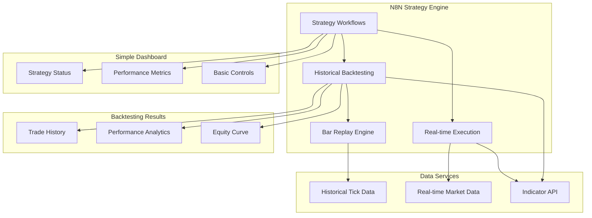

# N8N Strategy Design with Historical Bar Replay Backtesting

## Overview

Complete strategy development in N8N with tick-by-tick historical bar replay for backtesting, coupled with a simple, focused dashboard for monitoring and control.

## Architecture



## N8N Complete Strategy Design

### 1. Strategy Workflow Structure

```json
{
  "name": "Complete Trading Strategy",
  "nodes": [
    {
      "parameters": {
        "path": "strategy-trigger",
        "responseMode": "responseNode",
        "options": {}
      },
      "name": "Strategy Trigger",
      "type": "n8n-nodes-base.webhook",
      "position": [240, 300]
    },
    {
      "parameters": {
        "mode": "manual",
        "jsCode": "// Determine execution mode\nconst mode = $json.mode || 'realtime'; // 'realtime' or 'backtest'\nconst symbol = $json.symbol || 'NIFTY 50';\nconst timeframe = $json.timeframe || '5m';\nconst startDate = $json.start_date;\nconst endDate = $json.end_date;\n\nreturn [{\n  json: {\n    mode: mode,\n    symbol: symbol,\n    timeframe: timeframe,\n    start_date: startDate,\n    end_date: endDate,\n    current_time: mode === 'backtest' ? startDate : new Date().toISOString()\n  }\n}];"
      },
      "name": "Set Execution Mode",
      "type": "n8n-nodes-base.function",
      "position": [460, 300]
    },
    {
      "parameters": {
        "jsCode": "// Route to appropriate data source\nconst mode = items[0].json.mode;\n\nif (mode === 'backtest') {\n  // Historical data for backtesting\n  return [{\n    json: {\n      ...items[0].json,\n      data_source: 'historical',\n      url: `http://localhost:8000/api/v1/market-data/historical/${items[0].json.symbol}`\n    }\n  }];\n} else {\n  // Real-time data\n  return [{\n    json: {\n      ...items[0].json,\n      data_source: 'realtime',\n      url: `http://localhost:8000/api/v1/market-data/current/${items[0].json.symbol}`\n    }\n  }];\n}"
      },
      "name": "Route Data Source",
      "type": "n8n-nodes-base.function",
      "position": [680, 300]
    }
  ]
}
```

### 2. Historical Bar Replay Engine

```json
{
  "name": "Historical Bar Replay",
  "nodes": [
    {
      "parameters": {
        "url": "={{$json.url}}",
        "sendQuery": true,
        "queryParameters": {
          "parameters": [
            {
              "name": "timeframe",
              "value": "={{$json.timeframe}}"
            },
            {
              "name": "start_date",
              "value": "={{$json.start_date}}"
            },
            {
              "name": "end_date",
              "value": "={{$json.end_date}}"
            },
            {
              "name": "include_ticks",
              "value": "true"
            }
          ]
        }
      },
      "name": "Get Historical Data",
      "type": "n8n-nodes-base.httpRequest",
      "position": [900, 300]
    },
    {
      "parameters": {
        "jsCode": "// Process historical data for tick-by-tick replay\nconst historicalData = items[0].json;\nconst ticks = historicalData.ticks || [];\nconst bars = historicalData.bars || [];\n\n// Create replay timeline\nconst replayData = [];\nlet currentTime = new Date(historicalData.start_date);\n\n// Process each tick\nfor (const tick of ticks) {\n  replayData.push({\n    timestamp: tick.timestamp,\n    price: tick.price,\n    volume: tick.volume,\n    type: 'tick',\n    bar_info: null\n  });\n}\n\n// Process bars (for reference)\nfor (const bar of bars) {\n  replayData.push({\n    timestamp: bar.timestamp,\n    price: bar.close,\n    volume: bar.volume,\n    type: 'bar',\n    bar_info: {\n      open: bar.open,\n      high: bar.high,\n      low: bar.low,\n      close: bar.close\n    }\n  });\n}\n\n// Sort by timestamp\nreplayData.sort((a, b) => new Date(a.timestamp) - new Date(b.timestamp));\n\nreturn [{\n  json: {\n    symbol: historicalData.symbol,\n    timeframe: historicalData.timeframe,\n    replay_data: replayData,\n    total_ticks: ticks.length,\n    total_bars: bars.length,\n    start_date: historicalData.start_date,\n    end_date: historicalData.end_date\n  }\n}];"
      },
      "name": "Process Replay Data",
      "type": "n8n-nodes-base.function",
      "position": [1120, 300]
    },
    {
      "parameters": {
        "jsCode": "// Tick-by-tick replay simulation\nconst replayData = items[0].json.replay_data;\nconst batchSize = 100; // Process 100 ticks at a time\nconst results = [];\n\nfor (let i = 0; i < replayData.length; i += batchSize) {\n  const batch = replayData.slice(i, i + batchSize);\n  const currentTick = batch[batch.length - 1];\n  \n  // Calculate current forming bar\n  const currentBar = calculateCurrentBar(batch, items[0].json.timeframe);\n  \n  results.push({\n    json: {\n      timestamp: currentTick.timestamp,\n      price: currentTick.price,\n      volume: currentTick.volume,\n      type: currentTick.type,\n      current_bar: currentBar,\n      tick_number: i + batch.length,\n      total_ticks: replayData.length,\n      progress: Math.round(((i + batch.length) / replayData.length) * 100)\n    }\n  });\n}\n\nfunction calculateCurrentBar(ticks, timeframe) {\n  // Simple bar calculation - can be enhanced\n  const prices = ticks.map(t => t.price);\n  const volumes = ticks.map(t => t.volume);\n  \n  return {\n    open: prices[0],\n    high: Math.max(...prices),\n    low: Math.min(...prices),\n    close: prices[prices.length - 1],\n    volume: volumes.reduce((a, b) => a + b, 0),\n    timeframe: timeframe\n  };\n}\n\nreturn results;"
      },
      "name": "Replay Ticks",
      "type": "n8n-nodes-base.function",
      "position": [1340, 300]
    }
  ]
}
```

### 3. Real-time Indicator Calculation

```json
{
  "name": "Real-time Indicators",
  "nodes": [
    {
      "parameters": {
        "url": "http://localhost:8000/api/v1/indicators/calculate",
        "sendBody": true,
        "bodyParameters": {
          "parameters": [
            {
              "name": "symbol",
              "value": "={{$json.symbol}}"
            },
            {
              "name": "timeframe",
              "value": "={{$json.timeframe}}"
            },
            {
              "name": "current_bar",
              "value": "={{$json.current_bar}}"
            },
            {
              "name": "historical_bars",
              "value": "={{$json.historical_context}}"
            },
            {
              "name": "indicators",
              "value": "ema_20,ema_50,rsi,macd,bollinger_bands,atr"
            }
          ]
        }
      },
      "name": "Calculate Indicators",
      "type": "n8n-nodes-base.httpRequest",
      "position": [1560, 300]
    },
    {
      "parameters": {
        "jsCode": "// Merge tick data with indicators\nconst tickData = items[0].json;\nconst indicators = items[1].json.indicators;\n\nreturn [{\n  json: {\n    ...tickData,\n    indicators: indicators,\n    timestamp: tickData.timestamp,\n    price: tickData.price,\n    current_bar: tickData.current_bar,\n    // Add indicator values for easy access\n    ema_20: indicators.ema_20,\n    ema_50: indicators.ema_50,\n    rsi: indicators.rsi,\n    macd: indicators.macd,\n    bb_upper: indicators.bb_upper,\n    bb_lower: indicators.bb_lower,\n    atr: indicators.atr\n  }\n}];"
      },
      "name": "Merge Data",
      "type": "n8n-nodes-base.function",
      "position": [1780, 300]
    }
  ]
}
```

### 4. Strategy Logic Implementation

```json
{
  "name": "Strategy Logic",
  "nodes": [
    {
      "parameters": {
        "jsCode": "// Complete strategy logic implementation\nconst data = items[0].json;\nconst indicators = data.indicators;\nconst currentBar = data.current_bar;\n\n// Strategy parameters\nconst STRATEGY_TYPE = 'trend_following'; // or 'mean_reversion', 'momentum'\nconst RISK_PER_TRADE = 2; // percent\nconst MIN_ADX = 25;\nconst RSI_OVERSOLD = 30;\nconst RSI_OVERBOUGHT = 70;\n\nlet signal = 'HOLD';\nlet confidence = 'LOW';\nlet reason = '';\n\n// Trend Following Logic\nif (STRATEGY_TYPE === 'trend_following') {\n  const ema20 = indicators.ema_20;\n  const ema50 = indicators.ema_50;\n  const adx = indicators.adx;\n  \n  if (ema20 > ema50 && adx > MIN_ADX) {\n    signal = 'BUY';\n    confidence = adx > 40 ? 'HIGH' : 'MEDIUM';\n    reason = `Bullish EMA crossover with ADX ${adx}`;\n  } else if (ema20 < ema50 && adx > MIN_ADX) {\n    signal = 'SELL';\n    confidence = adx > 40 ? 'HIGH' : 'MEDIUM';\n    reason = `Bearish EMA crossover with ADX ${adx}`;\n  }\n}\n\n// Mean Reversion Logic\nelse if (STRATEGY_TYPE === 'mean_reversion') {\n  const rsi = indicators.rsi;\n  const bbUpper = indicators.bb_upper;\n  const bbLower = indicators.bb_lower;\n  const price = data.price;\n  \n  if (price <= bbLower && rsi <= RSI_OVERSOLD) {\n    signal = 'BUY';\n    confidence = 'HIGH';\n    reason = `Oversold: Price at lower BB, RSI ${rsi}`;\n  } else if (price >= bbUpper && rsi >= RSI_OVERBOUGHT) {\n    signal = 'SELL';\n    confidence = 'HIGH';\n    reason = `Overbought: Price at upper BB, RSI ${rsi}`;\n  }\n}\n\n// Momentum Logic\nelse if (STRATEGY_TYPE === 'momentum') {\n  const macd = indicators.macd;\n  const macdSignal = indicators.macd_signal;\n  const price = data.price;\n  \n  if (macd > macdSignal && macd > 0) {\n    signal = 'BUY';\n    confidence = 'MEDIUM';\n    reason = `MACD bullish crossover`;\n  } else if (macd < macdSignal && macd < 0) {\n    signal = 'SELL';\n    confidence = 'MEDIUM';\n    reason = `MACD bearish crossover`;\n  }\n}\n\nreturn [{\n  json: {\n    ...data,\n    strategy_type: STRATEGY_TYPE,\n    signal: signal,\n    confidence: confidence,\n    reason: reason,\n    timestamp: data.timestamp,\n    price: data.price\n  }\n}];"
      },
      "name": "Generate Signal",
      "type": "n8n-nodes-base.function",
      "position": [2000, 300]
    },
    {
      "parameters": {
        "conditions": {
          "options": {
            "caseSensitive": true,
            "leftValue": "",
            "typeValidation": "strict"
          },
          "conditions": [
            {
              "id": "signal_condition",
              "leftValue": "={{$json.signal}}",
              "rightValue": "HOLD",
              "operator": {
                "type": "string",
                "operation": "notEquals"
              }
            }
          ],
          "combinator": "and"
        }
      },
      "name": "Check Signal",
      "type": "n8n-nodes-base.if",
      "position": [2220, 300]
    }
  ]
}
```

### 5. Trade Execution & Backtesting

```json
{
  "name": "Trade Execution",
  "nodes": [
    {
      "parameters": {
        "jsCode": "// Calculate position size and risk\nconst signalData = items[0].json;\nconst mode = signalData.mode || 'realtime';\nconst accountSize = 100000; // Default\nconst riskPercent = 2;\n\n// Calculate position size\nconst atr = signalData.atr || 100;\nconst stopLossPoints = atr * 2; // 2x ATR stop\nconst riskPerShare = stopLossPoints;\nconst maxRisk = accountSize * (riskPercent / 100);\nconst positionSize = Math.floor(maxRisk / riskPerShare);\n\nconst trade = {\n  symbol: signalData.symbol,\n  signal: signalData.signal,\n  price: signalData.price,\n  quantity: positionSize,\n  stop_loss: signalData.signal === 'BUY' ? signalData.price - stopLossPoints : signalData.price + stopLossPoints,\n  take_profit: signalData.signal === 'BUY' ? signalData.price + (stopLossPoints * 2) : signalData.price - (stopLossPoints * 2),\n  confidence: signalData.confidence,\n  reason: signalData.reason,\n  timestamp: signalData.timestamp,\n  mode: mode,\n  atr: atr,\n  risk_amount: maxRisk\n};\n\nreturn [{ json: trade }];"
      },
      "name": "Calculate Trade",
      "type": "n8n-nodes-base.function",
      "position": [2440, 300]
    },
    {
      "parameters": {
        "conditions": {
          "options": {
            "caseSensitive": true,
            "leftValue": "",
            "typeValidation": "strict"
          },
          "conditions": [
            {
              "id": "mode_condition",
              "leftValue": "={{$json.mode}}",
              "rightValue": "realtime",
              "operator": {
                "type": "string",
                "operation": "equals"
              }
            }
          ],
          "combinator": "and"
        }
      },
      "name": "Check Mode",
      "type": "n8n-nodes-base.if",
      "position": [2660, 300]
    },
    {
      "parameters": {
        "url": "http://localhost:8000/api/v1/trading/orders",
        "sendBody": true,
        "bodyParameters": {
          "parameters": [
            {
              "name": "symbol",
              "value": "={{$json.symbol}}"
            },
            {
              "name": "side",
              "value": "={{$json.signal}}"
            },
            {
              "name": "quantity",
              "value": "={{$json.quantity}}"
            },
            {
              "name": "order_type",
              "value": "MARKET"
            },
            {
              "name": "stop_loss",
              "value": "={{$json.stop_loss}}"
            },
            {
              "name": "take_profit",
              "value": "={{$json.take_profit}}"
            }
          ]
        }
      },
      "name": "Execute Real Trade",
      "type": "n8n-nodes-base.httpRequest",
      "position": [2880, 200]
    },
    {
      "parameters": {
        "url": "http://localhost:8000/api/v1/backtesting/record-trade",
        "sendBody": true,
        "bodyParameters": {
          "parameters": [
            {
              "name": "trade_data",
              "value": "={{$json}}"
            }
          ]
        }
      },
      "name": "Record Backtest Trade",
      "type": "n8n-nodes-base.httpRequest",
      "position": [2880, 400]
    }
  ]
}
```

## Simple Dashboard Design

### 1. Minimal Dashboard Components

```typescript
// frontend/src/components/SimpleDashboard.tsx
import React, { useState, useEffect } from 'react';
import { Grid, Card, CardContent, Typography, Button, Switch } from '@mui/material';

const SimpleDashboard: React.FC = () => {
  const [strategies, setStrategies] = useState([]);
  const [performance, setPerformance] = useState({});
  const [isRealtime, setIsRealtime] = useState(true);

  useEffect(() => {
    fetchDashboardData();
    const interval = setInterval(fetchDashboardData, 5000); // Update every 5 seconds
    return () => clearInterval(interval);
  }, []);

  const fetchDashboardData = async () => {
    try {
      const [strategiesRes, performanceRes] = await Promise.all([
        fetch('/api/v1/strategies/status'),
        fetch('/api/v1/performance/summary')
      ]);
      
      setStrategies(await strategiesRes.json());
      setPerformance(await performanceRes.json());
    } catch (error) {
      console.error('Failed to fetch dashboard data:', error);
    }
  };

  const toggleStrategy = async (strategyId: string, active: boolean) => {
    try {
      await fetch(`/api/v1/strategies/${strategyId}/${active ? 'start' : 'stop'}`, {
        method: 'POST'
      });
      fetchDashboardData();
    } catch (error) {
      console.error('Failed to toggle strategy:', error);
    }
  };

  return (
    <Grid container spacing={3}>
      {/* Strategy Status */}
      <Grid item xs={12} md={6}>
        <Card>
          <CardContent>
            <Typography variant="h6" gutterBottom>
              Strategy Status
            </Typography>
            {strategies.map((strategy) => (
              <div key={strategy.id} style={{ marginBottom: 16 }}>
                <Typography variant="body1">
                  {strategy.name}
                </Typography>
                <Switch
                  checked={strategy.is_active}
                  onChange={(e) => toggleStrategy(strategy.id, e.target.checked)}
                  color="primary"
                />
                <Typography variant="body2" color="textSecondary">
                  {strategy.signal || 'No signal'}
                </Typography>
              </div>
            ))}
          </CardContent>
        </Card>
      </Grid>

      {/* Performance Summary */}
      <Grid item xs={12} md={6}>
        <Card>
          <CardContent>
            <Typography variant="h6" gutterBottom>
              Performance Today
            </Typography>
            <Typography variant="body1">
              Total P&L: ₹{performance.total_pnl || 0}
            </Typography>
            <Typography variant="body1">
              Trades: {performance.total_trades || 0}
            </Typography>
            <Typography variant="body1">
              Win Rate: {performance.win_rate || 0}%
            </Typography>
          </CardContent>
        </Card>
      </Grid>

      {/* Quick Controls */}
      <Grid item xs={12}>
        <Card>
          <CardContent>
            <Typography variant="h6" gutterBottom>
              Quick Controls
            </Typography>
            <Button
              variant="contained"
              color="primary"
              onClick={() => setIsRealtime(!isRealtime)}
              style={{ marginRight: 16 }}
            >
              {isRealtime ? 'Switch to Backtest' : 'Switch to Realtime'}
            </Button>
            <Button
              variant="outlined"
              onClick={() => window.open('/n8n', '_blank')}
            >
              Open N8N Editor
            </Button>
          </CardContent>
        </Card>
      </Grid>
    </Grid>
  );
};

export default SimpleDashboard;
```

### 2. API Endpoints for Simple Dashboard

```python
# backend/fastapi/app/api/dashboard.py
from fastapi import APIRouter
from typing import List, Dict
from app.services.dashboard_service import DashboardService

router = APIRouter(prefix="/api/v1", tags=["dashboard"])

@router.get("/strategies/status")
async def get_strategies_status() -> List[Dict]:
    """Get current status of all strategies"""
    service = DashboardService()
    return await service.get_strategies_status()

@router.get("/performance/summary")
async def get_performance_summary() -> Dict:
    """Get performance summary for dashboard"""
    service = DashboardService()
    return await service.get_performance_summary()

@router.post("/strategies/{strategy_id}/start")
async def start_strategy(strategy_id: str) -> Dict:
    """Start a strategy"""
    service = DashboardService()
    return await service.start_strategy(strategy_id)

@router.post("/strategies/{strategy_id}/stop")
async def stop_strategy(strategy_id: str) -> Dict:
    """Stop a strategy"""
    service = DashboardService()
    return await service.stop_strategy(strategy_id)
```

## Backtesting API Support

```python
# backend/fastapi/app/api/backtesting.py
from fastapi import APIRouter
from typing import List, Dict
from app.schemas.backtesting import BacktestRequest, BacktestResponse
from app.services.backtesting_service import BacktestingService

router = APIRouter(prefix="/api/v1/backtesting", tags=["backtesting"])

@router.post("/run")
async def run_backtest(request: BacktestRequest) -> BacktestResponse:
    """Run historical backtest with tick data"""
    service = BacktestingService()
    return await service.run_backtest(request)

@router.post("/record-trade")
async def record_backtest_trade(trade_data: Dict) -> Dict:
    """Record trade during backtesting"""
    service = BacktestingService()
    return await service.record_trade(trade_data)

@router.get("/results/{strategy_id}")
async def get_backtest_results(strategy_id: str) -> Dict:
    """Get backtest results"""
    service = BacktestingService()
    return await service.get_results(strategy_id)

@router.get("/equity-curve/{strategy_id}")
async def get_equity_curve(strategy_id: str) -> List[Dict]:
    """Get equity curve data"""
    service = BacktestingService()
    return await service.get_equity_curve(strategy_id)
```

## Benefits of This Approach

### 1. **Complete N8N Strategy Control**
- All strategy logic in N8N workflows
- Easy to modify and test strategies
- Visual debugging and monitoring
- No coding required for strategy changes

### 2. **Tick-by-Tick Historical Replay**
- Realistic backtesting with actual tick data
- Same indicators used in live trading
- Accurate performance measurement
- Easy strategy optimization

### 3. **Simple, Focused Dashboard**
- Only essential information displayed
- Quick strategy on/off controls
- Real-time performance metrics
- Clean, uncluttered interface

### 4. **Seamless Mode Switching**
- Toggle between real-time and backtesting
- Same strategy logic for both modes
- Easy performance comparison
- Quick validation of strategy changes

This design provides maximum flexibility for strategy development in N8N while keeping the dashboard simple and focused on essential information.