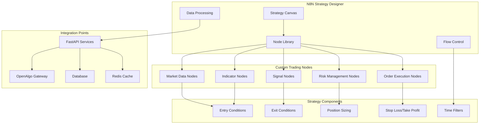

# N8N-Based Strategy Design Framework

## Overview

This document outlines how N8N will be used as the primary platform for designing, implementing, and managing trading strategies visually. This approach enables rapid strategy development, easy modification, and clear visualization of trading logic.

## N8N Strategy Architecture



## Custom N8N Node Development

### 1. Market Data Nodes
```yaml
Market Data Nodes:
  - GetLivePrice:
      description: "Fetch real-time market data for specific symbols"
      parameters: [symbol, exchange, data_type]
      returns: [price, volume, bid, ask, timestamp]
  
  - HistoricalData:
      description: "Retrieve historical price data"
      parameters: [symbol, timeframe, period]
      returns: [OHLCV data array]
  
  - MarketScanner:
      description: "Scan market for specific conditions"
      parameters: [criteria, universe, filters]
      returns: [matching_symbols]
  
  - NewsFeed:
      description: "Fetch market news and announcements"
      parameters: [sources, keywords, time_range]
      returns: [news_items]
```

### 2. Technical Indicator Nodes
```yaml
Indicator Nodes:
  - MovingAverage:
      types: [SMA, EMA, WMA]
      parameters: [period, source, type]
      
  - Oscillator:
      types: [RSI, Stochastic, MACD]
      parameters: [periods, overbought, oversold]
      
  - Volatility:
      types: [BollingerBands, ATR, VIX]
      parameters: [period, multiplier]
      
  - Volume:
      types: [OBV, VolumeMA, VWAP]
      parameters: [period, calculation_method]
      
  - Pattern:
      types: [Candlestick, Chart, Harmonic]
      parameters: [pattern_type, strictness]
```

### 3. Signal Generation Nodes
```yaml
Signal Nodes:
  - CrossOver:
      description: "Detect when two series cross"
      parameters: [series1, series2, direction]
      
  - Threshold:
      description: "Check if value crosses threshold"
      parameters: [value, threshold, direction]
      
  - Confluence:
      description: "Combine multiple signals"
      parameters: [signals, logic_operator, min_signals]
      
  - Divergence:
      description: "Detect price-indicator divergence"
      parameters: [price_series, indicator_series, type]
```

### 4. Risk Management Nodes
```yaml
Risk Management Nodes:
  - PositionSizer:
      methods: [fixed_percent, volatility_based, kelly_criterion]
      parameters: [account_size, risk_percent, method]
      
  - StopLoss:
      types: [fixed_percent, atr_based, support_resistance]
      parameters: [entry_price, method, parameters]
      
  - TakeProfit:
      types: [fixed_risk_reward, trailing, fibonacci]
      parameters: [entry_price, method, parameters]
      
  - RiskCheck:
      checks: [max_position, correlation, drawdown]
      parameters: [check_type, limits, current_state]
```

### 5. Order Execution Nodes
```yaml
Order Nodes:
  - PlaceOrder:
      description: "Place trading order through OpenAlgo"
      parameters: [symbol, side, quantity, order_type, price]
      
  - ModifyOrder:
      description: "Modify existing order"
      parameters: [order_id, modifications]
      
  - CancelOrder:
      description: "Cancel pending order"
      parameters: [order_id]
      
  - PositionCheck:
      description: "Check current positions"
      parameters: [symbol, portfolio]
```

## Strategy Templates

### 1. Trend Following Strategy Template
```yaml
Name: "Trend Following Strategy"
Description: "Buy on uptrend confirmation, sell on downtrend"

Nodes:
  1. GetLivePrice (symbol: NIFTY 50)
  2. MovingAverage (type: EMA, period: 20)
  3. MovingAverage (type: EMA, period: 50)
  4. CrossOver (series1: EMA20, series2: EMA50)
  5. ADX (period: 14, threshold: 25)
  6. Confluence (signals: [CrossOver, ADX], logic: AND)
  7. PositionSizer (method: volatility_based, risk: 2%)
  8. StopLoss (method: atr_based, multiplier: 2)
  9. TakeProfit (method: fixed_risk_reward, ratio: 2:1)
  10. PlaceOrder (condition: Confluence=true)
```

### 2. Mean Reversion Strategy Template
```yaml
Name: "Mean Reversion Strategy"
Description: "Buy oversold, sell overbought conditions"

Nodes:
  1. GetLivePrice (symbol: BANKNIFTY)
  2. BollingerBands (period: 20, std_dev: 2)
  3. RSI (period: 14, levels: 30, 70)
  4. VolumeCheck (min_volume: 1.5x_average)
  5. SignalGenerator:
      - Buy: price <= lower_band AND rsi <= 30
      - Sell: price >= upper_band AND rsi >= 70
  6. PositionSizer (method: fixed_percent, risk: 1.5%)
  7. StopLoss (method: support_resistance)
  8. TakeProfit (method: mean_reversion_target)
  9. PlaceOrder (condition: SignalGenerator.signal)
```

### 3. Momentum Strategy Template
```yaml
Name: "Momentum Strategy"
Description: "Follow strong price movements with volume confirmation"

Nodes:
  1. GetLivePrice (symbol: FINNIFTY)
  2. RateOfChange (period: 10)
  3. VolumeSpike (threshold: 2x_average, lookback: 5)
  4. MACD (fast: 12, slow: 26, signal: 9)
  5. PriceBreakout (lookback_period: 20, threshold: 2%)
  6. MomentumScore (weights: [ROC: 0.3, Volume: 0.3, MACD: 0.2, Breakout: 0.2])
  7. SignalFilter (min_score: 0.7)
  8. PositionSizer (method: kelly_criterion, max_risk: 3%)
  9. TrailingStop (method: atr_based, activation: 1R)
  10. PlaceOrder (condition: SignalFilter=true)
```

## Advanced Strategy Features

### 1. Multi-Timeframe Analysis
```yaml
Multi-Timeframe Nodes:
  - TimeframeSync:
      description: "Align data from different timeframes"
      parameters: [primary_tf, secondary_tfs, sync_method]
      
  - HigherTimeframeTrend:
      description: "Get trend direction from higher timeframe"
      parameters: [symbol, htf, indicator]
      
  - TimeframeFilter:
      description: "Filter signals based on HTF trend"
      parameters: [htf_trend, signal_direction, filter_type]
```

### 2. Market Regime Detection
```yaml
Regime Detection Nodes:
  - VolatilityRegime:
      description: "Classify market by volatility"
      parameters: [volatility_thresholds, lookback_period]
      
  - TrendRegime:
      description: "Identify trending vs ranging markets"
      parameters: [trend_strength_threshold, period]
      
  - RegimeFilter:
      description: "Filter strategies by market regime"
      parameters: [current_regime, allowed_regimes]
```

### 3. Portfolio Level Strategies
```yaml
Portfolio Nodes:
  - CorrelationCheck:
      description: "Check correlation between positions"
      parameters: [symbols, method, threshold]
      
  - SectorExposure:
      description: "Calculate sector-wise exposure"
      parameters: [positions, sector_mapping]
      
  - PortfolioRebalance:
      description: "Rebalance portfolio based on targets"
      parameters: [target_weights, rebalance_threshold]
```

## Strategy Testing and Validation

### 1. Backtesting Integration
```yaml
Backtesting Nodes:
  - HistoricalDataLoader:
      description: "Load historical data for testing"
      parameters: [symbols, period, timeframe]
      
  - StrategyExecutor:
      description: "Execute strategy on historical data"
      parameters: [strategy_config, start_date, end_date]
      
  - PerformanceAnalyzer:
      description: "Calculate strategy performance metrics"
      parameters: [trades, benchmark]
      
  - ReportGenerator:
      description: "Generate backtest report"
      parameters: [performance_data, include_charts]
```

### 2. Paper Trading
```yaml
Paper Trading Nodes:
  - VirtualAccount:
      description: "Simulate trading account"
      parameters: [initial_balance, commission_structure]
      
  - PaperOrder:
      description: "Simulate order execution"
      parameters: [order_details, slippage_model]
      
  - PortfolioTracker:
      description: "Track virtual portfolio"
      parameters: [positions, cash, transactions]
```

## Strategy Management

### 1. Version Control
```yaml
Version Control Features:
  - Strategy Versioning:
      description: "Track strategy changes over time"
      features: [version_history, rollback, comparison]
      
  - A/B Testing:
      description: "Compare strategy versions"
      features: [parallel_execution, statistical_significance]
      
  - Strategy Library:
      description: "Organize and categorize strategies"
      features: [tags, search, sharing]
```

### 2. Performance Monitoring
```yaml
Monitoring Nodes:
  - RealTimePnL:
      description: "Track real-time profit/loss"
      parameters: [positions, current_prices]
      
  - DrawdownTracker:
      description: "Monitor drawdown levels"
      parameters: [equity_curve, timeframes]
      
  - AlertManager:
      description: "Send alerts on conditions"
      parameters: [conditions, channels, severity]
```

## Integration with FastAPI

### 1. Data Services
```python
# FastAPI endpoints for N8N integration
@app.get("/api/v1/market-data/{symbol}")
async def get_market_data(symbol: str, exchange: str):
    """Provide market data to N8N nodes"""
    pass

@app.post("/api/v1/indicators/calculate")
async def calculate_indicators(data: IndicatorRequest):
    """Calculate technical indicators for N8N"""
    pass

@app.get("/api/v1/positions/current")
async def get_current_positions():
    """Provide current positions to N8N"""
    pass
```

### 2. Order Management
```python
@app.post("/api/v1/orders/place")
async def place_order(order: OrderRequest):
    """Place order through OpenAlgo"""
    pass

@app.post("/api/v1/orders/modify")
async def modify_order(modification: OrderModification):
    """Modify existing order"""
    pass

@app.delete("/api/v1/orders/{order_id}")
async def cancel_order(order_id: str):
    """Cancel pending order"""
    pass
```

## Best Practices for N8N Strategy Design

### 1. Node Organization
- Group related nodes using sub-workflows
- Use descriptive names for nodes and connections
- Add comments to explain complex logic
- Color-code nodes by function (data, indicators, signals, execution)

### 2. Error Handling
- Implement try-catch nodes for critical operations
- Add fallback mechanisms for data failures
- Use timeout nodes for external API calls
- Create alert workflows for error conditions

### 3. Performance Optimization
- Use data caching nodes for repeated calculations
- Implement batch processing for multiple symbols
- Optimize database queries with proper indexing
- Use asynchronous operations where possible

### 4. Security Considerations
- Validate all inputs at node level
- Implement rate limiting for API calls
- Use encrypted connections for sensitive data
- Add audit logging for all trading actions

This N8N-based strategy design framework provides a powerful visual environment for developing, testing, and deploying sophisticated trading strategies while maintaining flexibility and ease of use.