# VELOX-N8N Project Roadmap

## Overview

This document provides a visual roadmap of the VELOX-N8N algorithmic trading system implementation, including timelines, dependencies, and key milestones.

## Implementation Timeline

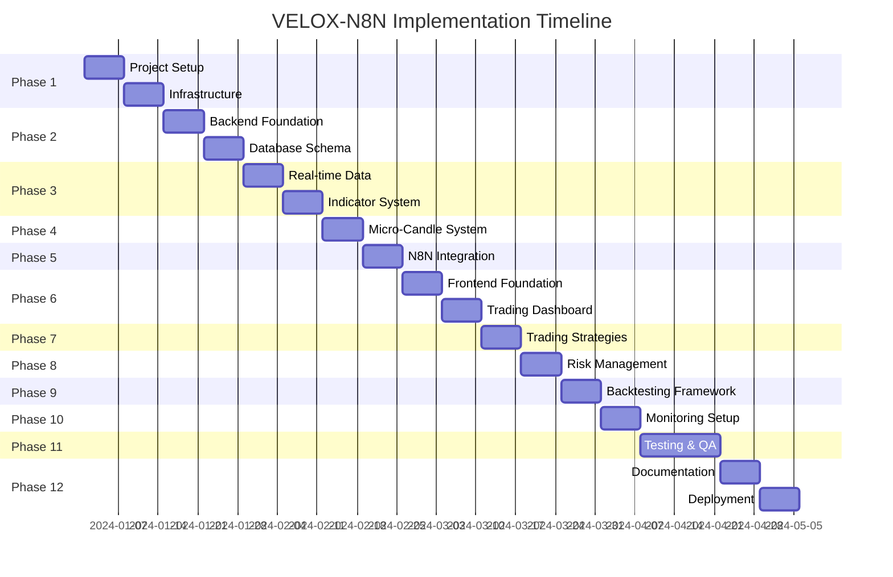

## Phase Dependencies

```mermaid
graph TB
    subgraph "Phase 1: Foundation"
        A1[Project Setup]
        A2[Infrastructure]
    end
    
    subgraph "Phase 2: Backend"
        B1[FastAPI Foundation]
        B2[Database Schema]
        B3[Core APIs]
    end
    
    subgraph "Phase 3: Real-time"
        C1[Data Management]
        C2[Indicator Calculator]
        C3[WebSocket API]
    end
    
    subgraph "Phase 4: Micro-Candles"
        D1[Data Fetcher]
        D2[Generation Engine]
        D3[Replay Integration]
    end
    
    subgraph "Phase 5: N8N"
        E1[API Development]
        E2[Webhook Integration]
        E3[Workflow Templates]
    end
    
    subgraph "Phase 6: Frontend"
        F1[React Foundation]
        F2[Trading Dashboard]
        F3[Strategy Management]
        F4[Charts & Visualization]
    end
    
    subgraph "Phase 7: Strategies"
        G1[Core Strategies]
        G2[Execution Engine]
        G3[Performance Tracking]
    end
    
    subgraph "Phase 8: Risk"
        H1[Position Sizing]
        H2[Risk Monitoring]
        H3[Compliance]
    end
    
    subgraph "Phase 9: Backtesting"
        I1[Data Management]
        I2[Backtesting Engine]
        I3[Optimization]
    end
    
    subgraph "Phase 10: Monitoring"
        J1[System Monitoring]
        J2[Business Analytics]
        J3[Alert System]
    end
    
    subgraph "Phase 11: Testing"
        K1[Unit Testing]
        K2[Integration Testing]
        K3[UAT]
    end
    
    subgraph "Phase 12: Deployment"
        L1[Documentation]
        L2[Production Setup]
        L3[Go-Live]
    end
    
    A1 --> A2
    A2 --> B1
    B1 --> B2
    B2 --> B3
    B3 --> C1
    C1 --> C2
    C2 --> C3
    C3 --> D1
    D1 --> D2
    D2 --> D3
    D3 --> E1
    E1 --> E2
    E2 --> E3
    E3 --> F1
    F1 --> F2
    F2 --> F3
    F3 --> F4
    F4 --> G1
    G1 --> G2
    G2 --> G3
    G3 --> H1
    H1 --> H2
    H2 --> H3
    H3 --> I1
    I1 --> I2
    I2 --> I3
    I3 --> J1
    J1 --> J2
    J2 --> J3
    J3 --> K1
    K1 --> K2
    K2 --> K3
    K3 --> L1
    L1 --> L2
    L2 --> L3
```

## System Architecture Evolution

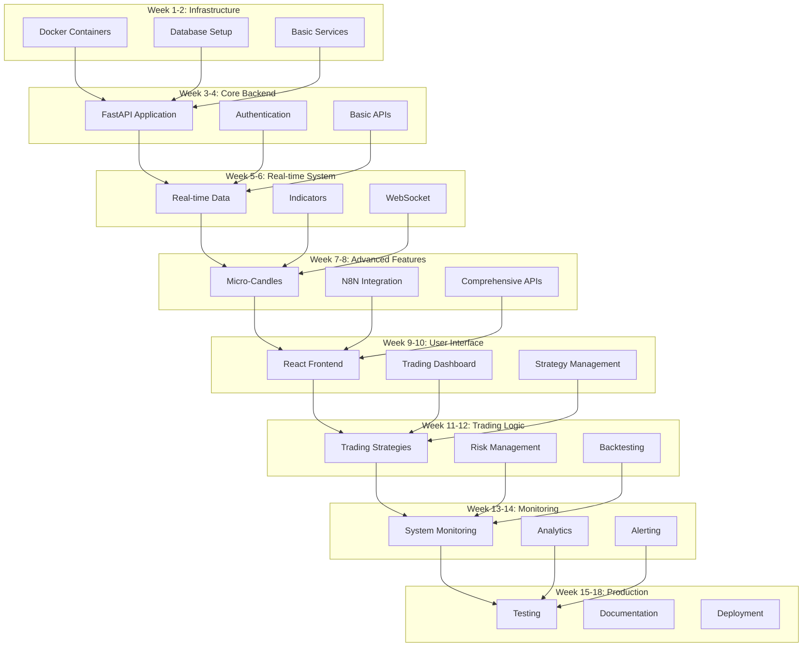

## Technology Stack Implementation Order

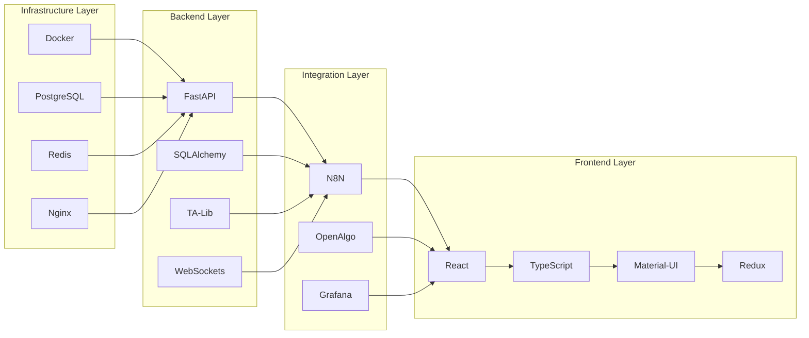

## Risk Mitigation Timeline

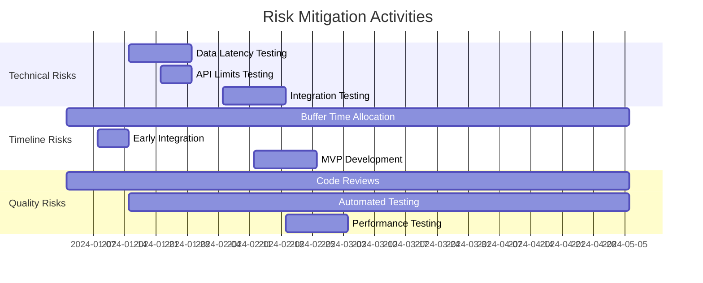

## Key Milestones

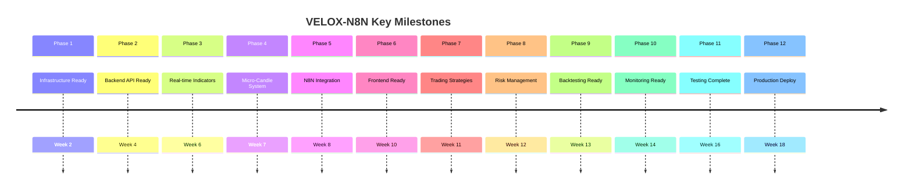

## Resource Allocation Over Time

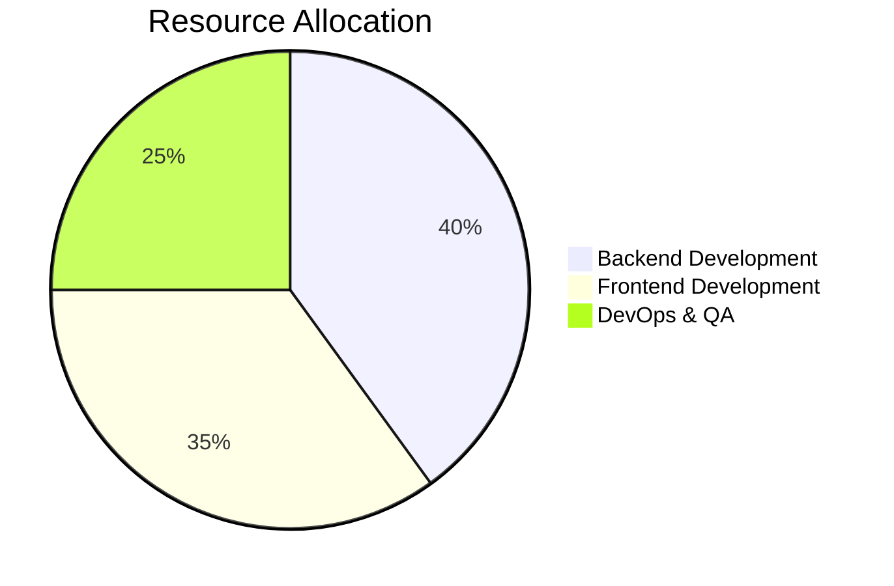

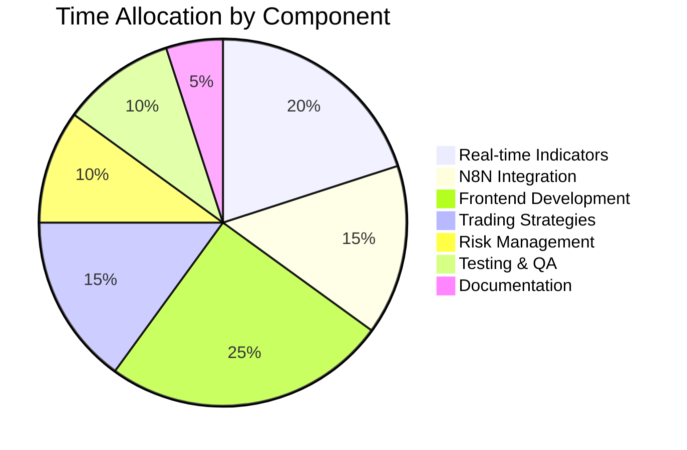

## Critical Path Analysis

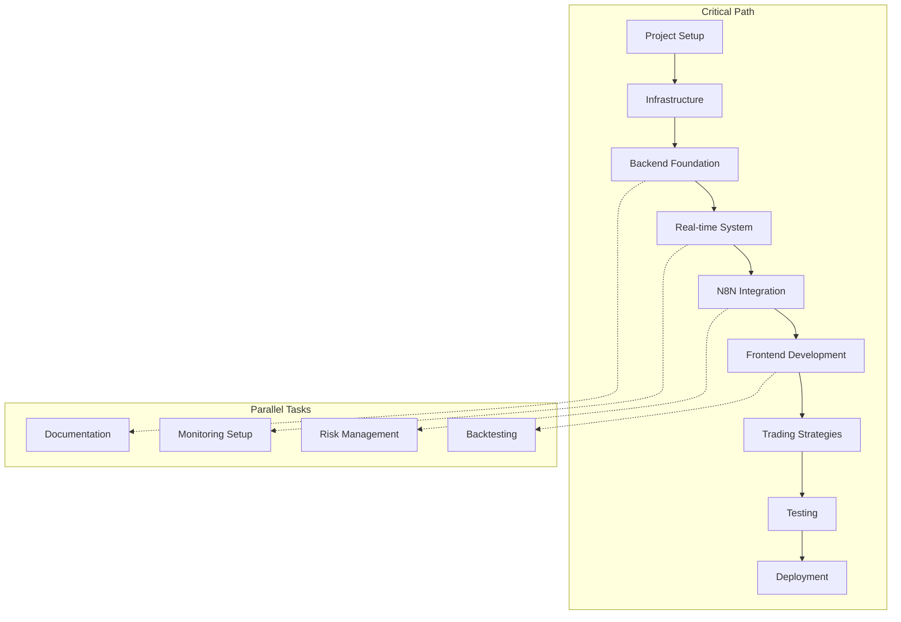

## Success Metrics Timeline

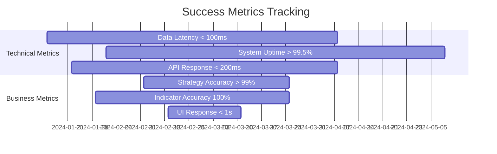

## Deployment Strategy

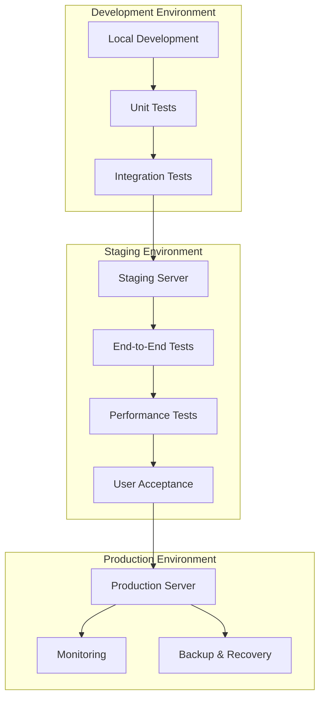

## Summary

This roadmap provides a comprehensive visual representation of the VELOX-N8N implementation plan, including:

1. **Timeline Gantt Charts** showing the 18-week implementation schedule
2. **Dependency Graphs** illustrating relationships between phases
3. **Architecture Evolution** showing system growth over time
4. **Technology Stack** implementation order
5. **Risk Mitigation** timeline and activities
6. **Key Milestones** throughout the project
7. **Resource Allocation** breakdown
8. **Critical Path** analysis for project management
9. **Success Metrics** tracking timeline
10. **Deployment Strategy** from development to production

The roadmap ensures all stakeholders have a clear understanding of the project timeline, dependencies, and key deliverables. It serves as a strategic guide for successful implementation of the VELOX-N8N algorithmic trading system.