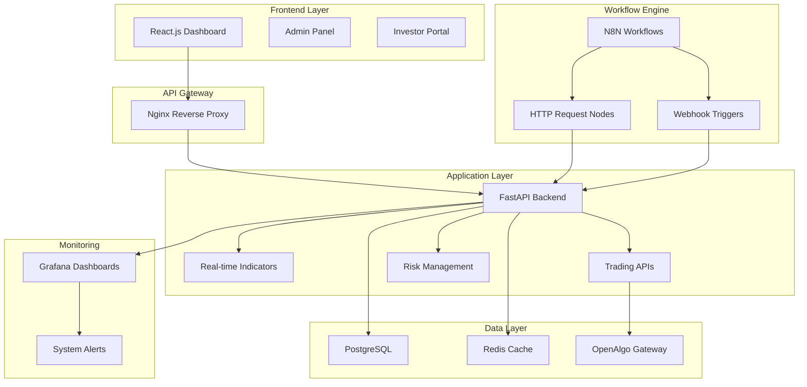
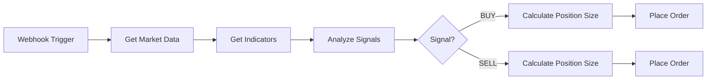

# VELOX-N8N Algorithmic Trading System - Project Summary

## 🎯 **Project Overview**

A comprehensive algorithmic trading system that combines real-time tick-by-tick indicators with visual strategy development using N8N workflows, specifically designed for Indian markets (NSE/BSE) with multi-broker support through OpenAlgo.

## 🏗️ **System Architecture**



## 🚀 **Key Features & Innovations**

### 1. **Real-Time Tick-by-Tick Indicators**
- **TradingView-like Experience**: Indicators update with every tick, not waiting for candle completion
- **Comprehensive Coverage**: 50+ indicators using TA-Lib (Moving Averages, Oscillators, Volatility, Volume, Trend, Momentum)
- **Multi-Timeframe Support**: 1m, 5m, 15m, 30m, 1h, 4h, 1d
- **Flexible Data Sources**: OHLC, HL2, HLC3, OHLC4

### 2. **Visual Strategy Development with N8N**
- **No-Code Strategy Design**: Drag-and-drop workflow creation
- **API-First Integration**: Uses N8N's native HTTP Request and Webhook nodes
- **Pre-built Templates**: Trend following, mean reversion, momentum strategies
- **Real-time Triggers**: Webhook-based strategy execution

### 3. **Comprehensive Trading APIs**
- **Market Data API**: Real-time and historical data
- **Indicator API**: Real-time calculations with WebSocket streaming
- **Trading API**: Order management through OpenAlgo
- **Risk Management API**: Position sizing, stop-loss, portfolio risk
- **Strategy API**: Strategy lifecycle management

### 4. **Multi-User Frontend**
- **Role-Based Access**: Admin and investor roles
- **Real-time Dashboards**: Live P&L, positions, indicators
- **Strategy Management**: Create, test, deploy strategies
- **Portfolio Monitoring**: Comprehensive performance tracking

## 📊 **Technical Stack**

### Backend
- **FastAPI**: High-performance async API framework
- **PostgreSQL**: Primary database for trades, strategies, users
- **Redis**: Real-time caching and session management
- **TA-Lib**: Technical analysis library
- **WebSockets**: Real-time data streaming

### Workflow Engine
- **N8N**: Visual workflow automation
- **HTTP Request Nodes**: API integration
- **Webhook Nodes**: Real-time triggers
- **Function Nodes**: Custom logic implementation

### Frontend
- **React 18**: Modern UI framework
- **TypeScript**: Type-safe development
- **Material-UI**: Professional component library
- **Redux Toolkit**: State management
- **Chart.js**: Interactive charts

### Infrastructure
- **Docker**: Containerized deployment
- **Nginx**: Reverse proxy and load balancing
- **Grafana**: System monitoring and analytics
- **OpenAlgo**: Multi-broker trading gateway

## 🎯 **Trading Strategies**

### 1. **Trend Following Strategy**
- **Indicators**: EMA crossovers (20/50), ADX trend strength
- **Logic**: Buy on bullish crossover with ADX > 25
- **Risk**: Volatility-based position sizing, 2R stop-loss

### 2. **Mean Reversion Strategy**
- **Indicators**: Bollinger Bands, RSI, Stochastic
- **Logic**: Buy at lower band with RSI oversold
- **Risk**: Support/resistance stops, mean reversion targets

### 3. **Momentum Strategy**
- **Indicators**: MACD, Rate of Change, Volume spike
- **Logic**: Follow strong price movements with volume confirmation
- **Risk**: Trailing stops, momentum failure detection

## 📈 **Real-Time Indicator System**

### Core Components
1. **RealTimeDataManager**: Tick data processing and candle formation
2. **IndicatorCalculator**: TA-Lib integration with 50+ indicators
3. **WebSocket API**: Real-time data streaming to consumers
4. **Cache Layer**: Redis for performance optimization

### API Endpoints
```python
# Real-time indicators
GET /api/v1/indicators/realtime/{symbol}
POST /api/v1/indicators/calculate
GET /api/v1/indicators/history/{symbol}

# WebSocket streaming
WS /api/v1/realtime/ws/{symbol}

# Market data
GET /api/v1/market-data/current/{symbol}
GET /api/v1/market-data/historical/{symbol}
POST /api/v1/market-data/scan
```

### Example Output
```json
{
  "symbol": "NIFTY 50",
  "current_price": 19850.25,
  "indicators": {
    "ema_20": 19845.50,
    "ema_50": 19820.75,
    "rsi": 58.3,
    "adx": 32.1,
    "bb_upper": 19900.00,
    "bb_lower": 19800.00
  },
  "candle": {
    "current": {"open": 19840, "high": 19855, "low": 19835, "close": 19850.25},
    "previous": {"open": 19830, "high": 19845, "low": 19825, "close": 19840}
  }
}
```

## 🔗 **N8N Integration Strategy**

### API-First Approach
- **No Custom Nodes**: Uses N8N's native HTTP Request and Webhook nodes
- **Comprehensive APIs**: All functionality exposed through REST APIs
- **Webhook Triggers**: Real-time strategy execution
- **Authentication**: JWT-based API security

### Example N8N Workflow


## 📅 **Implementation Timeline**

### Phase 1: Foundation (Week 1-2)
- Project setup and Docker environment
- OpenAlgo integration
- Real-time indicator system
- Basic API development

### Phase 2: N8N Integration (Week 3-4)
- Comprehensive API development
- N8N workflow setup
- Strategy templates
- Webhook integration

### Phase 3: Frontend (Week 5-6)
- React application development
- Real-time dashboards
- Strategy management interface
- User authentication

### Phase 4: Strategies (Week 7-8)
- Strategy implementation
- Risk management system
- Backtesting framework
- Performance analytics

### Phase 5: Deployment (Week 9-10)
- Production setup
- Monitoring and alerting
- Documentation
- Testing and optimization

## 🔒 **Security & Risk Management**

### Authentication & Authorization
- JWT-based authentication
- Role-based access control
- API rate limiting
- Session management

### Trading Security
- Order validation and limits
- Position size controls
- Emergency stop mechanisms
- Audit logging

### Risk Management
- Portfolio-level risk limits
- Correlation checks
- Drawdown monitoring
- Automated position sizing

## 📊 **Performance Metrics**

### Technical Targets
- **Data Latency**: < 100ms for indicator updates
- **System Uptime**: > 99.5%
- **API Response Time**: < 200ms
- **Memory Usage**: < 4GB for full system

### Business Metrics
- **Strategy Execution Accuracy**: > 99%
- **Real-time Indicator Accuracy**: 100%
- **User Interface Responsiveness**: < 1s load time

## 🚀 **Deployment Architecture**

### Single Server Setup
```yaml
Requirements:
  CPU: 8+ cores
  RAM: 16GB+
  Storage: 500GB SSD
  Network: Low latency to exchanges

Services:
  - Nginx (reverse proxy)
  - FastAPI (main application)
  - N8N (workflow engine)
  - PostgreSQL (database)
  - Redis (cache)
  - Grafana (monitoring)
  - OpenAlgo (trading gateway)
```

### Docker Compose Services
- All services containerized
- Automated deployment scripts
- Health checks and monitoring
- Backup and recovery procedures

## 📚 **Documentation Structure**

### Technical Documentation
- [architecture-plan.md](architecture-plan.md) - Complete system architecture
- [realtime-indicator-system.md](realtime-indicator-system.md) - Real-time indicators
- [n8n-api-integration.md](n8n-api-integration.md) - N8N API integration
- [implementation-guide.md](implementation-guide.md) - Step-by-step implementation

### Planning Documents
- [implementation-timeline.md](implementation-timeline.md) - Detailed timeline
- [pbr.md](pbr.md) - Original requirements

## 🎯 **Success Criteria**

### Functional Requirements
✅ Real-time tick-by-tick indicator calculation  
✅ Visual strategy development with N8N  
✅ Multi-broker support through OpenAlgo  
✅ Comprehensive risk management  
✅ Real-time monitoring and alerts  

### Non-Functional Requirements
✅ High performance and low latency  
✅ Scalable architecture  
✅ Secure and reliable  
✅ User-friendly interface  
✅ Comprehensive documentation  

## 🚀 **Next Steps**

1. **Immediate Actions**
   - Set up development environment
   - Create project structure
   - Test OpenAlgo connection
   - Implement real-time indicators

2. **Short-term Goals (2 weeks)**
   - Complete Phase 1 implementation
   - Have working real-time indicators
   - Test basic API endpoints

3. **Medium-term Goals (1 month)**
   - Complete N8N integration
   - Implement basic strategies
   - Build frontend foundation

4. **Long-term Goals (2-3 months)**
   - Deploy production system
   - Start paper trading
   - Optimize performance

## 🎉 **Project Benefits**

### For Traders
- **Real-time Insights**: TradingView-like indicator updates
- **Visual Strategy Development**: No coding required
- **Risk Management**: Automated position sizing and stops
- **Performance Tracking**: Comprehensive analytics

### For Developers
- **Modular Architecture**: Easy to extend and maintain
- **API-First Design**: Flexible integration options
- **Comprehensive Documentation**: Clear implementation guide
- **Modern Tech Stack**: Latest tools and frameworks

### For Business
- **Scalable Solution**: Can handle multiple users and strategies
- **Cost Effective**: Open-source technology stack
- **Quick Deployment**: Docker-based setup
- **Professional Interface**: Modern, user-friendly design

This VELOX-N8N algorithmic trading system represents a comprehensive solution that combines cutting-edge technology with practical trading requirements, providing a solid foundation for automated trading in Indian markets.