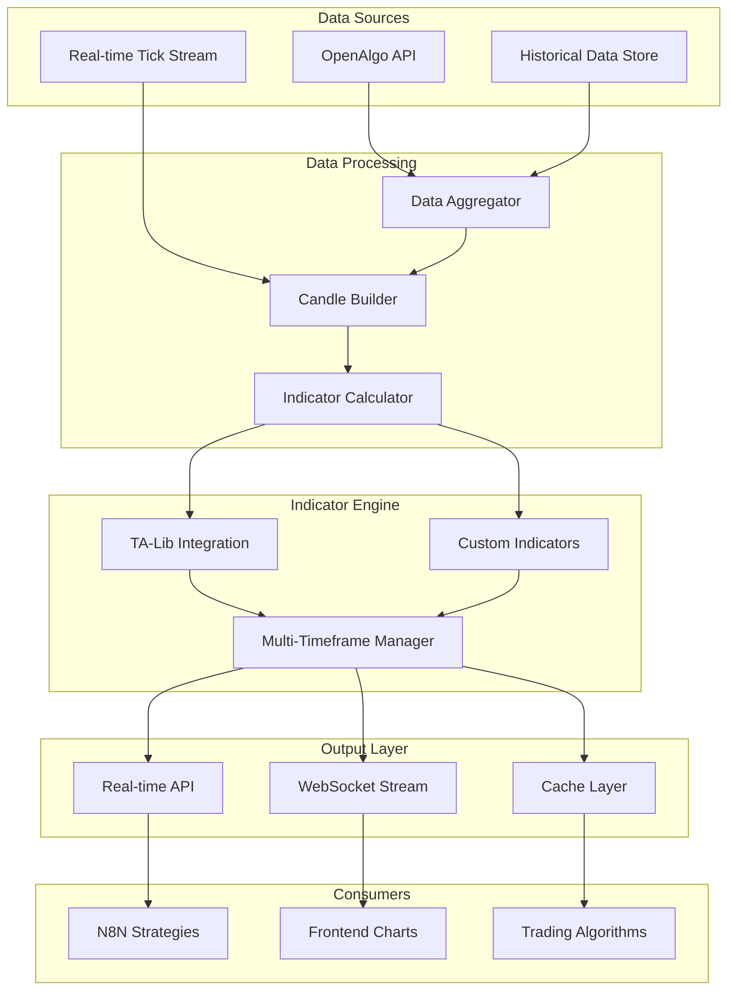

# Real-Time Tick-by-Tick Indicator Calculation System

## Overview

This system provides real-time indicator calculations that update tick-by-tick, similar to TradingView's real-time charts. By combining historical data with the current forming candle, we can calculate indicators in real-time without waiting for candle completion.

## Architecture



## Core Components

### 1. Real-Time Data Manager

```python
# backend/fastapi/app/services/realtime_data.py
import asyncio
import websockets
from typing import Dict, List, Optional
from datetime import datetime, timedelta
import pandas as pd
import numpy as np
from collections import deque
import json

class RealTimeDataManager:
    def __init__(self, openalgo_client):
        self.openalgo_client = openalgo_client
        self.tick_data: Dict[str, deque] = {}
        self.candle_data: Dict[str, pd.DataFrame] = {}
        self.indicator_cache: Dict[str, Dict] = {}
        self.subscribers: Dict[str, List] = {}
        
    async def start_realtime_stream(self, symbols: List[str]):
        """Start real-time data streaming for multiple symbols"""
        tasks = []
        for symbol in symbols:
            task = asyncio.create_task(self._stream_symbol_data(symbol))
            tasks.append(task)
        await asyncio.gather(*tasks)
    
    async def _stream_symbol_data(self, symbol: str):
        """Stream real-time data for a single symbol"""
        # Initialize data structures
        self.tick_data[symbol] = deque(maxlen=1000)
        self.candle_data[symbol] = await self._load_historical_data(symbol)
        
        # Connect to OpenAlgo WebSocket
        ws_url = f"{self.openalgo_client.base_url}/ws/{symbol}"
        async with websockets.connect(ws_url) as websocket:
            async for message in websocket:
                tick_data = json.loads(message)
                await self._process_tick(symbol, tick_data)
    
    async def _process_tick(self, symbol: str, tick: Dict):
        """Process incoming tick data"""
        timestamp = datetime.fromisoformat(tick['timestamp'])
        price = float(tick['price'])
        volume = int(tick.get('volume', 0))
        
        # Add to tick buffer
        self.tick_data[symbol].append({
            'timestamp': timestamp,
            'price': price,
            'volume': volume
        })
        
        # Update current candle
        await self._update_current_candle(symbol, tick)
        
        # Recalculate indicators
        await self._update_indicators(symbol)
        
        # Notify subscribers
        await self._notify_subscribers(symbol)
    
    async def _update_current_candle(self, symbol: str, tick: Dict):
        """Update the current forming candle with new tick data"""
        df = self.candle_data[symbol]
        timestamp = datetime.fromisoformat(tick['timestamp'])
        price = float(tick['price'])
        volume = int(tick.get('volume', 0))
        
        # Determine candle timeframe (1-minute, 5-minute, etc.)
        timeframes = ['1m', '5m', '15m', '30m', '1h', '4h', '1d']
        
        for tf in timeframes:
            candle_time = self._get_candle_time(timestamp, tf)
            
            # Check if we need to create a new candle
            if len(df) == 0 or df.iloc[-1]['timestamp'] != candle_time:
                # Create new candle
                new_candle = pd.DataFrame({
                    'timestamp': [candle_time],
                    'open': [price],
                    'high': [price],
                    'low': [price],
                    'close': [price],
                    'volume': [volume]
                })
                df = pd.concat([df, new_candle], ignore_index=True)
            else:
                # Update existing candle
                last_idx = len(df) - 1
                df.loc[last_idx, 'close'] = price
                df.loc[last_idx, 'high'] = max(df.loc[last_idx, 'high'], price)
                df.loc[last_idx, 'low'] = min(df.loc[last_idx, 'low'], price)
                df.loc[last_idx, 'volume'] += volume
        
        self.candle_data[symbol] = df
    
    def _get_candle_time(self, timestamp: datetime, timeframe: str) -> datetime:
        """Get the candle start time for a given timestamp and timeframe"""
        if timeframe == '1m':
            return timestamp.replace(second=0, microsecond=0)
        elif timeframe == '5m':
            minutes = (timestamp.minute // 5) * 5
            return timestamp.replace(minute=minutes, second=0, microsecond=0)
        elif timeframe == '15m':
            minutes = (timestamp.minute // 15) * 15
            return timestamp.replace(minute=minutes, second=0, microsecond=0)
        elif timeframe == '30m':
            minutes = (timestamp.minute // 30) * 30
            return timestamp.replace(minute=minutes, second=0, microsecond=0)
        elif timeframe == '1h':
            return timestamp.replace(minute=0, second=0, microsecond=0)
        elif timeframe == '4h':
            hours = (timestamp.hour // 4) * 4
            return timestamp.replace(hour=hours, minute=0, second=0, microsecond=0)
        elif timeframe == '1d':
            return timestamp.replace(hour=9, minute=15, second=0, microsecond=0)  # NSE opening time
        return timestamp
```

### 2. Advanced Indicator Calculator

```python
# backend/fastapi/app/services/indicator_calculator.py
import pandas as pd
import numpy as np
import ta
from typing import Dict, List, Optional, Union
from dataclasses import dataclass
from enum import Enum

class IndicatorType(Enum):
    MOVING_AVERAGE = "moving_average"
    OSCILLATOR = "oscillator"
    VOLATILITY = "volatility"
    VOLUME = "volume"
    TREND = "trend"
    MOMENTUM = "momentum"

@dataclass
class IndicatorConfig:
    name: str
    type: IndicatorType
    parameters: Dict
    source: str = "close"  # open, high, low, close, hl2, hlc3, ohlc4

class RealTimeIndicatorCalculator:
    def __init__(self):
        self.indicators: Dict[str, IndicatorConfig] = {}
        self.calculated_values: Dict[str, pd.DataFrame] = {}
        
    def add_indicator(self, symbol: str, config: IndicatorConfig):
        """Add an indicator configuration for a symbol"""
        key = f"{symbol}_{config.name}"
        self.indicators[key] = config
        
    def calculate_all_indicators(self, symbol: str, df: pd.DataFrame) -> Dict:
        """Calculate all configured indicators for a symbol"""
        results = {}
        
        for key, config in self.indicators.items():
            if key.startswith(f"{symbol}_"):
                indicator_values = self._calculate_indicator(df, config)
                results[config.name] = indicator_values
                
        return results
    
    def _calculate_indicator(self, df: pd.DataFrame, config: IndicatorConfig) -> Dict:
        """Calculate a single indicator"""
        source_data = self._get_source_data(df, config.source)
        
        if config.type == IndicatorType.MOVING_AVERAGE:
            return self._calculate_moving_averages(source_data, config.parameters)
        elif config.type == IndicatorType.OSCILLATOR:
            return self._calculate_oscillators(df, config.parameters)
        elif config.type == IndicatorType.VOLATILITY:
            return self._calculate_volatility_indicators(df, config.parameters)
        elif config.type == IndicatorType.VOLUME:
            return self._calculate_volume_indicators(df, config.parameters)
        elif config.type == IndicatorType.TREND:
            return self._calculate_trend_indicators(df, config.parameters)
        elif config.type == IndicatorType.MOMENTUM:
            return self._calculate_momentum_indicators(df, config.parameters)
        
        return {}
    
    def _get_source_data(self, df: pd.DataFrame, source: str) -> pd.Series:
        """Extract source data for indicator calculation"""
        if source == "open":
            return df['open']
        elif source == "high":
            return df['high']
        elif source == "low":
            return df['low']
        elif source == "close":
            return df['close']
        elif source == "hl2":
            return (df['high'] + df['low']) / 2
        elif source == "hlc3":
            return (df['high'] + df['low'] + df['close']) / 3
        elif source == "ohlc4":
            return (df['open'] + df['high'] + df['low'] + df['close']) / 4
        else:
            return df['close']
    
    def _calculate_moving_averages(self, data: pd.Series, params: Dict) -> Dict:
        """Calculate various moving averages"""
        results = {}
        
        # Simple Moving Average
        if 'sma_periods' in params:
            for period in params['sma_periods']:
                results[f'sma_{period}'] = ta.trend.sma_indicator(data, window=period)
        
        # Exponential Moving Average
        if 'ema_periods' in params:
            for period in params['ema_periods']:
                results[f'ema_{period}'] = ta.trend.ema_indicator(data, window=period)
        
        # Weighted Moving Average
        if 'wma_periods' in params:
            for period in params['wma_periods']:
                results[f'wma_{period}'] = ta.trend.wma_indicator(data, window=period)
        
        # Hull Moving Average
        if 'hma_periods' in params:
            for period in params['hma_periods']:
                results[f'hma_{period}'] = ta.trend.hma_indicator(data, window=period)
        
        return results
    
    def _calculate_oscillators(self, df: pd.DataFrame, params: Dict) -> Dict:
        """Calculate oscillator indicators"""
        results = {}
        
        # RSI
        if 'rsi_period' in params:
            results['rsi'] = ta.momentum.rsi(df['close'], window=params['rsi_period'])
        
        # Stochastic
        if 'stoch_k' in params and 'stoch_d' in params:
            stoch = ta.momentum.stoch(
                df['high'], df['low'], df['close'],
                window=params['stoch_k'], smooth_window=params['stoch_d']
            )
            results['stoch_k'] = stoch
            results['stoch_d'] = ta.trend.sma_indicator(stoch, window=params['stoch_d'])
        
        # MACD
        if 'macd_fast' in params and 'macd_slow' in params and 'macd_signal' in params:
            macd = ta.trend.MACD(
                df['close'],
                window_fast=params['macd_fast'],
                window_slow=params['macd_slow'],
                window_sign=params['macd_signal']
            )
            results['macd'] = macd.macd()
            results['macd_signal'] = macd.macd_signal()
            results['macd_histogram'] = macd.macd_diff()
        
        # Williams %R
        if 'williams_r_period' in params:
            results['williams_r'] = ta.momentum.williams_r(
                df['high'], df['low'], df['close'],
                lbp=params['williams_r_period']
            )
        
        # CCI
        if 'cci_period' in params:
            results['cci'] = ta.trend.cci(
                df['high'], df['low'], df['close'],
                window=params['cci_period']
            )
        
        return results
    
    def _calculate_volatility_indicators(self, df: pd.DataFrame, params: Dict) -> Dict:
        """Calculate volatility indicators"""
        results = {}
        
        # Bollinger Bands
        if 'bb_period' in params and 'bb_std' in params:
            bb = ta.volatility.BollingerBands(
                df['close'],
                window=params['bb_period'],
                window_dev=params['bb_std']
            )
            results['bb_upper'] = bb.bollinger_hband()
            results['bb_middle'] = bb.bollinger_mavg()
            results['bb_lower'] = bb.bollinger_lband()
            results['bb_width'] = bb.bollinger_wband()
        
        # ATR
        if 'atr_period' in params:
            results['atr'] = ta.volatility.average_true_range(
                df['high'], df['low'], df['close'],
                window=params['atr_period']
            )
        
        # Keltner Channels
        if 'kc_period' in params and 'kc_multiplier' in params:
            kc = ta.volatility.KeltnerChannel(
                df['high'], df['low'], df['close'],
                window=params['kc_period'],
                window_atr=params['kc_period'],
                multiplier=params['kc_multiplier']
            )
            results['kc_upper'] = kc.keltner_channel_hband()
            results['kc_middle'] = kc.keltner_channel_mband()
            results['kc_lower'] = kc.keltner_channel_lband()
        
        return results
    
    def _calculate_volume_indicators(self, df: pd.DataFrame, params: Dict) -> Dict:
        """Calculate volume-based indicators"""
        results = {}
        
        # On-Balance Volume
        if 'obv' in params and params['obv']:
            results['obv'] = ta.volume.on_balance_volume(df['close'], df['volume'])
        
        # Volume Moving Average
        if 'volume_ma_periods' in params:
            for period in params['volume_ma_periods']:
                results[f'volume_ma_{period}'] = ta.volume.volume_sma(df['volume'], window=period)
        
        # VWAP
        if 'vwap' in params and params['vwap']:
            results['vwap'] = ta.volume.volume_weighted_average_price(
                df['high'], df['low'], df['close'], df['volume']
            )
        
        # Money Flow Index
        if 'mfi_period' in params:
            results['mfi'] = ta.volume.money_flow_index(
                df['high'], df['low'], df['close'], df['volume'],
                window=params['mfi_period']
            )
        
        return results
    
    def _calculate_trend_indicators(self, df: pd.DataFrame, params: Dict) -> Dict:
        """Calculate trend indicators"""
        results = {}
        
        # ADX
        if 'adx_period' in params:
            adx = ta.trend.ADXIndicator(
                df['high'], df['low'], df['close'],
                window=params['adx_period']
            )
            results['adx'] = adx.adx()
            results['adx_pos'] = adx.adx_pos()
            results['adx_neg'] = adx.adx_neg()
        
        # Aroon
        if 'aroon_period' in params:
            aroon = ta.trend.AroonIndicator(
                df['high'], df['low'],
                window=params['aroon_period']
            )
            results['aroon_up'] = aroon.aroon_up()
            results['aroon_down'] = aroon.aroon_down()
            results['aroon_oscillator'] = aroon.aroon_indicator()
        
        # Parabolic SAR
        if 'sar' in params and params['sar']:
            results['sar'] = ta.trend.psar_down(
                df['high'], df['low'],
                **params.get('sar_params', {})
            )
        
        return results
    
    def _calculate_momentum_indicators(self, df: pd.DataFrame, params: Dict) -> Dict:
        """Calculate momentum indicators"""
        results = {}
        
        # Rate of Change
        if 'roc_periods' in params:
            for period in params['roc_periods']:
                results[f'roc_{period}'] = ta.momentum.roc(df['close'], window=period)
        
        # Momentum
        if 'momentum_periods' in params:
            for period in params['momentum_periods']:
                results[f'momentum_{period}'] = ta.momentum.momentum(df['close'], window=period)
        
        # Commodity Channel Index
        if 'cci_period' in params:
            results['cci'] = ta.trend.cci(
                df['high'], df['low'], df['close'],
                window=params['cci_period']
            )
        
        return results
```

### 3. Real-Time API Endpoints

```python
# backend/fastapi/app/api/realtime_indicators.py
from fastapi import APIRouter, WebSocket, WebSocketDisconnect, Depends
from typing import Dict, List, Optional
import json
import asyncio
from app.services.realtime_data import RealTimeDataManager
from app.services.indicator_calculator import RealTimeIndicatorCalculator, IndicatorConfig, IndicatorType
from app.core.openalgo_client import OpenAlgoClient

router = APIRouter()

# Global instances
data_manager = None
indicator_calculator = None

async def get_data_manager():
    global data_manager
    if data_manager is None:
        openalgo_client = OpenAlgoClient()
        data_manager = RealTimeDataManager(openalgo_client)
    return data_manager

async def get_indicator_calculator():
    global indicator_calculator
    if indicator_calculator is None:
        indicator_calculator = RealTimeIndicatorCalculator()
    return indicator_calculator

@router.post("/subscribe/{symbol}")
async def subscribe_symbol(
    symbol: str,
    indicators: List[Dict],
    data_manager: RealTimeDataManager = Depends(get_data_manager),
    calculator: RealTimeIndicatorCalculator = Depends(get_indicator_calculator)
):
    """Subscribe to real-time indicators for a symbol"""
    
    # Configure indicators
    for ind_config in indicators:
        config = IndicatorConfig(
            name=ind_config['name'],
            type=IndicatorType(ind_config['type']),
            parameters=ind_config['parameters'],
            source=ind_config.get('source', 'close')
        )
        calculator.add_indicator(symbol, config)
    
    # Start data streaming if not already running
    if symbol not in data_manager.subscribers:
        asyncio.create_task(data_manager.start_realtime_stream([symbol]))
    
    return {"message": f"Subscribed to {symbol} with {len(indicators)} indicators"}

@router.get("/indicators/{symbol}")
async def get_current_indicators(
    symbol: str,
    timeframe: str = "1m",
    data_manager: RealTimeDataManager = Depends(get_data_manager),
    calculator: RealTimeIndicatorCalculator = Depends(get_indicator_calculator)
):
    """Get current indicator values for a symbol"""
    
    if symbol not in data_manager.candle_data:
        return {"error": f"No data available for {symbol}"}
    
    df = data_manager.candle_data[symbol]
    indicators = calculator.calculate_all_indicators(symbol, df)
    
    # Get the latest values
    latest_values = {}
    for indicator_name, values in indicators.items():
        if isinstance(values, dict):
            latest_values[indicator_name] = {
                key: values[key].iloc[-1] if len(values[key]) > 0 else None
                for key in values.keys()
            }
        else:
            latest_values[indicator_name] = values.iloc[-1] if len(values) > 0 else None
    
    return {
        "symbol": symbol,
        "timeframe": timeframe,
        "timestamp": df.iloc[-1]['timestamp'].isoformat(),
        "current_price": df.iloc[-1]['close'],
        "indicators": latest_values,
        "candle_data": {
            "current": df.iloc[-1].to_dict(),
            "previous": df.iloc[-2].to_dict() if len(df) > 1 else None
        }
    }

@router.websocket("/ws/{symbol}")
async def websocket_endpoint(
    websocket: WebSocket,
    symbol: str,
    data_manager: RealTimeDataManager = Depends(get_data_manager),
    calculator: RealTimeIndicatorCalculator = Depends(get_indicator_calculator)
):
    """WebSocket endpoint for real-time indicator updates"""
    
    await websocket.accept()
    
    # Add to subscribers
    if symbol not in data_manager.subscribers:
        data_manager.subscribers[symbol] = []
    data_manager.subscribers[symbol].append(websocket)
    
    try:
        while True:
            # Wait for new data or client message
            await asyncio.sleep(0.1)
            
            # Send latest indicator values
            if symbol in data_manager.candle_data:
                df = data_manager.candle_data[symbol]
                indicators = calculator.calculate_all_indicators(symbol, df)
                
                latest_values = {}
                for indicator_name, values in indicators.items():
                    if isinstance(values, dict):
                        latest_values[indicator_name] = {
                            key: values[key].iloc[-1] if len(values[key]) > 0 else None
                            for key in values.keys()
                        }
                    else:
                        latest_values[indicator_name] = values.iloc[-1] if len(values) > 0 else None
                
                message = {
                    "symbol": symbol,
                    "timestamp": df.iloc[-1]['timestamp'].isoformat(),
                    "current_price": df.iloc[-1]['close'],
                    "indicators": latest_values,
                    "candle": {
                        "current": df.iloc[-1].to_dict(),
                        "previous": df.iloc[-2].to_dict() if len(df) > 1 else None
                    }
                }
                
                await websocket.send_text(json.dumps(message))
                
    except WebSocketDisconnect:
        # Remove from subscribers
        if symbol in data_manager.subscribers:
            data_manager.subscribers[symbol].remove(websocket)

@router.get("/indicator-history/{symbol}")
async def get_indicator_history(
    symbol: str,
    indicator: str,
    periods: int = 100,
    timeframe: str = "1m",
    data_manager: RealTimeDataManager = Depends(get_data_manager),
    calculator: RealTimeIndicatorCalculator = Depends(get_indicator_calculator)
):
    """Get historical indicator values for analysis"""
    
    if symbol not in data_manager.candle_data:
        return {"error": f"No data available for {symbol}"}
    
    df = data_manager.candle_data[symbol]
    indicators = calculator.calculate_all_indicators(symbol, df)
    
    if indicator not in indicators:
        return {"error": f"Indicator {indicator} not found"}
    
    indicator_data = indicators[indicator]
    
    # Get historical data
    history = []
    for i in range(max(0, len(df) - periods), len(df)):
        timestamp = df.iloc[i]['timestamp'].isoformat()
        price = df.iloc[i]['close']
        
        if isinstance(indicator_data, dict):
            values = {key: indicator_data[key].iloc[i] for key in indicator_data.keys()}
        else:
            values = indicator_data.iloc[i]
        
        history.append({
            "timestamp": timestamp,
            "price": price,
            "indicator": values
        })
    
    return {
        "symbol": symbol,
        "indicator": indicator,
        "timeframe": timeframe,
        "history": history
    }
```

### 4. Pre-configured Indicator Sets

```python
# backend/fastapi/app/services/indicator_presets.py
from typing import Dict, List
from app.services.indicator_calculator import IndicatorConfig, IndicatorType

class IndicatorPresets:
    """Pre-configured indicator sets for different trading strategies"""
    
    @staticmethod
    def trend_following() -> List[IndicatorConfig]:
        """Indicators for trend following strategies"""
        return [
            IndicatorConfig(
                name="moving_averages",
                type=IndicatorType.MOVING_AVERAGE,
                parameters={
                    "ema_periods": [9, 21, 50, 200],
                    "sma_periods": [20, 50, 200]
                }
            ),
            IndicatorConfig(
                name="trend_strength",
                type=IndicatorType.TREND,
                parameters={
                    "adx_period": 14,
                    "aroon_period": 14
                }
            ),
            IndicatorConfig(
                name="momentum",
                type=IndicatorType.MOMENTUM,
                parameters={
                    "roc_periods": [10, 20],
                    "momentum_periods": [10, 20]
                }
            )
        ]
    
    @staticmethod
    def mean_reversion() -> List[IndicatorConfig]:
        """Indicators for mean reversion strategies"""
        return [
            IndicatorConfig(
                name="oscillators",
                type=IndicatorType.OSCILLATOR,
                parameters={
                    "rsi_period": 14,
                    "stoch_k": 14,
                    "stoch_d": 3,
                    "williams_r_period": 14
                }
            ),
            IndicatorConfig(
                name="volatility",
                type=IndicatorType.VOLATILITY,
                parameters={
                    "bb_period": 20,
                    "bb_std": 2,
                    "atr_period": 14
                }
            ),
            IndicatorConfig(
                name="volume",
                type=IndicatorType.VOLUME,
                parameters={
                    "obv": True,
                    "volume_ma_periods": [20]
                }
            )
        ]
    
    @staticmethod
    def momentum() -> List[IndicatorConfig]:
        """Indicators for momentum strategies"""
        return [
            IndicatorConfig(
                name="macd",
                type=IndicatorType.OSCILLATOR,
                parameters={
                    "macd_fast": 12,
                    "macd_slow": 26,
                    "macd_signal": 9
                }
            ),
            IndicatorConfig(
                name="rate_of_change",
                type=IndicatorType.MOMENTUM,
                parameters={
                    "roc_periods": [5, 10, 20]
                }
            ),
            IndicatorConfig(
                name="volume_confirmation",
                type=IndicatorType.VOLUME,
                parameters={
                    "volume_ma_periods": [10, 20],
                    "vwap": True
                }
            )
        ]
    
    @staticmethod
    def comprehensive() -> List[IndicatorConfig]:
        """Comprehensive indicator set for advanced analysis"""
        return [
            IndicatorConfig(
                name="all_moving_averages",
                type=IndicatorType.MOVING_AVERAGE,
                parameters={
                    "sma_periods": [10, 20, 50, 100, 200],
                    "ema_periods": [9, 21, 50, 100, 200],
                    "wma_periods": [10, 20],
                    "hma_periods": [9, 21]
                }
            ),
            IndicatorConfig(
                name="all_oscillators",
                type=IndicatorType.OSCILLATOR,
                parameters={
                    "rsi_period": 14,
                    "stoch_k": 14,
                    "stoch_d": 3,
                    "macd_fast": 12,
                    "macd_slow": 26,
                    "macd_signal": 9,
                    "williams_r_period": 14,
                    "cci_period": 20
                }
            ),
            IndicatorConfig(
                name="all_volatility",
                type=IndicatorType.VOLATILITY,
                parameters={
                    "bb_period": 20,
                    "bb_std": 2,
                    "atr_period": 14,
                    "kc_period": 20,
                    "kc_multiplier": 2
                }
            ),
            IndicatorConfig(
                name="all_trend",
                type=IndicatorType.TREND,
                parameters={
                    "adx_period": 14,
                    "aroon_period": 14,
                    "sar": True,
                    "sar_params": {"step": 0.02, "max_step": 0.2}
                }
            ),
            IndicatorConfig(
                name="all_volume",
                type=IndicatorType.VOLUME,
                parameters={
                    "obv": True,
                    "volume_ma_periods": [10, 20, 50],
                    "vwap": True,
                    "mfi_period": 14
                }
            ),
            IndicatorConfig(
                name="all_momentum",
                type=IndicatorType.MOMENTUM,
                parameters={
                    "roc_periods": [5, 10, 20],
                    "momentum_periods": [10, 20],
                    "cci_period": 20
                }
            )
        ]
```

### 5. Usage Examples

```python
# Example: Subscribe to trend following indicators for NIFTY 50
import requests
import websocket
import json

# Subscribe to indicators
subscription_data = {
    "indicators": [
        {
            "name": "ema_20_50",
            "type": "moving_average",
            "parameters": {
                "ema_periods": [20, 50]
            }
        },
        {
            "name": "rsi",
            "type": "oscillator",
            "parameters": {
                "rsi_period": 14
            }
        },
        {
            "name": "bollinger_bands",
            "type": "volatility",
            "parameters": {
                "bb_period": 20,
                "bb_std": 2
            }
        }
    ]
}

response = requests.post(
    "http://localhost:8000/api/v1/realtime/subscribe/NIFTY 50",
    json=subscription_data
)

# Get current indicator values
current_indicators = requests.get(
    "http://localhost:8000/api/v1/realtime/indicators/NIFTY 50"
)
print(current_indicators.json())

# WebSocket for real-time updates
def on_message(ws, message):
    data = json.loads(message)
    print(f"Symbol: {data['symbol']}")
    print(f"Price: {data['current_price']}")
    print(f"EMA 20: {data['indicators']['ema_20']}")
    print(f"EMA 50: {data['indicators']['ema_50']}")
    print(f"RSI: {data['indicators']['rsi']}")
    print("---")

ws = websocket.WebSocketApp(
    "ws://localhost:8000/api/v1/realtime/ws/NIFTY 50",
    on_message=on_message
)
ws.run_forever()
```

## Installation and Setup

### Requirements
```bash
pip install ta pandas numpy websockets fastapi uvicorn sqlalchemy redis
```

### Configuration
```python
# backend/fastapi/app/core/config.py
class RealTimeConfig:
    # OpenAlgo Configuration
    OPENALGO_BASE_URL = "http://localhost:3000"
    OPENALGO_API_KEY = "your-api-key"
    
    # Data Configuration
    MAX_HISTORY_DAYS = 365
    TICK_BUFFER_SIZE = 1000
    UPDATE_INTERVAL = 0.1  # seconds
    
    # Indicator Configuration
    DEFAULT_TIMEFRAMES = ["1m", "5m", "15m", "30m", "1h", "4h", "1d"]
    CACHE_TTL = 60  # seconds
    
    # WebSocket Configuration
    WS_HEARTBEAT_INTERVAL = 30
    MAX_CONNECTIONS_PER_SYMBOL = 100
```

This real-time indicator system provides TradingView-like functionality with tick-by-tick updates, comprehensive indicator coverage using the TA library, and seamless integration with your N8N strategy workflows.